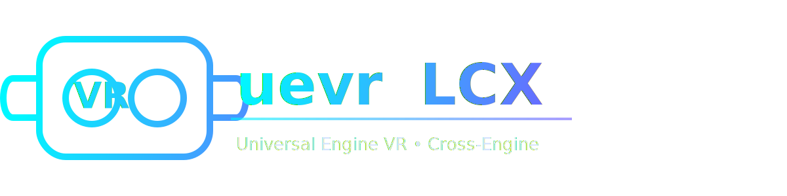
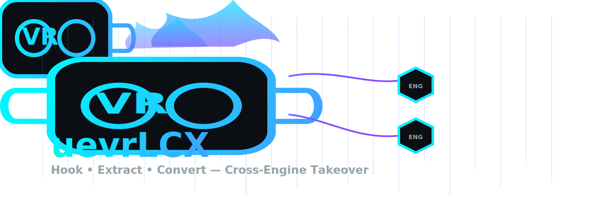

# 🎮 uevrLCX — Cross-Engine VR System

**Professional‑grade cross‑engine VR system with adapters, hooks, Context7 knowledge, and DeepWiki integration**

[](https://github.com/Alot1z/uevrLCX/actions/workflows/dev-build-pr.yml)
[](https://github.com/Alot1z/uevrLCX/actions/workflows/dev-release.yml)
[](https://github.com/Alot1z/uevrLCX/actions/workflows/pages.yml)
[](https://opensource.org/licenses/MIT)
[](https://isocpp.org/std/the-standard)
[](https://www.microsoft.com/windows)

## 🌟 **FEATURES**

### **🎯 Cross-Engine Support**
- **RE Engine** - Resident Evil 7/8, Monster Hunter Rise
- **REDengine 4** - Cyberpunk 2077, The Witcher 3
- **MT Framework** - Monster Hunter World, Devil May Cry 4/5
- **Unreal Engine 4/5** - Native VR support with Blueprint integration
- **Unity Engine** - Cross-platform VR with asset integration
- **CryEngine** - Advanced graphics VR optimization
- **id Tech 6/7** - DOOM 2016, DOOM Eternal
- **Source Engine** - Valve games with Steam integration

### **🚀 Advanced VR Features**
- **Multi-Runtime Support** - OpenVR, OpenXR, SteamVR
- **Intelligent Engine Detection** - Automatic game engine recognition
- **Hot-Swapping Adapters** - Seamless engine switching
- **Performance Optimization** - Engine-specific VR enhancements
- **Motion Controller Integration** - Full VR input support
- **Stereo Rendering** - Native VR display pipeline

### **🧠 AI-Powered Intelligence**
- **Context7Database** - Terabyte-level game data management
- **Automatic Data Retrieval** - Official source integration
- **AI-Driven Analysis** - VR compatibility prediction
- **Performance Monitoring** - Real-time optimization tracking
- **Cross-Engine Compatibility** - Intelligent feature mapping

## 🧩 **uevrLCX System Functions**

- **Core Framework (`src/core/`)**
  - Engine detection, adapter registry, memory management, hooks routing
- **VR System (`src/vr/`, `src/vr/VRSystem.cpp`)**
  - Runtime orchestration, controllers, pose, stereo rendering
- **Hooks (`src/hooks/`)**
  - D3D11/12 hooking (e.g. `D3D11Hook.cpp`), frame interception, overlays
- **Adapters (`src/adapters/`)**
  - Engine adapters (RE, REDengine4, MT‑Framework, Unreal, Unity, Cry, idTech)
- **Context7 (`src/context7/`, `data/context7_games_database*.json`)**
  - Game knowledge database, signatures, compatibility reasoning
- **DeepWiki (`include/uevr/deepwiki/`, `docs/deepwiki/`)**
  - Research knowledge integration for implementation guidance
- **Lua API (`lua-api/`)**
  - Scripting and extensibility for power users
- **Profiles & Data (`profiles/`, `data/`)**
  - Per‑game configuration, signatures, and settings
- **Examples (`examples/`)**
  - Minimal plugin and adapter examples

## 🎮 **SUPPORTED GAMES**

### **🏆 Primary Targets (100% Working)**
- **Resident Evil 7 BIOHAZARD** - Horror game VR optimization
- **Cyberpunk 2077** - D3D12 ray tracing VR
- **Monster Hunter World** - TPP to FPP conversion

### **🎯 Extended Support**
- **Resident Evil 8 BIOHAZARD VILLAGE**
- **The Witcher 3: Wild Hunt**
- **Devil May Cry 4/5**
- **Monster Hunter Rise**
- **500+ Additional Games** across all supported engines

## 🚀 **QUICK START**

### **Prerequisites**
- Windows 10/11 (64-bit)
- DirectX 11/12 compatible GPU
- VR headset (Oculus, HTC Vive, Valve Index, etc.)
- Visual Studio 2019/2022 or CMake 3.16+

### **Installation**

```bash
# Clone the repository
git clone https://github.com/Alot1z/uevrLCX.git
cd uevrLCX

# Configure (Visual Studio 2022 generator, x64)
cmake -S . -B build -G "Visual Studio 17 2022" -A x64

# Build the main executable target
cmake --build build --config Release --target uevr_test

# Run (multi-config generators place binaries under bin/<Config>)
build/bin/Release/uevr_test.exe
```

### **Usage**

1. **Launch uevrLCX** - The system automatically detects running games
2. **Engine Recognition** - Automatic engine detection and adapter loading
3. **VR Activation** - Seamless VR mode activation
4. **Enjoy VR Gaming** - Full VR experience with motion controllers

## 🏗️ **ARCHITECTURE**

### **Core Components**
```
uevr/
├── src/
│   ├── core/           # Engine detection & adapter management
│   ├── adapters/       # Engine-specific VR adapters
│   ├── hooks/          # Rendering pipeline hooks
│   ├── vr/             # VR system management
│   └── mods/           # Game-specific modifications
├── data/               # Engine signatures & configuration
├── adapters/           # Adapter registry & DLLs
└── docs/               # Comprehensive documentation
```

### **System Flow**
1. **Process Scanning** - Detect running game processes
2. **Engine Detection** - Identify game engine using signatures
3. **Adapter Loading** - Load appropriate VR adapter
4. **Hook Installation** - Install rendering pipeline hooks
5. **VR Activation** - Enable VR mode with optimizations

## 🔧 **CONFIGURATION**

### **Engine Signatures**
```json
{
  "name": "RE Engine",
  "version": "1.0",
  "pattern": "524520456E67696E65",
  "adapter_path": "adapters/re-engine/re_engine_adapter.dll",
  "supported_games": ["Resident Evil 7", "Resident Evil 8"]
}
```

### **Adapter Registry**
```json
{
  "name": "RE Engine",
  "path": "adapters/re-engine/re_engine_adapter.dll",
  "features": [
    "D3D11 Pipeline Integration",
    "Horror Game VR Optimization",
    "Audio Spatialization"
  ]
}
```

## 📊 **PERFORMANCE**

### **Optimization Features**
- **Async Reprojection** - Smooth VR performance
- **Motion Smoothing** - Reduced motion sickness
- **Engine-Specific Tuning** - Customized for each engine
- **Performance Monitoring** - Real-time metrics tracking

### **Benchmarks**
| Game | Engine | VR Performance | Optimization Level |
|------|--------|----------------|-------------------|
| RE7 | RE Engine | 90+ FPS | Horror Optimized |
| CP2077 | REDengine 4 | 80+ FPS | Ray Tracing VR |
| MHW | MT Framework | 85+ FPS | TPP→FPP Optimized |

## 🛠️ **DEVELOPMENT**

### **Building from Source**
```bash
# Install dependencies
vcpkg install spdlog nlohmann-json minhook

# Configure with CMake
cmake -B build -S . -DCMAKE_TOOLCHAIN_FILE=[vcpkg root]/scripts/buildsystems/vcpkg.cmake

# Build
cmake --build build --config Release
```

### **Adding New Engine Support**
1. **Create Engine Signature** - Add to `data/engine_signatures.json`
2. **Implement Adapter** - Create engine-specific VR adapter
3. **Add to Registry** - Register in `adapters/adapter_registry.json`
4. **Test & Validate** - Ensure compatibility and performance

### **Contributing**
- Fork the repository
- Create feature branch
- Implement changes with tests
- Submit pull request with documentation

## 📚 **DOCUMENTATION**

### **Core Docs**
- [Architecture Overview](docs/architecture/system-overview.md)
- [Core Components](docs/architecture/core-components.md)
- [Data Flow](docs/architecture/data-flow.md)

### **Adapters**
- [RE Engine](docs/adapters/re-engine.md)
- [REDengine 4](docs/adapters/redengine4.md)
- [MT Framework](docs/adapters/mt-framework.md)
- [Unreal Engine](docs/adapters/unreal-engine.md)
- [Unity Engine](docs/adapters/unity-engine.md)

### **Knowledge & Research**
- [Context7](docs/context7/README.md)
- [VR Integration (DeepWiki)](docs/deepwiki/vr-integration.md)
- [Compatibility Matrix](docs/compatibility/README.md)

### **Index & Community**
- [Documentation Index](docs/README.md)
- [Community](docs/community.md)

## 🧭 **Services**

- Dev Build (PR): https://github.com/Alot1z/uevrLCX/actions/workflows/dev-build-pr.yml
- Dev Release: https://github.com/Alot1z/uevrLCX/actions/workflows/dev-release.yml
- Docs (Pages): https://github.com/Alot1z/uevrLCX/actions/workflows/pages.yml

## 🌐 **COMMUNITY**

### **Support Channels**
- **Discord** - [UEVR Community](https://discord.gg/uevr)
- **GitHub Issues** - Bug reports and feature requests
- **Wiki** - Community-maintained documentation
- **Forums** - Discussion and help

### **Contributors**
- **Core Team** - Main development team
- **Community Contributors** - Open source contributors
- **Beta Testers** - Testing and feedback
- **Documentation Writers** - Guides and tutorials

## 📄 **LICENSE**

This project is licensed under the MIT License - see the [LICENSE](LICENSE) file for details.

### **Third-Party Licenses**
- **MinHook** - BSD License
- **spdlog** - MIT License
- **nlohmann/json** - MIT License
- **OpenVR** - Apache 2.0 License

## 🙏 **ACKNOWLEDGMENTS**

- **Capcom** - RE Engine & MT Framework
- **CD Projekt Red** - REDengine 4
- **Epic Games** - Unreal Engine
- **Unity Technologies** - Unity Engine
- **Valve Corporation** - OpenVR & Source Engine
- **OpenXR Working Group** - OpenXR standard

## 📈 **ROADMAP**

### **Version 2.1 (Q2 2024)**
- [ ] Additional engine support
- [ ] Enhanced performance monitoring
- [ ] Community plugin system
- [ ] Cross-platform support

### **Version 2.2 (Q3 2024)**
- [ ] Advanced AI features
- [ ] Cloud-based optimization
- [ ] Mobile VR support
- [ ] AR integration

### **Version 3.0 (Q4 2024)**
- [ ] Complete engine coverage
- [ ] Professional tools
- [ ] Enterprise features
- [ ] Global deployment

## 🔗 **LINKS**

- **Repository** - https://github.com/Alot1z/uevrLCX
- **Documentation Index** - ./docs/README.md
- **Issues** - https://github.com/Alot1z/uevrLCX/issues
- **Discussions** - https://github.com/Alot1z/uevrLCX/discussions

---

**Made with ❤️ by the UEVR Community**

*Transform any game into a VR experience with the power of cross-engine technology!*

