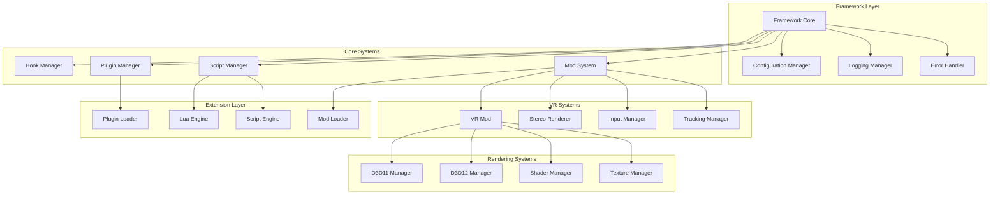

# 🔧 Core Components

> **Detailed component breakdown of UEVR system**

This document provides an in-depth analysis of UEVR's core components, their responsibilities, and how they interact to deliver cross-engine VR functionality.

## 🎯 **Component Overview**

### **Component Hierarchy**
UEVR's architecture is built around a hierarchical component system:



## 🏗️ **Framework Layer**

### **Framework Core**
The central coordinator that manages the entire UEVR system:

#### **Responsibilities**
- **System Initialization**: Coordinates component startup sequence
- **Component Management**: Manages component lifecycle and dependencies
- **State Coordination**: Maintains global system state
- **Event Dispatching**: Routes events between components
- **Resource Management**: Manages shared system resources

#### **Core Implementation**
```cpp
class Framework {
public:
    // Singleton access
    static Framework& get_instance();
    
    // System lifecycle
    bool initialize();
    void shutdown();
    bool is_running() const;
    
    // Component management
    template<typename T>
    T* get_component() const;
    
    template<typename T>
    void register_component(std::unique_ptr<T> component);
    
    // Event system
    void dispatch_event(const Event& event);
    void subscribe_to_event(EventType type, EventHandler handler);
    
    // Configuration
    const Config& get_config() const;
    void update_config(const Config& config);
    
private:
    // Component registry
    std::unordered_map<std::type_index, std::unique_ptr<IComponent>> m_components;
    
    // Event system
    std::unordered_map<EventType, std::vector<EventHandler>> m_event_handlers;
    
    // System state
    SystemState m_state;
    std::mutex m_mutex;
};
```

#### **Component Lifecycle Management**
```cpp
class IComponent {
public:
    virtual ~IComponent() = default;
    
    // Lifecycle methods
    virtual bool initialize() = 0;
    virtual void shutdown() = 0;
    virtual void update(float delta_time) = 0;
    
    // Component identification
    virtual std::string get_name() const = 0;
    virtual ComponentType get_type() const = 0;
    
    // Dependency management
    virtual std::vector<ComponentType> get_dependencies() const = 0;
    virtual bool can_initialize() const = 0;
    
protected:
    ComponentContext m_context;
    ComponentState m_state;
};
```

### **Configuration Manager**
Manages system-wide configuration and settings:

#### **Configuration Structure**
```cpp
struct Config {
    // Framework settings
    struct Framework {
        std::string log_level = "info";
        bool enable_debug_mode = false;
        std::string config_file = "uevr.ini";
        bool auto_save_config = true;
    } framework;
    
    // VR settings
    struct VR {
        bool enabled = true;
        float render_scale = 1.0f;
        bool enable_motion_controls = true;
        float ipd = 64.0f;
        std::string headset_type = "auto";
    } vr;
    
    // Performance settings
    struct Performance {
        int target_fps = 90;
        bool enable_afr = false;
        bool enable_dynamic_resolution = true;
        std::string quality_preset = "balanced";
    } performance;
    
    // Input settings
    struct Input {
        float snap_turn_angle = 45.0f;
        float deadzone = 0.1f;
        bool enable_haptics = true;
        bool controller_swap = false;
    } input;
};
```

#### **Configuration Management**
```cpp
class ConfigManager {
public:
    // Configuration loading/saving
    bool load_config(const std::string& file_path);
    bool save_config(const std::string& file_path);
    bool load_default_config();
    
    // Configuration access
    template<typename T>
    T get_value(const std::string& key, const T& default_value = T{}) const;
    
    template<typename T>
    void set_value(const std::string& key, const T& value);
    
    // Configuration validation
    bool validate_config(const Config& config);
    std::vector<std::string> get_validation_errors() const;
    
    // Hot-reload support
    void enable_hot_reload(bool enable);
    bool is_hot_reload_enabled() const;
    
private:
    Config m_config;
    std::string m_config_file;
    bool m_hot_reload_enabled;
    std::filesystem::file_time_type m_last_modified;
    
    // Configuration parsing
    bool parse_ini_file(const std::string& content);
    bool parse_json_file(const std::string& content);
};
```

### **Logging Manager**
Provides comprehensive logging capabilities:

#### **Logging System**
```cpp
class LogManager {
public:
    // Log levels
    enum class Level {
        Trace, Debug, Info, Warning, Error, Fatal
    };
    
    // Logging methods
    template<typename... Args>
    void log(Level level, const std::string& format, Args&&... args);
    
    template<typename... Args>
    void trace(const std::string& format, Args&&... args);
    
    template<typename... Args>
    void debug(const std::string& format, Args&&... args);
    
    template<typename... Args>
    void info(const std::string& format, Args&&... args);
    
    template<typename... Args>
    void warning(const std::string& format, Args&&... args);
    
    template<typename... Args>
    void error(const std::string& format, Args&&... args);
    
    template<typename... Args>
    void fatal(const std::string& format, Args&&... args);
    
    // Logging configuration
    void set_log_level(Level level);
    void set_log_file(const std::string& file_path);
    void enable_console_output(bool enable);
    void enable_file_output(bool enable);
    
private:
    Level m_current_level;
    std::ofstream m_log_file;
    bool m_console_output_enabled;
    bool m_file_output_enabled;
    
    // Log formatting
    std::string format_log_message(Level level, const std::string& message);
    std::string get_timestamp();
    std::string level_to_string(Level level);
};
```

### **Error Handler**
Manages system errors and provides recovery mechanisms:

#### **Error Management**
```cpp
class ErrorHandler {
public:
    // Error types
    enum class ErrorType {
        Hook, Rendering, VR, Input, Configuration, Plugin, System
    };
    
    // Error severity
    enum class Severity {
        Info, Warning, Error, Critical, Fatal
    };
    
    // Error handling
    void handle_error(ErrorType type, Severity severity, 
                     const std::string& message, 
                     const std::string& details = "");
    
    // Error recovery
    bool can_recover(ErrorType type) const;
    bool attempt_recovery(ErrorType type);
    
    // Error reporting
    std::vector<ErrorInfo> get_errors() const;
    void clear_errors();
    
    // Error callbacks
    using ErrorCallback = std::function<void(const ErrorInfo&)>;
    void set_error_callback(ErrorCallback callback);
    
private:
    struct ErrorInfo {
        ErrorType type;
        Severity severity;
        std::string message;
        std::string details;
        std::chrono::system_clock::time_point timestamp;
        std::string stack_trace;
    };
    
    std::vector<ErrorInfo> m_errors;
    std::unordered_map<ErrorType, ErrorCallback> m_error_callbacks;
    std::mutex m_error_mutex;
};
```

## 🔌 **Core Systems**

### **Hook Manager**
Manages the injection and management of API hooks:

#### **Hook System Architecture**
```cpp
class HookManager {
public:
    // Hook types
    enum class HookType {
        DirectX11, DirectX12, OpenGL, Vulkan, Input, Window, Memory
    };
    
    // Hook installation
    bool install_hook(HookType type, const HookTarget& target);
    bool remove_hook(HookType type);
    bool remove_all_hooks();
    
    // Hook status
    bool is_hook_active(HookType type) const;
    std::vector<HookType> get_active_hooks() const;
    
    // Hook management
    void pause_hooks();
    void resume_hooks();
    bool are_hooks_paused() const;
    
    // Hook validation
    bool validate_hook_target(const HookTarget& target) const;
    std::vector<std::string> get_validation_errors() const;
    
private:
    struct HookInfo {
        HookType type;
        HookTarget target;
        std::unique_ptr<IHook> hook;
        bool active;
        std::chrono::system_clock::time_point installed_time;
    };
    
    std::unordered_map<HookType, HookInfo> m_hooks;
    bool m_hooks_paused;
    std::mutex m_hooks_mutex;
};
```

#### **Hook Interface**
```cpp
class IHook {
public:
    virtual ~IHook() = default;
    
    // Hook lifecycle
    virtual bool install() = 0;
    virtual bool uninstall() = 0;
    virtual bool is_installed() const = 0;
    
    // Hook information
    virtual std::string get_name() const = 0;
    virtual HookType get_type() const = 0;
    virtual std::string get_description() const = 0;
    
    // Hook state
    virtual void enable() = 0;
    virtual void disable() = 0;
    virtual bool is_enabled() const = 0;
    
protected:
    HookContext m_context;
    HookState m_state;
};
```

### **Mod System**
Manages modular functionality through a plugin architecture:

#### **Mod Architecture**
```cpp
class ModSystem {
public:
    // Mod management
    bool load_mod(const std::string& mod_path);
    bool unload_mod(const std::string& mod_name);
    bool reload_mod(const std::string& mod_name);
    
    // Mod information
    std::vector<ModInfo> get_loaded_mods() const;
    ModInfo* get_mod(const std::string& mod_name) const;
    bool is_mod_loaded(const std::string& mod_name) const;
    
    // Mod lifecycle
    void initialize_all_mods();
    void shutdown_all_mods();
    void update_all_mods(float delta_time);
    
    // Mod dependencies
    std::vector<std::string> resolve_mod_dependencies(const std::string& mod_name);
    bool can_load_mod(const std::string& mod_name) const;
    
private:
    struct ModInfo {
        std::string name;
        std::string version;
        std::string description;
        std::vector<std::string> dependencies;
        std::unique_ptr<IMod> mod;
        ModState state;
        std::chrono::system_clock::time_point load_time;
    };
    
    std::unordered_map<std::string, ModInfo> m_mods;
    std::vector<std::string> m_mod_load_order;
    std::mutex m_mods_mutex;
};
```

#### **Mod Interface**
```cpp
class IMod {
public:
    virtual ~IMod() = default;
    
    // Mod lifecycle
    virtual bool initialize() = 0;
    virtual void shutdown() = 0;
    virtual void update(float delta_time) = 0;
    
    // Mod information
    virtual std::string get_name() const = 0;
    virtual std::string get_version() const = 0;
    virtual std::string get_description() const = 0;
    virtual std::vector<std::string> get_dependencies() const = 0;
    
    // Mod state
    virtual ModState get_state() const = 0;
    virtual bool is_enabled() const = 0;
    virtual void set_enabled(bool enabled) = 0;
    
    // Mod configuration
    virtual bool load_config(const Config& config) = 0;
    virtual Config get_config() const = 0;
    
protected:
    ModContext m_context;
    ModConfig m_config;
    ModState m_state;
};
```

## 🥽 **VR Systems**

### **VR Mod**
The main module responsible for VR functionality:

#### **VR Mod Implementation**
```cpp
class VRMod : public IMod {
public:
    // VR initialization
    bool initialize() override;
    void shutdown() override;
    void update(float delta_time) override;
    
    // VR state management
    bool enable_vr();
    bool disable_vr();
    bool is_vr_enabled() const;
    
    // VR rendering
    bool begin_stereo_frame();
    bool end_stereo_frame();
    bool submit_stereo_frame(const StereoFrame& frame);
    
    // VR input
    void process_vr_input();
    void update_tracking();
    void handle_controller_input();
    
    // VR configuration
    bool set_vr_config(const VRConfig& config);
    VRConfig get_vr_config() const;
    
private:
    // VR components
    std::unique_ptr<StereoRenderer> m_stereo_renderer;
    std::unique_ptr<InputManager> m_input_manager;
    std::unique_ptr<TrackingManager> m_tracking_manager;
    
    // VR state
    VRState m_vr_state;
    VRConfig m_vr_config;
    bool m_vr_enabled;
};
```

### **Stereo Renderer**
Handles the conversion of flat rendering to VR stereo:

#### **Stereo Rendering Pipeline**
```cpp
class StereoRenderer {
public:
    // Stereo setup
    bool initialize_stereo();
    void shutdown_stereo();
    
    // Frame processing
    bool begin_stereo_frame();
    bool render_left_eye();
    bool render_right_eye();
    bool end_stereo_frame();
    
    // Stereo configuration
    bool set_stereo_config(const StereoConfig& config);
    StereoConfig get_stereo_config() const;
    
    // Performance optimization
    bool enable_afr(bool enable);
    bool enable_dynamic_resolution(bool enable);
    void set_target_fps(int fps);
    
private:
    struct StereoConfig {
        float ipd = 64.0f;
        float fov = 90.0f;
        bool enable_afr = false;
        bool enable_dynamic_resolution = true;
        float render_scale = 1.0f;
    };
    
    StereoConfig m_config;
    StereoState m_state;
    
    // Rendering resources
    std::unique_ptr<RenderTargetPool> m_render_targets;
    std::unique_ptr<ShaderManager> m_shader_manager;
    std::unique_ptr<TextureManager> m_texture_manager;
};
```

### **Input Manager**
Manages VR input and maps it to game controls:

#### **Input System**
```cpp
class InputManager {
public:
    // Input initialization
    bool initialize_input();
    void shutdown_input();
    
    // Input processing
    void process_vr_input();
    void update_controller_state();
    void handle_gesture_input();
    
    // Input mapping
    bool map_controller_input(VRInputType vr_input, GameInputType game_input);
    bool clear_input_mapping(VRInputType vr_input);
    InputMapping get_input_mapping() const;
    
    // Input configuration
    bool set_input_config(const InputConfig& config);
    InputConfig get_input_config() const;
    
private:
    struct InputConfig {
        float snap_turn_angle = 45.0f;
        float deadzone = 0.1f;
        bool enable_haptics = true;
        bool controller_swap = false;
        bool enable_gesture_controls = true;
    };
    
    InputConfig m_config;
    InputMapping m_mapping;
    ControllerState m_controller_state;
    
    // Input components
    std::unique_ptr<VRInput> m_vr_input;
    std::unique_ptr<GameInput> m_game_input;
    std::unique_ptr<HapticManager> m_haptic_manager;
};
```

### **Tracking Manager**
Manages VR headset and controller tracking:

#### **Tracking System**
```cpp
class TrackingManager {
public:
    // Tracking initialization
    bool initialize_tracking();
    void shutdown_tracking();
    
    // Tracking updates
    void update_tracking();
    void calibrate_tracking();
    void reset_tracking();
    
    // Tracking data
    TrackingData get_head_tracking() const;
    TrackingData get_controller_tracking(int controller_index) const;
    RoomScaleData get_room_scale_data() const;
    
    // Tracking configuration
    bool set_tracking_config(const TrackingConfig& config);
    TrackingConfig get_tracking_config() const;
    
private:
    struct TrackingConfig {
        float ipd = 64.0f;
        bool enable_room_scale = true;
        float room_scale_boundary = 2.0f;
        bool enable_controller_tracking = true;
        bool enable_hand_tracking = false;
    };
    
    TrackingConfig m_config;
    TrackingState m_state;
    
    // Tracking components
    std::unique_ptr<HeadTracker> m_head_tracker;
    std::vector<std::unique_ptr<ControllerTracker>> m_controller_trackers;
    std::unique_ptr<RoomScaleTracker> m_room_scale_tracker;
};
```

## 🎨 **Rendering Systems**

### **D3D11 Manager**
Handles DirectX 11 rendering integration:

#### **D3D11 Integration**
```cpp
class D3D11Manager {
public:
    // Device management
    bool hook_device(ID3D11Device* device);
    bool unhook_device();
    bool is_device_hooked() const;
    
    // Render target management
    bool create_stereo_render_targets();
    bool destroy_stereo_render_targets();
    ID3D11RenderTargetView* get_left_eye_target() const;
    ID3D11RenderTargetView* get_right_eye_target() const;
    
    // Stereo rendering
    bool begin_stereo_rendering();
    bool render_left_eye();
    bool render_right_eye();
    bool end_stereo_rendering();
    
    // Performance optimization
    bool enable_afr(bool enable);
    bool enable_dynamic_resolution(bool enable);
    
private:
    ID3D11Device* m_device;
    ID3D11DeviceContext* m_context;
    
    // Render targets
    ID3D11RenderTargetView* m_left_eye_target;
    ID3D11RenderTargetView* m_right_eye_target;
    ID3D11DepthStencilView* m_depth_stencil_view;
    
    // Rendering state
    D3D11State m_state;
    bool m_device_hooked;
};
```

### **D3D12 Manager**
Handles DirectX 12 rendering integration:

#### **D3D12 Integration**
```cpp
class D3D12Manager {
public:
    // Device management
    bool hook_device(ID3D12Device* device);
    bool unhook_device();
    bool is_device_hooked() const;
    
    // Command list management
    bool create_stereo_command_lists();
    bool destroy_stereo_command_lists();
    ID3D12GraphicsCommandList* get_left_eye_command_list() const;
    ID3D12GraphicsCommandList* get_right_eye_command_list() const;
    
    // Stereo rendering
    bool begin_stereo_rendering();
    bool record_stereo_commands();
    bool execute_stereo_commands();
    bool end_stereo_rendering();
    
    // Resource management
    bool create_stereo_resources();
    bool destroy_stereo_resources();
    
private:
    ID3D12Device* m_device;
    ID3D12CommandQueue* m_command_queue;
    ID3D12CommandAllocator* m_command_allocator;
    
    // Command lists
    ID3D12GraphicsCommandList* m_left_eye_command_list;
    ID3D12GraphicsCommandList* m_right_eye_command_list;
    
    // Resources
    ID3D12Resource* m_left_eye_resource;
    ID3D12Resource* m_right_eye_resource;
    ID3D12Resource* m_depth_resource;
    
    // Rendering state
    D3D12State m_state;
    bool m_device_hooked;
};
```

### **Shader Manager**
Manages VR-optimized shaders:

#### **Shader System**
```cpp
class ShaderManager {
public:
    // Shader compilation
    bool compile_shader(const std::string& source, ShaderType type);
    bool load_shader_from_file(const std::string& file_path, ShaderType type);
    
    // Shader management
    ShaderHandle create_shader(const ShaderInfo& info);
    bool destroy_shader(ShaderHandle handle);
    bool bind_shader(ShaderHandle handle);
    
    // Shader optimization
    bool optimize_shader_for_vr(ShaderHandle handle);
    bool enable_shader_caching(bool enable);
    
    // Shader information
    ShaderInfo get_shader_info(ShaderHandle handle) const;
    std::vector<ShaderHandle> get_loaded_shaders() const;
    
private:
    struct ShaderInfo {
        std::string name;
        ShaderType type;
        std::string source;
        std::vector<std::string> defines;
        std::vector<std::string> includes;
    };
    
    std::unordered_map<ShaderHandle, ShaderInfo> m_shaders;
    ShaderHandle m_next_handle;
    bool m_shader_caching_enabled;
    
    // Shader compilation
    bool compile_d3d11_shader(const ShaderInfo& info, ShaderHandle handle);
    bool compile_d3d12_shader(const ShaderInfo& info, ShaderHandle handle);
};
```

### **Texture Manager**
Manages texture resources for VR rendering:

#### **Texture Management**
```cpp
class TextureManager {
public:
    // Texture creation
    TextureHandle create_texture(const TextureInfo& info);
    bool destroy_texture(TextureHandle handle);
    
    // Texture loading
    TextureHandle load_texture_from_file(const std::string& file_path);
    TextureHandle load_texture_from_memory(const void* data, size_t size);
    
    // Texture optimization
    bool optimize_texture_for_vr(TextureHandle handle);
    bool generate_mipmaps(TextureHandle handle);
    
    // Texture binding
    bool bind_texture(TextureHandle handle, int slot);
    bool unbind_texture(int slot);
    
    // Texture information
    TextureInfo get_texture_info(TextureHandle handle) const;
    std::vector<TextureHandle> get_loaded_textures() const;
    
private:
    struct TextureInfo {
        std::string name;
        uint32_t width;
        uint32_t height;
        uint32_t depth;
        uint32_t mip_levels;
        DXGI_FORMAT format;
        D3D11_USAGE usage;
        uint32_t bind_flags;
        uint32_t cpu_access_flags;
    };
    
    std::unordered_map<TextureHandle, TextureInfo> m_textures;
    TextureHandle m_next_handle;
    
    // Texture optimization
    bool optimize_texture_d3d11(TextureHandle handle);
    bool optimize_texture_d3d12(TextureHandle handle);
};
```

## 🔌 **Extension Layer**

### **Plugin Loader**
Manages the loading and execution of third-party plugins:

#### **Plugin System**
```cpp
class PluginLoader {
public:
    // Plugin loading
    bool load_plugin(const std::string& plugin_path);
    bool unload_plugin(const std::string& plugin_name);
    bool reload_plugin(const std::string& plugin_name);
    
    // Plugin management
    std::vector<PluginInfo> get_loaded_plugins() const;
    PluginInfo* get_plugin(const std::string& plugin_name) const;
    bool is_plugin_loaded(const std::string& plugin_name) const;
    
    // Plugin lifecycle
    void initialize_all_plugins();
    void shutdown_all_plugins();
    void update_all_plugins(float delta_time);
    
    // Plugin validation
    bool validate_plugin(const std::string& plugin_path) const;
    std::vector<std::string> get_validation_errors() const;
    
private:
    struct PluginInfo {
        std::string name;
        std::string version;
        std::string description;
        std::string author;
        std::string file_path;
        HMODULE module_handle;
        std::unique_ptr<IPlugin> plugin;
        PluginState state;
    };
    
    std::unordered_map<std::string, PluginInfo> m_plugins;
    std::mutex m_plugins_mutex;
};
```

### **Lua Engine**
Provides Lua scripting capabilities:

#### **Lua Integration**
```cpp
class LuaEngine {
public:
    // Engine initialization
    bool initialize();
    void shutdown();
    
    // Script execution
    bool execute_script(const std::string& script);
    bool execute_script_file(const std::string& file_path);
    bool execute_function(const std::string& function_name);
    
    // Script management
    bool register_function(const std::string& name, lua_CFunction function);
    bool register_table(const std::string& name, const luaL_Reg* functions);
    
    // Variable access
    bool get_global_variable(const std::string& name, LuaValue& value);
    bool set_global_variable(const std::string& name, const LuaValue& value);
    
    // Error handling
    std::string get_last_error() const;
    void clear_errors();
    
private:
    lua_State* m_lua_state;
    std::string m_last_error;
    
    // Lua bindings
    void register_uevr_bindings();
    void register_vr_bindings();
    void register_input_bindings();
    void register_rendering_bindings();
};
```

### **Script Engine**
Manages high-level scripting capabilities:

#### **Script Management**
```cpp
class ScriptEngine {
public:
    // Script loading
    bool load_script(const std::string& script_path);
    bool unload_script(const std::string& script_name);
    bool reload_script(const std::string& script_name);
    
    // Script execution
    bool execute_script(const std::string& script_name);
    bool execute_all_scripts();
    
    // Script management
    std::vector<ScriptInfo> get_loaded_scripts() const;
    ScriptInfo* get_script(const std::string& script_name) const;
    bool is_script_loaded(const std::string& script_name) const;
    
    // Script configuration
    bool set_script_config(const std::string& script_name, const ScriptConfig& config);
    ScriptConfig get_script_config(const std::string& script_name) const;
    
private:
    struct ScriptInfo {
        std::string name;
        std::string file_path;
        std::string content;
        ScriptConfig config;
        ScriptState state;
        std::chrono::system_clock::time_point load_time;
        std::chrono::system_clock::time_point last_execution;
    };
    
    std::unordered_map<std::string, ScriptInfo> m_scripts;
    std::unique_ptr<LuaEngine> m_lua_engine;
    std::mutex m_scripts_mutex;
};
```

## 🔄 **Component Interaction**

### **Component Communication**
Components communicate through a well-defined event system:

#### **Event System**
```cpp
class EventSystem {
public:
    // Event types
    enum class EventType {
        SystemStartup, SystemShutdown, VREnabled, VRDisabled,
        FrameBegin, FrameEnd, InputReceived, ErrorOccurred
    };
    
    // Event dispatching
    void dispatch_event(const Event& event);
    void dispatch_event(EventType type, const EventData& data = {});
    
    // Event subscription
    using EventHandler = std::function<void(const Event&)>;
    void subscribe_to_event(EventType type, EventHandler handler);
    void unsubscribe_from_event(EventType type, EventHandler handler);
    
    // Event queuing
    void queue_event(const Event& event);
    void process_event_queue();
    
private:
    struct Event {
        EventType type;
        EventData data;
        std::chrono::system_clock::time_point timestamp;
        std::string source;
    };
    
    std::unordered_map<EventType, std::vector<EventHandler>> m_event_handlers;
    std::queue<Event> m_event_queue;
    std::mutex m_event_mutex;
};
```

### **Dependency Management**
Components manage dependencies through a dependency injection system:

#### **Dependency Injection**
```cpp
class DependencyInjector {
public:
    // Service registration
    template<typename T>
    void register_service(std::unique_ptr<T> service);
    
    template<typename T>
    void register_service(T* service);
    
    // Service resolution
    template<typename T>
    T* resolve_service() const;
    
    template<typename T>
    std::vector<T*> resolve_services() const;
    
    // Dependency validation
    bool validate_dependencies() const;
    std::vector<std::string> get_dependency_errors() const;
    
private:
    std::unordered_map<std::type_index, std::shared_ptr<void>> m_services;
    std::mutex m_services_mutex;
};
```

---

**🔧 These core components form the foundation of UEVR's cross-engine VR capabilities!**

*Previous: [System Architecture Overview](system-overview.md) | Next: [Data Flow](data-flow.md) → [Design Patterns](design-patterns.md)*
