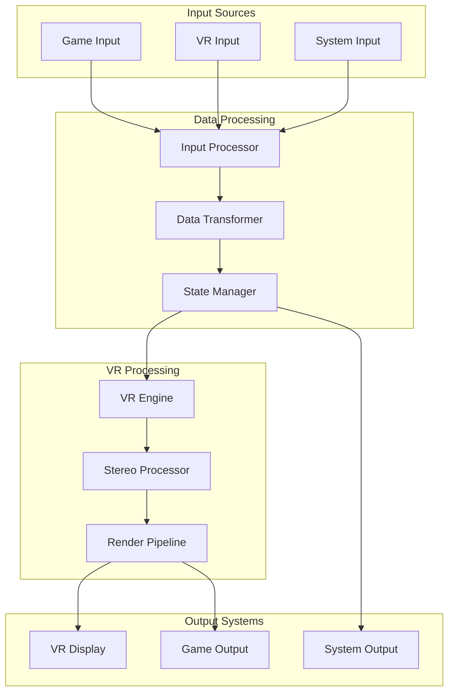
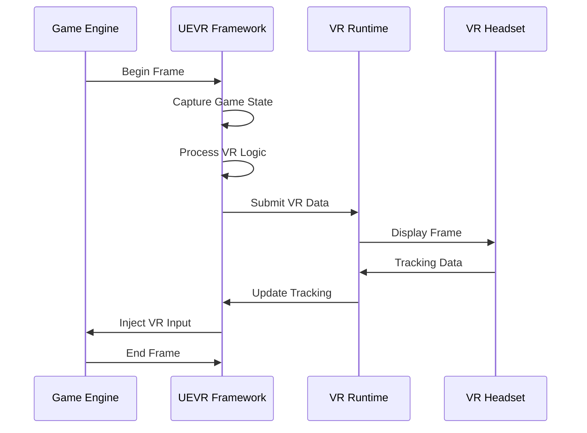
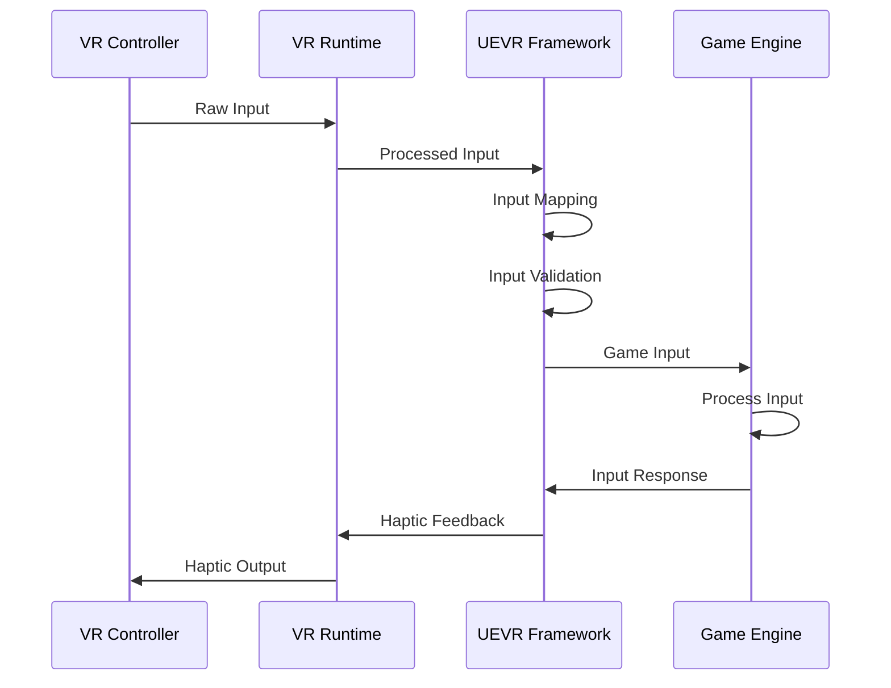
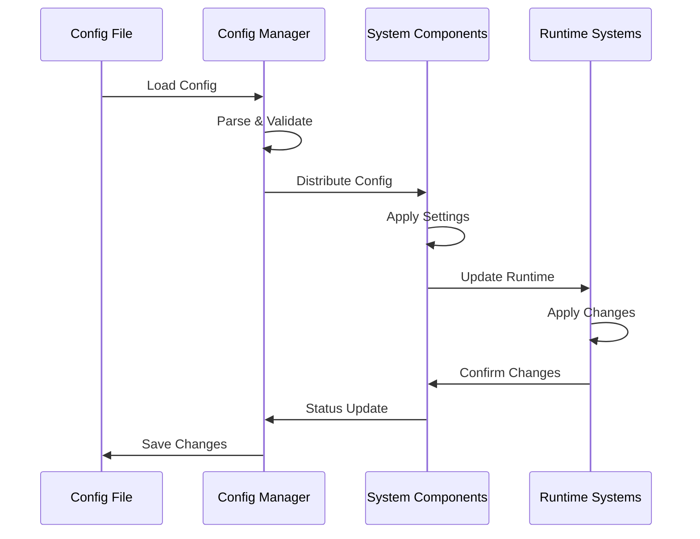
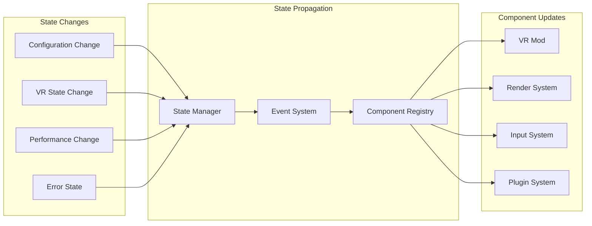
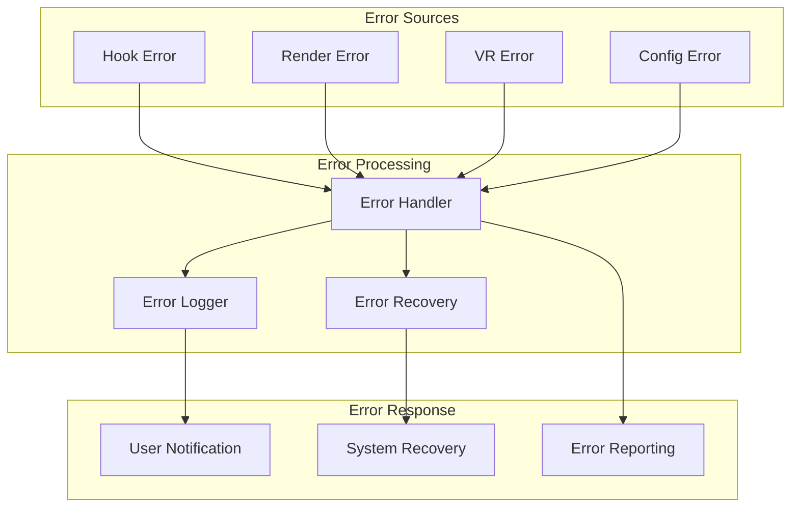

# 🔄 Data Flow

> **How data moves through the UEVR system**

This document provides a detailed explanation of how data flows through the UEVR system, from game input to VR output, covering all major data paths and transformations.

## 🎯 **Data Flow Overview**

### **System Data Architecture**
UEVR processes data through several interconnected pipelines:



## 🔄 **Main Data Flow Paths**

### **1. Frame Processing Pipeline**
The primary data flow for rendering frames:



### **2. Input Processing Flow**
How input data flows through the system:



### **3. Configuration Data Flow**
How configuration data propagates through the system:



## 📊 **Data Structures**

### **Core Data Types**
The fundamental data structures used throughout the system:

#### **Frame Data**
```cpp
struct FrameData {
    // Frame identification
    uint64_t frame_number;
    std::chrono::high_resolution_clock::time_point timestamp;
    
    // Rendering data
    DirectX::XMFLOAT4X4 view_matrix;
    DirectX::XMFLOAT4X4 projection_matrix;
    DirectX::XMFLOAT3 camera_position;
    DirectX::XMFLOAT3 camera_direction;
    
    // Performance metrics
    float frame_time;
    float gpu_time;
    float cpu_time;
    
    // VR-specific data
    bool vr_enabled;
    float ipd;
    float render_scale;
};
```

#### **VR Input Data**
```cpp
struct VRInputData {
    // Head tracking
    DirectX::XMFLOAT3 head_position;
    DirectX::XMFLOAT4 head_rotation;
    DirectX::XMFLOAT3 head_velocity;
    DirectX::XMFLOAT3 head_angular_velocity;
    
    // Controller data
    struct ControllerData {
        DirectX::XMFLOAT3 position;
        DirectX::XMFLOAT4 rotation;
        DirectX::XMFLOAT3 velocity;
        DirectX::XMFLOAT3 angular_velocity;
        
        // Button states
        bool trigger_pressed;
        bool grip_pressed;
        bool menu_pressed;
        bool system_pressed;
        
        // Analog inputs
        DirectX::XMFLOAT2 thumbstick;
        DirectX::XMFLOAT2 trackpad;
        float trigger_value;
        float grip_value;
    };
    
    std::array<ControllerData, 2> controllers;
    
    // Room scale data
    DirectX::XMFLOAT3 room_position;
    DirectX::XMFLOAT4 room_rotation;
    bool room_scale_active;
};
```

#### **Stereo Rendering Data**
```cpp
struct StereoRenderingData {
    // Eye-specific data
    struct EyeData {
        DirectX::XMFLOAT4X4 view_matrix;
        DirectX::XMFLOAT4X4 projection_matrix;
        DirectX::XMFLOAT3 eye_offset;
        float fov;
        float aspect_ratio;
    };
    
    EyeData left_eye;
    EyeData right_eye;
    
    // Rendering configuration
    bool alternate_frame_rendering;
    bool dynamic_resolution;
    float render_scale;
    
    // Performance settings
    int target_fps;
    bool vsync_enabled;
    bool adaptive_quality;
};
```

## 🔄 **Data Transformation Pipeline**

### **Input Data Transformation**
How raw input data is processed and transformed:

#### **Raw Input Processing**
```cpp
class InputDataProcessor {
public:
    // Process raw VR input
    VRInputData process_raw_input(const RawVRInput& raw_input);
    
    // Apply input filtering
    VRInputData apply_input_filtering(const VRInputData& input);
    
    // Map to game input
    GameInputData map_to_game_input(const VRInputData& vr_input);
    
    // Validate input data
    bool validate_input_data(const VRInputData& input);
    
private:
    // Input filtering
    DirectX::XMFLOAT3 apply_deadzone(const DirectX::XMFLOAT3& input, float deadzone);
    DirectX::XMFLOAT3 apply_smoothing(const DirectX::XMFLOAT3& input, float smoothing_factor);
    
    // Input mapping
    InputMapping m_input_mapping;
    InputConfig m_input_config;
};
```

#### **Input Validation**
```cpp
class InputValidator {
public:
    // Validate input ranges
    bool validate_position_range(const DirectX::XMFLOAT3& position);
    bool validate_rotation_range(const DirectX::XMFLOAT4& rotation);
    bool validate_velocity_range(const DirectX::XMFLOAT3& velocity);
    
    // Check for anomalies
    bool detect_input_anomalies(const VRInputData& input);
    bool validate_tracking_consistency(const VRInputData& input);
    
    // Input sanitization
    VRInputData sanitize_input(const VRInputData& input);
    
private:
    // Validation thresholds
    float m_max_position_delta;
    float m_max_rotation_delta;
    float m_max_velocity;
    
    // Anomaly detection
    std::deque<VRInputData> m_input_history;
    AnomalyDetector m_anomaly_detector;
};
```

### **Rendering Data Transformation**
How rendering data is processed for VR:

#### **Stereo Matrix Calculation**
```cpp
class StereoMatrixCalculator {
public:
    // Calculate stereo view matrices
    StereoViewMatrices calculate_stereo_matrices(const FrameData& frame_data);
    
    // Apply IPD offset
    DirectX::XMFLOAT4X4 apply_ipd_offset(const DirectX::XMFLOAT4X4& view_matrix, 
                                         float ipd, EyeType eye);
    
    // Calculate projection matrices
    DirectX::XMFLOAT4X4 calculate_projection_matrix(float fov, float aspect_ratio, 
                                                    float near_plane, float far_plane);
    
    // Handle different VR modes
    StereoViewMatrices calculate_room_scale_matrices(const FrameData& frame_data);
    StereoViewMatrices calculate_seated_matrices(const FrameData& frame_data);
    
private:
    // Stereo configuration
    StereoConfig m_stereo_config;
    
    // Matrix calculation helpers
    DirectX::XMFLOAT4X4 create_look_at_matrix(const DirectX::XMFLOAT3& eye, 
                                              const DirectX::XMFLOAT3& target, 
                                              const DirectX::XMFLOAT3& up);
    DirectX::XMFLOAT4X4 create_perspective_matrix(float fov, float aspect_ratio, 
                                                  float near_plane, float far_plane);
};
```

#### **Render Target Management**
```cpp
class RenderTargetManager {
public:
    // Create stereo render targets
    bool create_stereo_targets(const StereoRenderingData& stereo_data);
    
    // Manage render target pool
    RenderTarget* acquire_render_target(uint32_t width, uint32_t height, 
                                      DXGI_FORMAT format);
    void release_render_target(RenderTarget* target);
    
    // Handle dynamic resolution
    bool adjust_render_targets(float scale_factor);
    
    // Optimize for VR
    bool optimize_targets_for_vr();
    
private:
    // Render target pool
    std::vector<std::unique_ptr<RenderTarget>> m_target_pool;
    std::vector<RenderTarget*> m_available_targets;
    
    // Target configuration
    RenderTargetConfig m_target_config;
    
    // Optimization settings
    bool m_enable_dynamic_resolution;
    float m_min_scale_factor;
    float m_max_scale_factor;
};
```

## 🔄 **State Management Data Flow**

### **System State Propagation**
How system state changes propagate through components:

#### **State Change Flow**


#### **State Synchronization**
```cpp
class StateSynchronizer {
public:
    // Synchronize component states
    bool synchronize_states();
    
    // Handle state conflicts
    bool resolve_state_conflicts();
    
    // Validate state consistency
    bool validate_state_consistency();
    
    // Rollback invalid states
    bool rollback_invalid_states();
    
private:
    // State tracking
    std::unordered_map<std::string, ComponentState> m_component_states;
    std::vector<StateConflict> m_state_conflicts;
    
    // State validation
    StateValidator m_state_validator;
    ConflictResolver m_conflict_resolver;
};
```

### **Configuration Data Flow**
How configuration changes propagate through the system:

#### **Configuration Propagation**
```cpp
class ConfigurationPropagator {
public:
    // Propagate configuration changes
    bool propagate_configuration(const Config& config);
    
    // Handle hot-reload
    bool handle_hot_reload(const std::string& config_file);
    
    // Validate configuration
    bool validate_configuration(const Config& config);
    
    // Rollback configuration
    bool rollback_configuration();
    
private:
    // Configuration history
    std::deque<Config> m_config_history;
    size_t m_max_history_size;
    
    // Change tracking
    std::vector<ConfigChange> m_pending_changes;
    std::vector<ConfigChange> m_applied_changes;
    
    // Validation
    ConfigValidator m_config_validator;
};
```

## 🔄 **Performance Data Flow**

### **Performance Monitoring Pipeline**
How performance data is collected and processed:

#### **Performance Data Collection**
```cpp
class PerformanceDataCollector {
public:
    // Collect frame performance data
    FramePerformanceData collect_frame_performance();
    
    // Collect GPU performance data
    GPUPerformanceData collect_gpu_performance();
    
    // Collect memory performance data
    MemoryPerformanceData collect_memory_performance();
    
    // Collect VR-specific performance data
    VRPerformanceData collect_vr_performance();
    
private:
    // Performance counters
    std::unique_ptr<FrameCounter> m_frame_counter;
    std::unique_ptr<GPUProfiler> m_gpu_profiler;
    std::unique_ptr<MemoryProfiler> m_memory_profiler;
    std::unique_ptr<VRProfiler> m_vr_profiler;
    
    // Data aggregation
    PerformanceAggregator m_performance_aggregator;
};
```

#### **Performance Optimization**
```cpp
class PerformanceOptimizer {
public:
    // Analyze performance data
    PerformanceAnalysis analyze_performance(const PerformanceData& data);
    
    // Generate optimization suggestions
    std::vector<OptimizationSuggestion> generate_suggestions(const PerformanceAnalysis& analysis);
    
    // Apply automatic optimizations
    bool apply_automatic_optimizations(const std::vector<OptimizationSuggestion>& suggestions);
    
    // Monitor optimization effectiveness
    bool monitor_optimization_effectiveness();
    
private:
    // Performance analysis
    PerformanceAnalyzer m_performance_analyzer;
    OptimizationEngine m_optimization_engine;
    
    // Optimization tracking
    std::vector<AppliedOptimization> m_applied_optimizations;
    OptimizationEffectivenessTracker m_effectiveness_tracker;
};
```

## 🔄 **Error Handling Data Flow**

### **Error Propagation Pipeline**
How errors flow through the system:

#### **Error Flow**


#### **Error Recovery System**
```cpp
class ErrorRecoverySystem {
public:
    // Handle error recovery
    bool handle_error_recovery(const ErrorInfo& error);
    
    // Attempt automatic recovery
    bool attempt_automatic_recovery(ErrorType error_type);
    
    // Execute recovery strategies
    bool execute_recovery_strategy(const RecoveryStrategy& strategy);
    
    // Monitor recovery success
    bool monitor_recovery_success();
    
private:
    // Recovery strategies
    std::unordered_map<ErrorType, std::vector<RecoveryStrategy>> m_recovery_strategies;
    
    // Recovery tracking
    std::vector<RecoveryAttempt> m_recovery_attempts;
    RecoverySuccessTracker m_success_tracker;
    
    // Strategy execution
    StrategyExecutor m_strategy_executor;
};
```

## 🔄 **Data Persistence Flow**

### **Configuration Persistence**
How configuration data is saved and loaded:

#### **Persistence Pipeline**
```cpp
class ConfigurationPersistence {
public:
    // Save configuration
    bool save_configuration(const Config& config, const std::string& file_path);
    
    // Load configuration
    bool load_configuration(const std::string& file_path, Config& config);
    
    // Auto-save configuration
    bool auto_save_configuration(const Config& config);
    
    // Backup configuration
    bool backup_configuration(const std::string& backup_path);
    
private:
    // File handling
    std::unique_ptr<ConfigFileHandler> m_file_handler;
    
    // Auto-save settings
    bool m_auto_save_enabled;
    std::chrono::seconds m_auto_save_interval;
    std::chrono::system_clock::time_point m_last_auto_save;
    
    // Backup management
    BackupManager m_backup_manager;
};
```

### **Logging Data Flow**
How logging data is processed and stored:

#### **Logging Pipeline**
```cpp
class LoggingPipeline {
public:
    // Process log messages
    bool process_log_message(const LogMessage& message);
    
    // Filter log messages
    std::vector<LogMessage> filter_log_messages(const LogFilter& filter);
    
    // Export log data
    bool export_log_data(const std::string& export_path, const LogExportOptions& options);
    
    // Clean up old logs
    bool cleanup_old_logs(const LogCleanupOptions& options);
    
private:
    // Log storage
    std::unique_ptr<LogStorage> m_log_storage;
    
    // Log filtering
    LogFilterEngine m_filter_engine;
    
    // Log export
    LogExporter m_log_exporter;
    
    // Log cleanup
    LogCleanupManager m_cleanup_manager;
};
```

## 🔄 **Real-time Data Flow**

### **Frame-by-Frame Processing**
The real-time data processing pipeline:

#### **Frame Processing Pipeline**
```cpp
class FrameProcessingPipeline {
public:
    // Process single frame
    bool process_frame(const FrameData& frame_data);
    
    // Handle frame timing
    bool handle_frame_timing();
    
    // Manage frame synchronization
    bool synchronize_frame();
    
    // Optimize frame processing
    bool optimize_frame_processing();
    
private:
    // Frame timing
    FrameTimer m_frame_timer;
    FrameSynchronizer m_frame_synchronizer;
    
    // Processing optimization
    FrameOptimizer m_frame_optimizer;
    
    // Performance tracking
    FramePerformanceTracker m_performance_tracker;
};
```

### **Real-time Input Processing**
How input is processed in real-time:

#### **Input Processing Pipeline**
```cpp
class InputProcessingPipeline {
public:
    // Process input in real-time
    bool process_input_real_time();
    
    // Handle input buffering
    bool handle_input_buffering();
    
    // Process input events
    bool process_input_events();
    
    // Optimize input processing
    bool optimize_input_processing();
    
private:
    // Input buffering
    InputBuffer m_input_buffer;
    InputEventProcessor m_event_processor;
    
    // Input optimization
    InputOptimizer m_input_optimizer;
    
    // Performance tracking
    InputPerformanceTracker m_performance_tracker;
};
```

## 🔄 **Data Flow Optimization**

### **Performance Optimization Strategies**
How data flow is optimized for performance:

#### **Data Flow Optimization**
```cpp
class DataFlowOptimizer {
public:
    // Optimize data flow paths
    bool optimize_data_flow_paths();
    
    // Reduce data copying
    bool reduce_data_copying();
    
    // Optimize memory access patterns
    bool optimize_memory_access();
    
    // Parallelize data processing
    bool parallelize_data_processing();
    
private:
    // Flow analysis
    DataFlowAnalyzer m_flow_analyzer;
    
    // Optimization strategies
    std::vector<std::unique_ptr<OptimizationStrategy>> m_optimization_strategies;
    
    // Performance measurement
    DataFlowPerformanceMeasurer m_performance_measurer;
};
```

### **Memory Management Optimization**
How memory usage is optimized in data flow:

#### **Memory Optimization**
```cpp
class MemoryOptimizer {
public:
    // Optimize memory allocation
    bool optimize_memory_allocation();
    
    // Implement memory pooling
    bool implement_memory_pooling();
    
    // Optimize cache usage
    bool optimize_cache_usage();
    
    // Reduce memory fragmentation
    bool reduce_memory_fragmentation();
    
private:
    // Memory pools
    std::unordered_map<size_t, MemoryPool> m_memory_pools;
    
    // Cache optimization
    CacheOptimizer m_cache_optimizer;
    
    // Fragmentation analysis
    FragmentationAnalyzer m_fragmentation_analyzer;
};
```

---

**🔄 Understanding data flow is crucial for optimizing UEVR's performance and reliability!**

*Previous: [Core Components](core-components.md) | Next: [Design Patterns](design-patterns.md) → [Performance Architecture](performance/architecture.md)*
