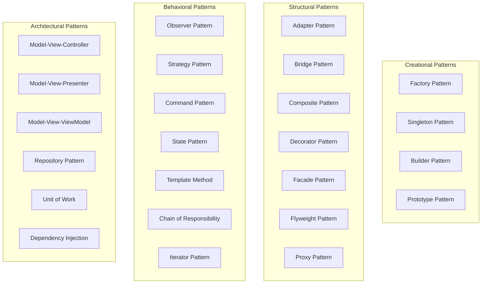

# 🎨 Design Patterns

> **Architectural decisions and patterns used in UEVR**

This document explains the key design patterns and architectural decisions that shape UEVR's system design, providing insights into why certain approaches were chosen and how they contribute to the system's success.

## 🎯 **Design Pattern Overview**

### **Pattern Philosophy**
UEVR's architecture is built around several core design principles:

- **Modularity**: Loose coupling between components for maintainability
- **Extensibility**: Plugin-based architecture for custom functionality
- **Performance**: Optimized patterns for VR rendering requirements
- **Reliability**: Robust error handling and recovery mechanisms
- **Compatibility**: Universal patterns for cross-engine support

### **Pattern Categories**
The system employs patterns from several categories:



## 🏭 **Creational Patterns**

### **Factory Pattern**
Used extensively for creating engine-specific adapters and components:

#### **Adapter Factory**
```cpp
class AdapterFactory {
public:
    // Create adapter based on engine type
    static std::unique_ptr<IVRAdapter> create_adapter(EngineType engine_type);
    
    // Create adapter with configuration
    static std::unique_ptr<IVRAdapter> create_adapter(EngineType engine_type, 
                                                     const AdapterConfig& config);
    
    // Register custom adapter creators
    static void register_adapter_creator(EngineType engine_type, 
                                       AdapterCreator creator);
    
private:
    // Adapter creation functions
    static std::unique_ptr<IVRAdapter> create_mt_framework_adapter();
    static std::unique_ptr<IVRAdapter> create_re_engine_adapter();
    static std::unique_ptr<IVRAdapter> create_redengine4_adapter();
    static std::unique_ptr<IVRAdapter> create_unreal_engine_adapter();
    
    // Custom adapter registry
    static std::unordered_map<EngineType, AdapterCreator> s_custom_creators;
};

// Usage example
auto adapter = AdapterFactory::create_adapter(EngineType::MT_FRAMEWORK);
```

#### **Component Factory**
```cpp
class ComponentFactory {
public:
    // Create components with dependencies
    template<typename T, typename... Args>
    static std::unique_ptr<T> create_component(Args&&... args);
    
    // Create component with configuration
    template<typename T>
    static std::unique_ptr<T> create_component_with_config(const ComponentConfig& config);
    
    // Register component creators
    template<typename T>
    static void register_component_creator(ComponentCreator<T> creator);
    
private:
    // Component registry
    static std::unordered_map<std::type_index, std::function<std::unique_ptr<IComponent>()>> s_creators;
};

// Usage example
auto vr_mod = ComponentFactory::create_component<VRMod>(vr_config);
```

### **Singleton Pattern**
Used for global system components that need single instances:

#### **Framework Singleton**
```cpp
class Framework {
public:
    // Singleton access
    static Framework& get_instance();
    
    // Prevent copying
    Framework(const Framework&) = delete;
    Framework& operator=(const Framework&) = delete;
    
    // System lifecycle
    bool initialize();
    void shutdown();
    bool is_running() const;
    
private:
    // Private constructor
    Framework() = default;
    
    // Instance management
    static std::unique_ptr<Framework> s_instance;
    static std::mutex s_instance_mutex;
    
    // System state
    SystemState m_state;
    std::vector<std::unique_ptr<IComponent>> m_components;
};

// Thread-safe singleton implementation
Framework& Framework::get_instance() {
    std::lock_guard<std::mutex> lock(s_instance_mutex);
    if (!s_instance) {
        s_instance = std::make_unique<Framework>();
    }
    return *s_instance;
}
```

#### **Configuration Manager Singleton**
```cpp
class ConfigManager {
public:
    // Singleton access
    static ConfigManager& get_instance();
    
    // Configuration management
    bool load_config(const std::string& file_path);
    bool save_config(const std::string& file_path);
    
    // Configuration access
    template<typename T>
    T get_value(const std::string& key, const T& default_value = T{}) const;
    
    template<typename T>
    void set_value(const std::string& key, const T& value);
    
private:
    ConfigManager() = default;
    static std::unique_ptr<ConfigManager> s_instance;
    static std::mutex s_instance_mutex;
    
    Config m_config;
    std::string m_config_file;
};
```

### **Builder Pattern**
Used for constructing complex objects with many optional parameters:

#### **VR Configuration Builder**
```cpp
class VRConfigBuilder {
public:
    // Basic VR settings
    VRConfigBuilder& set_enabled(bool enabled);
    VRConfigBuilder& set_render_scale(float scale);
    VRConfigBuilder& set_ipd(float ipd);
    
    // Performance settings
    VRConfigBuilder& set_target_fps(int fps);
    VRConfigBuilder& set_quality_preset(QualityPreset preset);
    VRConfigBuilder& enable_afr(bool enable);
    
    // Input settings
    VRConfigBuilder& set_snap_turn_angle(float angle);
    VRConfigBuilder& set_deadzone(float deadzone);
    VRConfigBuilder& enable_haptics(bool enable);
    
    // Build the configuration
    VRConfig build() const;
    
private:
    VRConfig m_config;
};

// Usage example
VRConfig config = VRConfigBuilder()
    .set_enabled(true)
    .set_render_scale(1.0f)
    .set_ipd(64.0f)
    .set_target_fps(90)
    .set_quality_preset(QualityPreset::Balanced)
    .enable_afr(false)
    .set_snap_turn_angle(45.0f)
    .set_deadzone(0.1f)
    .enable_haptics(true)
    .build();
```

#### **Hook Configuration Builder**
```cpp
class HookConfigBuilder {
public:
    // Hook type configuration
    HookConfigBuilder& set_hook_type(HookType type);
    HookConfigBuilder& set_target_address(uintptr_t address);
    HookConfigBuilder& set_hook_size(size_t size);
    
    // Hook behavior
    HookConfigBuilder& set_priority(HookPriority priority);
    HookConfigBuilder& enable_chain_hooks(bool enable);
    HookConfigBuilder& set_error_handling(ErrorHandlingMode mode);
    
    // Build the configuration
    HookConfig build() const;
    
private:
    HookConfig m_config;
};
```

## 🏗️ **Structural Patterns**

### **Adapter Pattern**
Core pattern for supporting different game engines:

#### **VR Adapter Interface**
```cpp
class IVRAdapter {
public:
    virtual ~IVRAdapter() = default;
    
    // Core adapter functionality
    virtual bool initialize() = 0;
    virtual bool inject_vr() = 0;
    virtual bool cleanup() = 0;
    
    // Engine-specific information
    virtual EngineType get_engine_type() const = 0;
    virtual std::string get_adapter_name() const = 0;
    virtual std::string get_engine_version() const = 0;
    
    // VR functionality
    virtual bool enable_vr_mode() = 0;
    virtual bool disable_vr_mode() = 0;
    virtual bool is_vr_enabled() const = 0;
    
    // Configuration
    virtual bool load_config(const AdapterConfig& config) = 0;
    virtual AdapterConfig get_config() const = 0;
};

// MT Framework Adapter Implementation
class MTFrameworkAdapter : public IVRAdapter {
public:
    bool initialize() override;
    bool inject_vr() override;
    bool cleanup() override;
    
    EngineType get_engine_type() const override { return EngineType::MT_FRAMEWORK; }
    std::string get_adapter_name() const override { return "MT Framework VR Adapter"; }
    std::string get_engine_version() const override;
    
    bool enable_vr_mode() override;
    bool disable_vr_mode() override;
    bool is_vr_enabled() const override;
    
    bool load_config(const AdapterConfig& config) override;
    AdapterConfig get_config() const override;
    
private:
    // MT Framework specific implementation
    bool hook_mt_framework_functions();
    bool setup_stereo_rendering();
    bool configure_vr_input();
    
    MTFrameworkState m_state;
    AdapterConfig m_config;
};
```

#### **Rendering Adapter**
```cpp
class IRenderingAdapter {
public:
    virtual ~IRenderingAdapter() = default;
    
    // Rendering functionality
    virtual bool initialize_rendering() = 0;
    virtual bool create_stereo_targets() = 0;
    virtual bool render_stereo_frame() = 0;
    virtual bool cleanup_rendering() = 0;
    
    // API-specific information
    virtual RenderingAPI get_api_type() const = 0;
    virtual std::string get_api_version() const = 0;
    
    // Performance
    virtual bool enable_optimizations() = 0;
    virtual PerformanceMetrics get_performance_metrics() const = 0;
};

// DirectX 11 Adapter Implementation
class D3D11RenderingAdapter : public IRenderingAdapter {
public:
    bool initialize_rendering() override;
    bool create_stereo_targets() override;
    bool render_stereo_frame() override;
    bool cleanup_rendering() override;
    
    RenderingAPI get_api_type() const override { return RenderingAPI::DirectX11; }
    std::string get_api_version() const override;
    
    bool enable_optimizations() override;
    PerformanceMetrics get_performance_metrics() const override;
    
private:
    // D3D11 specific implementation
    bool hook_d3d11_device();
    bool create_stereo_render_targets();
    bool setup_stereo_rendering();
    
    ID3D11Device* m_device;
    ID3D11DeviceContext* m_context;
    D3D11State m_state;
};
```

### **Bridge Pattern**
Used to separate abstraction from implementation:

#### **VR Runtime Bridge**
```cpp
// Abstraction
class IVRRuntime {
public:
    virtual ~IVRRuntime() = default;
    
    // VR runtime interface
    virtual bool initialize() = 0;
    virtual bool submit_frame(const VRFrame& frame) = 0;
    virtual bool get_tracking_data(TrackingData& data) = 0;
    virtual bool shutdown() = 0;
    
    // Runtime information
    virtual std::string get_runtime_name() const = 0;
    virtual std::string get_runtime_version() const = 0;
    virtual bool is_runtime_active() const = 0;
};

// Implementation
class OpenVRRuntime : public IVRRuntime {
public:
    bool initialize() override;
    bool submit_frame(const VRFrame& frame) override;
    bool get_tracking_data(TrackingData& data) override;
    bool shutdown() override;
    
    std::string get_runtime_name() const override { return "OpenVR"; }
    std::string get_runtime_version() const override;
    bool is_runtime_active() const override;
    
private:
    // OpenVR specific implementation
    bool initialize_openvr();
    bool setup_tracking();
    bool configure_rendering();
    
    vr::IVRSystem* m_vr_system;
    vr::IVRCompositor* m_compositor;
    OpenVRState m_state;
};

// Refined abstraction
class VRRuntimeManager {
public:
    VRRuntimeManager(std::unique_ptr<IVRRuntime> runtime);
    
    // High-level VR operations
    bool enable_vr();
    bool disable_vr();
    bool submit_stereo_frame(const StereoFrame& frame);
    bool update_tracking();
    
    // Runtime management
    bool switch_runtime(std::unique_ptr<IVRRuntime> new_runtime);
    bool is_vr_active() const;
    
private:
    std::unique_ptr<IVRRuntime> m_runtime;
    VRState m_state;
};
```

### **Composite Pattern**
Used for managing complex component hierarchies:

#### **Component Hierarchy**
```cpp
class IComponent {
public:
    virtual ~IComponent() = default;
    
    // Component lifecycle
    virtual bool initialize() = 0;
    virtual void shutdown() = 0;
    virtual void update(float delta_time) = 0;
    
    // Component information
    virtual std::string get_name() const = 0;
    virtual ComponentType get_type() const = 0;
    
    // Hierarchy management
    virtual void add_child(std::unique_ptr<IComponent> child) = 0;
    virtual void remove_child(const std::string& child_name) = 0;
    virtual IComponent* get_child(const std::string& child_name) const = 0;
    virtual std::vector<IComponent*> get_children() const = 0;
    
    // Parent relationship
    virtual void set_parent(IComponent* parent) = 0;
    virtual IComponent* get_parent() const = 0;
};

// Leaf component
class VRMod : public IComponent {
public:
    bool initialize() override;
    void shutdown() override;
    void update(float delta_time) override;
    
    std::string get_name() const override { return "VR Mod"; }
    ComponentType get_type() const override { return ComponentType::VR; }
    
    // Leaf components don't have children
    void add_child(std::unique_ptr<IComponent> child) override {}
    void remove_child(const std::string& child_name) override {}
    IComponent* get_child(const std::string& child_name) const override { return nullptr; }
    std::vector<IComponent*> get_children() const override { return {}; }
    
    void set_parent(IComponent* parent) override { m_parent = parent; }
    IComponent* get_parent() const override { return m_parent; }
    
private:
    IComponent* m_parent;
    VRState m_state;
};

// Composite component
class ModSystem : public IComponent {
public:
    bool initialize() override;
    void shutdown() override;
    void update(float delta_time) override;
    
    std::string get_name() const override { return "Mod System"; }
    ComponentType get_type() const override { return ComponentType::System; }
    
    // Composite components manage children
    void add_child(std::unique_ptr<IComponent> child) override;
    void remove_child(const std::string& child_name) override;
    IComponent* get_child(const std::string& child_name) const override;
    std::vector<IComponent*> get_children() const override;
    
    void set_parent(IComponent* parent) override { m_parent = parent; }
    IComponent* get_parent() const override { return m_parent; }
    
private:
    IComponent* m_parent;
    std::vector<std::unique_ptr<IComponent>> m_children;
    std::unordered_map<std::string, IComponent*> m_child_map;
};
```

### **Decorator Pattern**
Used for adding functionality to components dynamically:

#### **VR Mod Decorators**
```cpp
class VRModDecorator : public IComponent {
public:
    VRModDecorator(std::unique_ptr<IComponent> component);
    
    // Delegate to wrapped component
    bool initialize() override { return m_component->initialize(); }
    void shutdown() override { m_component->shutdown(); }
    void update(float delta_time) override { m_component->update(delta_time); }
    
    std::string get_name() const override { return m_component->get_name(); }
    ComponentType get_type() const override { return m_component->get_type(); }
    
protected:
    std::unique_ptr<IComponent> m_component;
};

// Performance monitoring decorator
class PerformanceMonitorDecorator : public VRModDecorator {
public:
    PerformanceMonitorDecorator(std::unique_ptr<IComponent> component);
    
    bool initialize() override;
    void update(float delta_time) override;
    
private:
    // Performance monitoring
    void start_performance_tracking();
    void end_performance_tracking();
    void record_performance_metrics();
    
    PerformanceTracker m_performance_tracker;
    std::chrono::high_resolution_clock::time_point m_frame_start;
};

// Logging decorator
class LoggingDecorator : public VRModDecorator {
public:
    LoggingDecorator(std::unique_ptr<IComponent> component);
    
    bool initialize() override;
    void shutdown() override;
    void update(float delta_time) override;
    
private:
    // Logging functionality
    void log_operation(const std::string& operation);
    void log_error(const std::string& error);
    void log_performance(const PerformanceMetrics& metrics);
    
    Logger m_logger;
};

// Usage example
auto vr_mod = std::make_unique<VRMod>();
auto monitored_mod = std::make_unique<PerformanceMonitorDecorator>(std::move(vr_mod));
auto logged_mod = std::make_unique<LoggingDecorator>(std::move(monitored_mod));
```

### **Facade Pattern**
Used to provide simplified interfaces to complex subsystems:

#### **VR System Facade**
```cpp
class VRSystemFacade {
public:
    // Simplified VR interface
    bool enable_vr();
    bool disable_vr();
    bool is_vr_enabled() const;
    
    // Simple configuration
    bool set_vr_settings(const VRUserSettings& settings);
    VRUserSettings get_vr_settings() const;
    
    // Easy access to common features
    bool set_render_quality(QualityLevel quality);
    bool set_comfort_settings(const ComfortSettings& settings);
    bool calibrate_vr();
    
    // Status information
    VRStatus get_vr_status() const;
    std::string get_vr_info() const;
    
private:
    // Complex subsystems
    std::unique_ptr<VRMod> m_vr_mod;
    std::unique_ptr<StereoRenderer> m_stereo_renderer;
    std::unique_ptr<InputManager> m_input_manager;
    std::unique_ptr<TrackingManager> m_tracking_manager;
    std::unique_ptr<PerformanceManager> m_performance_manager;
    
    // Configuration management
    std::unique_ptr<ConfigManager> m_config_manager;
    
    // Helper methods
    bool initialize_subsystems();
    bool validate_settings(const VRUserSettings& settings);
    void apply_settings(const VRUserSettings& settings);
};

// Usage example
VRSystemFacade vr_system;
vr_system.enable_vr();
vr_system.set_render_quality(QualityLevel::High);
vr_system.set_comfort_settings(ComfortSettings::Default);
```

### **Flyweight Pattern**
Used for sharing common data between components:

#### **Shader Flyweight**
```cpp
class ShaderFlyweight {
public:
    // Get shared shader
    static ShaderHandle get_shader(const ShaderKey& key);
    
    // Release shader reference
    static void release_shader(ShaderHandle handle);
    
    // Shader management
    static bool preload_common_shaders();
    static void cleanup_unused_shaders();
    
private:
    // Shader cache
    static std::unordered_map<ShaderKey, ShaderData> s_shader_cache;
    static std::unordered_map<ShaderHandle, ShaderReference> s_shader_references;
    
    // Shader key for identification
    struct ShaderKey {
        std::string name;
        ShaderType type;
        std::vector<std::string> defines;
        
        bool operator==(const ShaderKey& other) const;
        size_t hash() const;
    };
    
    // Shader data
    struct ShaderData {
        ShaderHandle handle;
        std::string compiled_code;
        std::vector<std::string> dependencies;
        std::chrono::system_clock::time_point last_used;
    };
    
    // Shader reference counting
    struct ShaderReference {
        ShaderKey key;
        size_t reference_count;
        std::chrono::system_clock::time_point last_accessed;
    };
};

// Usage example
auto vertex_shader = ShaderFlyweight::get_shader({"BasicVertex", ShaderType::Vertex, {}});
auto pixel_shader = ShaderFlyweight::get_shader({"BasicPixel", ShaderType::Pixel, {}});
```

### **Proxy Pattern**
Used for controlling access to expensive resources:

#### **Render Target Proxy**
```cpp
class IRenderTarget {
public:
    virtual ~IRenderTarget() = default;
    
    // Render target interface
    virtual bool bind() = 0;
    virtual bool unbind() = 0;
    virtual bool clear() = 0;
    
    // Resource information
    virtual uint32_t get_width() const = 0;
    virtual uint32_t get_height() const = 0;
    virtual DXGI_FORMAT get_format() const = 0;
    
    // Resource management
    virtual bool is_valid() const = 0;
    virtual void invalidate() = 0;
};

// Real render target
class RenderTarget : public IRenderTarget {
public:
    bool bind() override;
    bool unbind() override;
    bool clear() override;
    
    uint32_t get_width() const override { return m_width; }
    uint32_t get_height() const override { return m_height; }
    DXGI_FORMAT get_format() const override { return m_format; }
    
    bool is_valid() const override { return m_resource != nullptr; }
    void invalidate() override;
    
private:
    ID3D11Resource* m_resource;
    ID3D11RenderTargetView* m_rtv;
    uint32_t m_width;
    uint32_t m_height;
    DXGI_FORMAT m_format;
};

// Proxy render target
class RenderTargetProxy : public IRenderTarget {
public:
    RenderTargetProxy(const RenderTargetKey& key);
    
    bool bind() override;
    bool unbind() override;
    bool clear() override;
    
    uint32_t get_width() const override;
    uint32_t get_height() const override;
    DXGI_FORMAT get_format() const override;
    
    bool is_valid() const override;
    void invalidate() override;
    
private:
    // Lazy initialization
    bool ensure_initialized();
    
    RenderTargetKey m_key;
    std::unique_ptr<RenderTarget> m_real_target;
    bool m_initialized;
    
    // Resource pooling
    static std::unordered_map<RenderTargetKey, std::weak_ptr<RenderTarget>> s_target_pool;
    static std::mutex s_pool_mutex;
};
```

## 🎭 **Behavioral Patterns**

### **Observer Pattern**
Used for event-driven communication between components:

#### **Event System**
```cpp
class Event {
public:
    Event(EventType type, const EventData& data = {});
    
    EventType get_type() const { return m_type; }
    const EventData& get_data() const { return m_data; }
    std::chrono::system_clock::time_point get_timestamp() const { return m_timestamp; }
    
private:
    EventType m_type;
    EventData m_data;
    std::chrono::system_clock::time_point m_timestamp;
};

class IEventObserver {
public:
    virtual ~IEventObserver() = default;
    virtual void on_event(const Event& event) = 0;
};

class EventSystem {
public:
    // Observer management
    void subscribe(EventType type, IEventObserver* observer);
    void unsubscribe(EventType type, IEventObserver* observer);
    
    // Event dispatching
    void dispatch_event(const Event& event);
    void dispatch_event(EventType type, const EventData& data = {});
    
    // Event queuing
    void queue_event(const Event& event);
    void process_event_queue();
    
private:
    std::unordered_map<EventType, std::vector<IEventObserver*>> m_observers;
    std::queue<Event> m_event_queue;
    std::mutex m_mutex;
};

// Usage example
class VRMod : public IEventObserver {
public:
    void on_event(const Event& event) override {
        switch (event.get_type()) {
            case EventType::VRStateChanged:
                handle_vr_state_change(event.get_data());
                break;
            case EventType::PerformanceWarning:
                handle_performance_warning(event.get_data());
                break;
        }
    }
    
private:
    void handle_vr_state_change(const EventData& data);
    void handle_performance_warning(const EventData& data);
};
```

### **Strategy Pattern**
Used for interchangeable algorithms and behaviors:

#### **Rendering Strategy**
```cpp
class IRenderingStrategy {
public:
    virtual ~IRenderingStrategy() = default;
    
    virtual bool render_frame(const FrameData& frame_data) = 0;
    virtual bool setup_rendering() = 0;
    virtual bool cleanup_rendering() = 0;
    
    virtual std::string get_strategy_name() const = 0;
    virtual PerformanceMetrics get_performance_metrics() const = 0;
};

// Standard rendering strategy
class StandardRenderingStrategy : public IRenderingStrategy {
public:
    bool render_frame(const FrameData& frame_data) override;
    bool setup_rendering() override;
    bool cleanup_rendering() override;
    
    std::string get_strategy_name() const override { return "Standard"; }
    PerformanceMetrics get_performance_metrics() const override;
    
private:
    bool render_left_eye();
    bool render_right_eye();
    bool submit_to_vr();
};

// AFR rendering strategy
class AFRRenderingStrategy : public IRenderingStrategy {
public:
    bool render_frame(const FrameData& frame_data) override;
    bool setup_rendering() override;
    bool cleanup_rendering() override;
    
    std::string get_strategy_name() const override { return "AFR"; }
    PerformanceMetrics get_performance_metrics() const override;
    
private:
    bool render_alternate_eyes();
    bool manage_frame_timing();
    
    bool m_left_eye_frame;
    std::chrono::high_resolution_clock::time_point m_last_frame_time;
};

// Rendering context
class RenderingContext {
public:
    void set_strategy(std::unique_ptr<IRenderingStrategy> strategy);
    
    bool render_frame(const FrameData& frame_data);
    bool setup_rendering();
    bool cleanup_rendering();
    
    std::string get_current_strategy() const;
    PerformanceMetrics get_performance_metrics() const;
    
private:
    std::unique_ptr<IRenderingStrategy> m_strategy;
};

// Usage example
auto standard_strategy = std::make_unique<StandardRenderingStrategy>();
auto afr_strategy = std::make_unique<AFRRenderingStrategy>();

RenderingContext context;
context.set_strategy(std::move(standard_strategy));

// Switch strategies based on performance
if (performance_is_low()) {
    context.set_strategy(std::move(afr_strategy));
}
```

### **Command Pattern**
Used for encapsulating requests as objects:

#### **VR Command System**
```cpp
class IVRCommand {
public:
    virtual ~IVRCommand() = default;
    
    virtual bool execute() = 0;
    virtual bool undo() = 0;
    virtual std::string get_description() const = 0;
    
    virtual bool can_execute() const = 0;
    virtual bool can_undo() const = 0;
};

// Enable VR command
class EnableVRCommand : public IVRCommand {
public:
    EnableVRCommand(VRMod* vr_mod);
    
    bool execute() override;
    bool undo() override;
    std::string get_description() const override { return "Enable VR Mode"; }
    
    bool can_execute() const override;
    bool can_undo() const override;
    
private:
    VRMod* m_vr_mod;
    bool m_previous_state;
    bool m_executed;
};

// Change render quality command
class ChangeRenderQualityCommand : public IVRCommand {
public:
    ChangeRenderQualityCommand(VRMod* vr_mod, QualityLevel new_quality);
    
    bool execute() override;
    bool undo() override;
    std::string get_description() const override { return "Change Render Quality"; }
    
    bool can_execute() const override;
    bool can_undo() const override;
    
private:
    VRMod* m_vr_mod;
    QualityLevel m_new_quality;
    QualityLevel m_previous_quality;
    bool m_executed;
};

// Command invoker
class CommandInvoker {
public:
    // Execute command
    bool execute_command(std::unique_ptr<IVRCommand> command);
    
    // Undo last command
    bool undo_last_command();
    
    // Redo last undone command
    bool redo_last_command();
    
    // Command history
    const std::vector<std::unique_ptr<IVRCommand>>& get_command_history() const;
    const std::vector<std::unique_ptr<IVRCommand>>& get_undo_history() const;
    
private:
    std::vector<std::unique_ptr<IVRCommand>> m_command_history;
    std::vector<std::unique_ptr<IVRCommand>> m_undo_history;
    size_t m_max_history_size;
};

// Usage example
CommandInvoker invoker;
invoker.execute_command(std::make_unique<EnableVRCommand>(&vr_mod));
invoker.execute_command(std::make_unique<ChangeRenderQualityCommand>(&vr_mod, QualityLevel::High));

// Undo last command
invoker.undo_last_command();
```

### **State Pattern**
Used for managing component state transitions:

#### **VR State Management**
```cpp
class IVRState {
public:
    virtual ~IVRState() = default;
    
    virtual void enter(VRMod* vr_mod) = 0;
    virtual void exit(VRMod* vr_mod) = 0;
    virtual void update(VRMod* vr_mod, float delta_time) = 0;
    
    virtual std::string get_state_name() const = 0;
    virtual bool can_transition_to(const std::string& target_state) const = 0;
};

// Disabled VR state
class VRDisabledState : public IVRState {
public:
    void enter(VRMod* vr_mod) override;
    void exit(VRMod* vr_mod) override;
    void update(VRMod* vr_mod, float delta_time) override;
    
    std::string get_state_name() const override { return "Disabled"; }
    bool can_transition_to(const std::string& target_state) const override;
    
private:
    void cleanup_vr_resources(VRMod* vr_mod);
};

// Enabled VR state
class VREnabledState : public IVRState {
public:
    void enter(VRMod* vr_mod) override;
    void exit(VRMod* vr_mod) override;
    void update(VRMod* vr_mod, float delta_time) override;
    
    std::string get_state_name() const override { return "Enabled"; }
    bool can_transition_to(const std::string& target_state) const override;
    
private:
    void initialize_vr_resources(VRMod* vr_mod);
    void update_vr_rendering(VRMod* vr_mod);
};

// VR state machine
class VRStateMachine {
public:
    VRStateMachine();
    
    // State transitions
    bool transition_to(const std::string& target_state);
    bool can_transition_to(const std::string& target_state) const;
    
    // State management
    void update(float delta_time);
    std::string get_current_state() const;
    
    // State registration
    void register_state(std::unique_ptr<IVRState> state);
    
private:
    std::unique_ptr<IVRState> m_current_state;
    std::unordered_map<std::string, std::unique_ptr<IVRState>> m_states;
    VRMod* m_vr_mod;
};

// Usage example
VRStateMachine state_machine;
state_machine.register_state(std::make_unique<VRDisabledState>());
state_machine.register_state(std::make_unique<VREnabledState>());

// Transition to enabled state
state_machine.transition_to("Enabled");
```

## 🏛️ **Architectural Patterns**

### **Model-View-Controller (MVC)**
Used for the UI system:

#### **VR UI MVC**
```cpp
// Model - VR configuration and state
class VRConfigurationModel {
public:
    // Configuration data
    VRConfig get_vr_config() const;
    void set_vr_config(const VRConfig& config);
    
    // State data
    VRState get_vr_state() const;
    bool is_vr_enabled() const;
    
    // Notify observers of changes
    void add_observer(IConfigObserver* observer);
    void remove_observer(IConfigObserver* observer);
    
private:
    VRConfig m_config;
    VRState m_state;
    std::vector<IConfigObserver*> m_observers;
    
    void notify_observers();
};

// View - ImGui UI rendering
class VRUIView {
public:
    void render();
    void set_model(VRConfigurationModel* model);
    
private:
    VRConfigurationModel* m_model;
    
    void render_vr_settings();
    void render_performance_settings();
    void render_input_settings();
    void render_debug_info();
};

// Controller - UI event handling
class VRUIController {
public:
    VRUIController(VRConfigurationModel* model, VRUIView* view);
    
    void handle_input();
    void update();
    
private:
    VRConfigurationModel* m_model;
    VRUIView* m_view;
    
    void handle_vr_toggle();
    void handle_quality_change();
    void handle_input_mapping();
};
```

### **Dependency Injection**
Used for component management:

#### **Service Container**
```cpp
class ServiceContainer {
public:
    // Service registration
    template<typename T>
    void register_service(std::unique_ptr<T> service);
    
    template<typename T>
    void register_service(T* service);
    
    // Service resolution
    template<typename T>
    T* resolve_service() const;
    
    template<typename T>
    std::vector<T*> resolve_services() const;
    
    // Service lifecycle
    void initialize_all_services();
    void shutdown_all_services();
    
private:
    std::unordered_map<std::type_index, std::shared_ptr<void>> m_services;
    std::mutex m_services_mutex;
};

// Usage example
ServiceContainer container;
container.register_service(std::make_unique<ConfigManager>());
container.register_service(std::make_unique<LogManager>());
container.register_service(std::make_unique<VRMod>());

// Resolve services
auto config_manager = container.resolve_service<ConfigManager>();
auto log_manager = container.resolve_service<LogManager>();
auto vr_mod = container.resolve_service<VRMod>();
```

## 🔄 **Pattern Combinations**

### **Composite + Observer + Command**
Used for the mod system:

```cpp
class ModSystem : public IComponent, public IEventObserver {
public:
    bool initialize() override;
    void shutdown() override;
    void update(float delta_time) override;
    
    // Event handling
    void on_event(const Event& event) override;
    
    // Mod management
    bool load_mod(const std::string& mod_path);
    bool unload_mod(const std::string& mod_name);
    
    // Command execution
    bool execute_mod_command(const std::string& mod_name, const std::string& command);
    
private:
    // Composite pattern for mod hierarchy
    std::vector<std::unique_ptr<IComponent>> m_mods;
    
    // Observer pattern for mod communication
    EventSystem m_event_system;
    
    // Command pattern for mod operations
    CommandInvoker m_command_invoker;
};
```

### **Factory + Strategy + Decorator**
Used for rendering system:

```cpp
class RenderingSystem {
public:
    // Factory pattern for creating renderers
    std::unique_ptr<IRenderer> create_renderer(RenderingAPI api);
    
    // Strategy pattern for rendering algorithms
    void set_rendering_strategy(std::unique_ptr<IRenderingStrategy> strategy);
    
    // Decorator pattern for adding features
    std::unique_ptr<IRenderer> add_performance_monitoring(std::unique_ptr<IRenderer> renderer);
    std::unique_ptr<IRenderer> add_logging(std::unique_ptr<IRenderer> renderer);
    
private:
    RenderingFactory m_factory;
    RenderingContext m_context;
};
```

---

**🎨 These design patterns provide the foundation for UEVR's robust and extensible architecture!**

*Previous: [Data Flow](data-flow.md) | Next: [Performance Architecture](performance/architecture.md) → [Security Architecture](security/architecture.md)*
