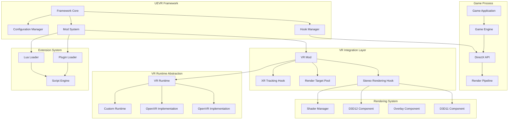
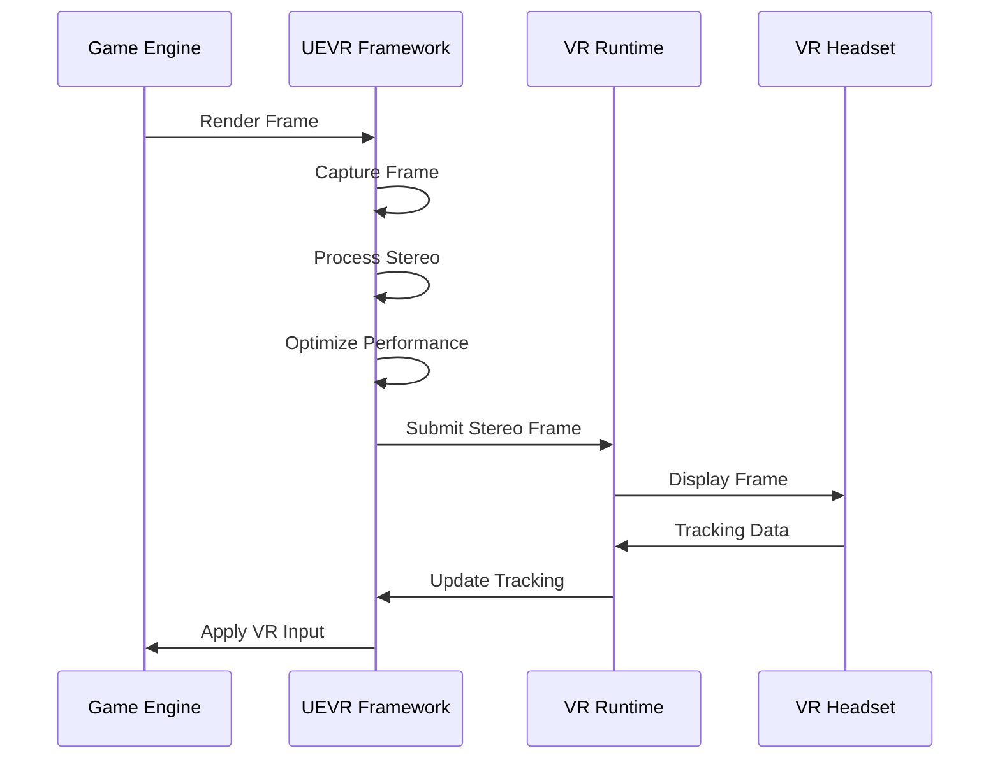
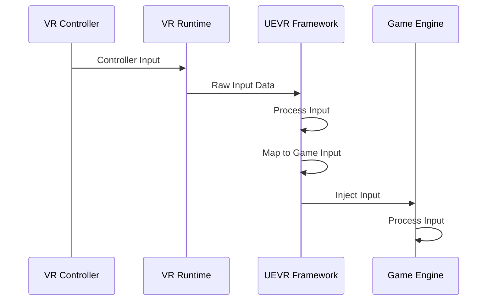

# 🏗️ System Architecture Overview

> **High-level system design and architecture of UEVR**

This document provides a comprehensive overview of UEVR's system architecture, explaining how the various components work together to deliver cross-engine VR functionality.

## 🎯 **Architecture Philosophy**

### **Design Principles**
- **Modularity**: Loosely coupled components for easy maintenance
- **Extensibility**: Plugin-based architecture for custom functionality
- **Performance**: Optimized for 90+ FPS VR rendering
- **Compatibility**: Support for multiple game engines and VR runtimes
- **Reliability**: Robust error handling and recovery mechanisms

### **Core Concepts**
- **Cross-Engine Support**: Universal compatibility across different game engines
- **Runtime Injection**: Dynamic modification of game processes
- **VR Abstraction**: Unified interface for different VR runtimes
- **Performance Optimization**: Advanced rendering techniques for smooth VR

## 🏗️ **System Architecture Diagram**



## 🔧 **Core Components**

### **Framework Core**
The central coordinator that manages the entire UEVR system:

#### **Responsibilities**
- **Process Management**: Handles game process injection and monitoring
- **Component Coordination**: Manages all system components
- **Configuration**: Loads and applies system settings
- **Error Handling**: Provides robust error recovery mechanisms

#### **Key Features**
- **Automatic Detection**: Identifies game engines automatically
- **Dynamic Loading**: Loads components based on detected engine
- **State Management**: Tracks system state and health
- **Logging System**: Comprehensive logging for debugging

### **Hook Manager**
Responsible for intercepting and modifying game API calls:

#### **Hook Types**
- **DirectX Hooks**: Intercepts D3D11/D3D12 calls
- **Input Hooks**: Captures and modifies input events
- **Window Hooks**: Manages window messages and events
- **Memory Hooks**: Monitors and modifies memory access

#### **Implementation**
```cpp
class HookManager {
public:
    // Install hooks for detected APIs
    bool install_hooks();
    
    // Remove all installed hooks
    void remove_hooks();
    
    // Check hook status
    bool are_hooks_active();
    
private:
    std::vector<std::unique_ptr<Hook>> m_hooks;
    HookContext m_context;
};
```

### **Mod System**
Manages modular functionality through a plugin architecture:

#### **Core Mods**
- **VR Mod**: Main VR functionality and stereo rendering
- **Plugin Loader**: Manages third-party plugins
- **Lua Loader**: Provides Lua scripting capabilities
- **Framework Config**: Handles system configuration

#### **Mod Lifecycle**
```cpp
class Mod {
public:
    virtual void on_initialize() = 0;
    virtual void on_shutdown() = 0;
    virtual void on_frame() = 0;
    virtual void on_present() = 0;
    
protected:
    ModContext m_context;
    ModConfig m_config;
};
```

## 🎨 **Rendering Architecture**

### **Stereo Rendering Pipeline**
UEVR's core rendering system that converts flat-screen games to VR:

#### **Pipeline Stages**
1. **Frame Capture**: Intercepts game rendering calls
2. **Stereo Processing**: Generates left and right eye views
3. **VR Submission**: Sends rendered frames to VR runtime
4. **Display**: Presents frames on VR headset

#### **Key Components**
- **FFakeStereoRenderingHook**: Core stereo rendering logic
- **RenderTargetPool**: Efficient render target management
- **ShaderManager**: VR-optimized shader compilation
- **DepthBuffer**: Enhanced depth perception for VR

### **DirectX Integration**
Supports both DirectX 11 and DirectX 12 rendering:

#### **D3D11 Component**
```cpp
class D3D11Component {
public:
    // Hook D3D11 device and context
    bool hook_device(ID3D11Device* device);
    
    // Create stereo render targets
    bool create_stereo_targets();
    
    // Present stereo frames
    bool present_stereo_frames();
    
private:
    ID3D11Device* m_device;
    ID3D11DeviceContext* m_context;
    std::vector<ID3D11RenderTargetView*> m_stereo_targets;
};
```

#### **D3D12 Component**
```cpp
class D3D12Component {
public:
    // Hook D3D12 device and command queue
    bool hook_device(ID3D12Device* device);
    
    // Manage command lists for stereo rendering
    bool setup_stereo_rendering();
    
    // Execute stereo rendering commands
    bool execute_stereo_commands();
    
private:
    ID3D12Device* m_device;
    ID3D12CommandQueue* m_command_queue;
    std::vector<ID3D12Resource*> m_stereo_resources;
};
```

## 🎮 **VR Integration Layer**

### **VR Mod**
The main module responsible for VR functionality:

#### **Core Features**
- **Stereo Rendering**: Converts flat rendering to VR stereo
- **Motion Controls**: Maps VR controllers to game inputs
- **Room Scale**: Supports physical movement in VR space
- **Performance Optimization**: Maintains smooth frame rates

#### **VR State Management**
```cpp
class VRMod {
public:
    // Initialize VR system
    bool initialize_vr();
    
    // Update VR state
    void update_vr_state();
    
    // Handle VR input
    void process_vr_input();
    
    // Render VR overlay
    void render_vr_overlay();
    
private:
    VRRuntime m_vr_runtime;
    VRInput m_vr_input;
    VROverlay m_vr_overlay;
    VRPerformance m_vr_performance;
};
```

### **XR Tracking System**
Manages VR headset and controller tracking:

#### **Tracking Components**
- **Head Tracking**: Monoculus headset position and orientation
- **Controller Tracking**: VR controller position and state
- **Room Scale**: Physical space boundaries and movement
- **Calibration**: IPD and tracking calibration

#### **Implementation**
```cpp
class IXRTrackingSystemHook {
public:
    // Hook tracking system functions
    bool hook_tracking_system();
    
    // Get current tracking data
    TrackingData get_tracking_data();
    
    // Update tracking state
    void update_tracking_state();
    
private:
    TrackingContext m_tracking_context;
    CalibrationData m_calibration;
    BoundarySystem m_boundaries;
};
```

## 🔌 **Extension System**

### **Plugin Architecture**
Enables third-party developers to extend UEVR functionality:

#### **Plugin Types**
- **Rendering Plugins**: Custom rendering effects and post-processing
- **Input Plugins**: Custom input handling and mapping
- **Utility Plugins**: Helper functions and tools
- **Game-Specific Plugins**: Optimizations for specific titles

#### **Plugin Interface**
```cpp
class Plugin {
public:
    // Plugin lifecycle
    virtual void on_initialize() = 0;
    virtual void on_shutdown() = 0;
    
    // Frame callbacks
    virtual void on_frame() = 0;
    virtual void on_present() = 0;
    
    // Input callbacks
    virtual void on_xinput_get_state(XINPUT_STATE* state) = 0;
    virtual void on_xinput_set_state(XINPUT_VIBRATION* vibration) = 0;
    
    // Engine callbacks
    virtual void on_pre_engine_tick(UGameEngine* engine, float delta) = 0;
    virtual void on_post_engine_tick(UGameEngine* engine, float delta) = 0;
    
    // VR callbacks
    virtual void on_pre_calculate_stereo_view_offset() = 0;
    virtual void on_post_calculate_stereo_view_offset() = 0;
};
```

### **Lua Scripting System**
Provides high-level scripting capabilities:

#### **Scripting Features**
- **Game Object Access**: Manipulate game objects and properties
- **VR Integration**: Access VR tracking and input data
- **UI System**: Create custom ImGui interfaces
- **Event System**: Respond to game and VR events

#### **Lua API Example**
```lua
-- Example Lua script
function on_frame()
    local player = uevr.get_player_pawn()
    if player then
        -- Modify player properties
        player.Health = 100
        player.Stamina = 100
    end
end

function on_draw_ui()
    if ImGui.Begin("My Script") then
        if ImGui.Button("Heal Player") then
            -- Perform actions
        end
        ImGui.End()
    end
end

-- Register callbacks
uevr.register_on_frame(on_frame)
uevr.register_on_draw_ui(on_draw_ui)
```

## ⚡ **Performance Architecture**

### **Optimization Strategies**
UEVR employs multiple optimization techniques to maintain smooth VR performance:

#### **Alternate Frame Rendering (AFR)**
- Renders left and right eyes on alternate frames
- Reduces GPU workload by 50%
- Maintains smooth VR experience
- Configurable per-game basis

#### **Dynamic Resolution Scaling**
- Automatic resolution adjustment based on performance
- Maintains target frame rate
- Configurable quality vs. performance balance
- Real-time adjustment during gameplay

#### **Render Target Pooling**
- Efficient memory management for render targets
- Reduces memory allocation overhead
- Optimized for VR stereo rendering
- Automatic cleanup and reuse

### **Performance Monitoring**
Real-time performance tracking and optimization:

#### **Metrics**
- **Frame Rate**: Target 90+ FPS for smooth VR
- **Frame Time**: Target 11ms or less per frame
- **GPU Utilization**: Monitor GPU workload
- **Memory Usage**: Track memory consumption

#### **Optimization Tools**
```cpp
class PerformanceMonitor {
public:
    // Track performance metrics
    void track_frame_time();
    void track_gpu_utilization();
    void track_memory_usage();
    
    // Generate optimization suggestions
    OptimizationSuggestions get_suggestions();
    
    // Apply automatic optimizations
    void apply_optimizations();
    
private:
    PerformanceMetrics m_metrics;
    OptimizationEngine m_optimizer;
};
```

## 🔒 **Security & Safety**

### **Process Isolation**
UEVR operates in a safe, isolated environment:

#### **Safety Features**
- **Read-Only Memory**: Prevents accidental memory corruption
- **Hook Validation**: Validates all hook installations
- **Error Recovery**: Graceful handling of hook failures
- **Process Monitoring**: Continuous health monitoring

#### **Security Measures**
- **Code Signing**: Digitally signed binaries
- **Integrity Checks**: Verification of system integrity
- **Access Control**: Restricted access to system resources
- **Audit Logging**: Comprehensive security logging

## 🔄 **Data Flow**

### **Frame Processing Pipeline**
Complete data flow from game to VR headset:



### **Input Processing Flow**
How VR input flows through the system:



## 🚀 **Future Architecture**

### **Planned Enhancements**
- **Multi-Engine Support**: Additional game engine compatibility
- **Advanced Rendering**: Ray tracing and advanced graphics
- **AI Integration**: Machine learning for optimization
- **Cloud Features**: Remote configuration and updates

### **Scalability Improvements**
- **Multi-GPU Support**: SLI/CrossFire optimization
- **Distributed Rendering**: Network-based rendering
- **Load Balancing**: Dynamic workload distribution
- **Resource Management**: Advanced resource optimization

---

**🏗️ This architecture provides the foundation for UEVR's cross-engine VR capabilities!**

*Next: [Core Components](core-components.md) → [Data Flow](data-flow.md) → [Design Patterns](design-patterns.md)*
