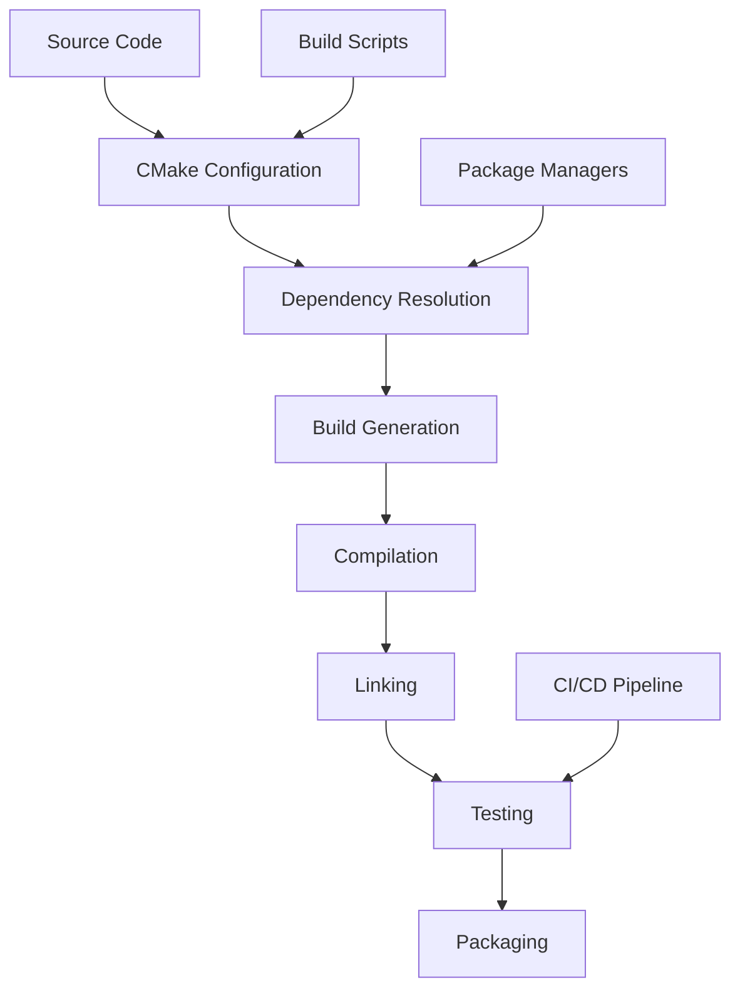

# Build System Overview

This document provides a comprehensive overview of UEVR's build system, including build configuration, dependencies, build processes, and development setup.

## Build System Architecture

### Overview
UEVR uses a modern, cross-platform build system based on CMake with support for multiple build configurations, dependency management, and automated testing.



### Core Components
- **CMake**: Primary build system generator
- **vcpkg**: C++ package manager for dependencies
- **Ninja**: Fast build system (optional)
- **MSBuild**: Windows-specific build system
- **Make**: Unix/Linux build system

## Build Configuration

### CMake Configuration
```cmake
# CMakeLists.txt - Main configuration
cmake_minimum_required(VERSION 3.20)
project(UEVR VERSION 1.0.0 LANGUAGES CXX)

# Set C++ standard
set(CMAKE_CXX_STANDARD 20)
set(CMAKE_CXX_STANDARD_REQUIRED ON)

# Build options
option(BUILD_TESTS "Build test suite" ON)
option(BUILD_DOCS "Build documentation" ON)
option(BUILD_EXAMPLES "Build examples" OFF)
option(ENABLE_LOGGING "Enable logging" ON)
option(ENABLE_PROFILING "Enable profiling" OFF)

# Platform-specific settings
if(WIN32)
    set(PLATFORM_WINDOWS ON)
    set(CMAKE_WINDOWS_EXPORT_ALL_SYMBOLS ON)
elseif(APPLE)
    set(PLATFORM_MACOS ON)
elseif(UNIX)
    set(PLATFORM_LINUX ON)
endif()
```

### Build Profiles
```cmake
# Debug configuration
set(CMAKE_BUILD_TYPE Debug)
set(CMAKE_CXX_FLAGS_DEBUG "-g -O0 -DDEBUG")

# Release configuration
set(CMAKE_BUILD_TYPE Release)
set(CMAKE_CXX_FLAGS_RELEASE "-O3 -DNDEBUG")

# RelWithDebInfo configuration
set(CMAKE_BUILD_TYPE RelWithDebInfo)
set(CMAKE_CXX_FLAGS_RELWITHDEBINFO "-O2 -g -DNDEBUG")
```

## Dependencies

### Core Dependencies
```cmake
# Find required packages
find_package(OpenVR REQUIRED)
find_package(OpenXR REQUIRED)
find_package(DirectX REQUIRED)
find_package(Vulkan REQUIRED)

# Optional dependencies
find_package(Lua QUIET)
find_package(Python3 QUIET)
find_package(Boost QUIET)
```

### Dependency Management with vcpkg
```json
// vcpkg.json
{
  "name": "uevr",
  "version": "1.0.0",
  "dependencies": [
    {
      "name": "openvr",
      "version>=": "1.23.7"
    },
    {
      "name": "openxr",
      "version>=": "1.0.28"
    },
    {
      "name": "vulkan",
      "version>=": "1.3.250"
    },
    {
      "name": "boost",
      "version>=": "1.82.0"
    },
    {
      "name": "lua",
      "version>=": "5.4.6"
    }
  ],
  "builtin-baseline": "2024-01-15"
}
```

### Manual Dependency Installation
```bash
# Windows with vcpkg
vcpkg install openvr:x64-windows
vcpkg install openxr:x64-windows
vcpkg install vulkan:x64-windows

# Linux with package manager
sudo apt-get install libopenvr-dev
sudo apt-get install libopenxr-dev
sudo apt-get install libvulkan-dev

# macOS with Homebrew
brew install openvr
brew install openxr
brew install vulkan-headers
```

## Build Process

### Step-by-Step Build
```bash
# 1. Clone repository
git clone https://github.com/your-repo/uevr.git
cd uevr

# 2. Create build directory
mkdir build
cd build

# 3. Configure with CMake
cmake .. -DCMAKE_BUILD_TYPE=Release

# 4. Build
cmake --build . --config Release

# 5. Install (optional)
cmake --install .
```

### Advanced Build Configuration
```bash
# Configure with specific options
cmake .. \
    -DCMAKE_BUILD_TYPE=Release \
    -DBUILD_TESTS=ON \
    -DBUILD_DOCS=ON \
    -DENABLE_PROFILING=ON \
    -DCMAKE_TOOLCHAIN_FILE=/path/to/vcpkg/scripts/buildsystems/vcpkg.cmake

# Build with specific target
cmake --build . --target UEVR --config Release

# Build with multiple jobs
cmake --build . --config Release --parallel 8
```

### Build Scripts
```bash
#!/bin/bash
# build.sh - Automated build script

set -e

# Configuration
BUILD_TYPE=${1:-Release}
BUILD_DIR="build-${BUILD_TYPE}"
INSTALL_DIR="install-${BUILD_TYPE}"

echo "Building UEVR in ${BUILD_TYPE} mode..."

# Clean previous build
if [ -d "$BUILD_DIR" ]; then
    rm -rf "$BUILD_DIR"
fi

# Create build directory
mkdir -p "$BUILD_DIR"
cd "$BUILD_DIR"

# Configure
cmake .. \
    -DCMAKE_BUILD_TYPE="$BUILD_TYPE" \
    -DCMAKE_INSTALL_PREFIX="../$INSTALL_DIR" \
    -DBUILD_TESTS=ON \
    -DBUILD_DOCS=ON

# Build
cmake --build . --config "$BUILD_TYPE" --parallel

# Test
ctest --output-on-failure

# Install
cmake --install .

echo "Build completed successfully!"
```

## Platform-Specific Builds

### Windows Build
```batch
@echo off
REM build.bat - Windows build script

set BUILD_TYPE=%1
if "%BUILD_TYPE%"=="" set BUILD_TYPE=Release

echo Building UEVR in %BUILD_TYPE% mode...

REM Create build directory
if exist build-%BUILD_TYPE% rmdir /s /q build-%BUILD_TYPE%
mkdir build-%BUILD_TYPE%
cd build-%BUILD_TYPE%

REM Configure with Visual Studio
cmake .. -G "Visual Studio 17 2022" -A x64 -DCMAKE_BUILD_TYPE=%BUILD_TYPE%

REM Build
cmake --build . --config %BUILD_TYPE%

REM Test
ctest --output-on-failure -C %BUILD_TYPE%

echo Build completed successfully!
```

### Linux Build
```bash
#!/bin/bash
# build-linux.sh - Linux build script

# Install system dependencies
sudo apt-get update
sudo apt-get install -y \
    build-essential \
    cmake \
    ninja-build \
    libopenvr-dev \
    libopenxr-dev \
    libvulkan-dev \
    libboost-all-dev \
    liblua5.4-dev

# Build
./build.sh Release
```

### macOS Build
```bash
#!/bin/bash
# build-macos.sh - macOS build script

# Install dependencies with Homebrew
brew install cmake ninja openvr openxr vulkan-headers boost lua

# Build
./build.sh Release
```

## Build Targets

### Main Targets
```cmake
# Main UEVR library
add_library(UEVR SHARED
    src/core/framework.cpp
    src/core/hook_manager.cpp
    src/core/mod_system.cpp
    src/vr/vr_mod.cpp
    src/rendering/d3d11_component.cpp
    src/rendering/d3d12_component.cpp
    src/rendering/vulkan_component.cpp
)

# UEVR executable
add_executable(UEVR_EXE
    src/main.cpp
    src/launcher.cpp
)

# Link libraries
target_link_libraries(UEVR_EXE PRIVATE UEVR)
```

### Test Targets
```cmake
# Test executable
add_executable(UEVR_Tests
    tests/main.cpp
    tests/core/framework_test.cpp
    tests/core/hook_manager_test.cpp
    tests/vr/vr_mod_test.cpp
)

# Link test libraries
target_link_libraries(UEVR_Tests PRIVATE
    UEVR
    gtest
    gtest_main
)

# Enable testing
enable_testing()
add_test(NAME UEVR_Tests COMMAND UEVR_Tests)
```

### Documentation Targets
```cmake
# Documentation generation
if(BUILD_DOCS)
    find_package(Doxygen)
    if(DOXYGEN_FOUND)
        set(DOXYGEN_IN ${CMAKE_CURRENT_SOURCE_DIR}/docs/Doxyfile.in)
        set(DOXYGEN_OUT ${CMAKE_CURRENT_BINARY_DIR}/Doxyfile)
        
        configure_file(${DOXYGEN_IN} ${DOXYGEN_OUT} @ONLY)
        
        add_custom_target(docs ALL
            COMMAND ${DOXYGEN_EXECUTABLE} ${DOXYGEN_OUT}
            WORKING_DIRECTORY ${CMAKE_CURRENT_BINARY_DIR}
            COMMENT "Generating API documentation with Doxygen"
            VERBATIM
        )
    endif()
endif()
```

## Build Configuration Options

### Compiler Options
```cmake
# Compiler-specific flags
if(MSVC)
    # Microsoft Visual C++
    set(CMAKE_CXX_FLAGS "${CMAKE_CXX_FLAGS} /W4 /utf-8")
    set(CMAKE_CXX_FLAGS_DEBUG "${CMAKE_CXX_FLAGS_DEBUG} /Zi")
    set(CMAKE_CXX_FLAGS_RELEASE "${CMAKE_CXX_FLAGS_RELEASE} /O2")
elseif(CMAKE_CXX_COMPILER_ID MATCHES "GNU|Clang")
    # GCC/Clang
    set(CMAKE_CXX_FLAGS "${CMAKE_CXX_FLAGS} -Wall -Wextra -Wpedantic")
    set(CMAKE_CXX_FLAGS_DEBUG "${CMAKE_CXX_FLAGS_DEBUG} -g -O0")
    set(CMAKE_CXX_FLAGS_RELEASE "${CMAKE_CXX_FLAGS_RELEASE} -O3 -DNDEBUG")
endif()
```

### Feature Flags
```cmake
# Feature detection and configuration
option(ENABLE_VULKAN "Enable Vulkan support" ON)
option(ENABLE_DX12 "Enable DirectX 12 support" ON)
option(ENABLE_OPENXR "Enable OpenXR support" ON)
option(ENABLE_OPENVR "Enable OpenVR support" ON)
option(ENABLE_LUA "Enable Lua scripting" ON)
option(ENABLE_PYTHON "Enable Python scripting" OFF)

# Conditional compilation
if(ENABLE_VULKAN)
    add_definitions(-DUEVR_VULKAN_ENABLED)
endif()

if(ENABLE_DX12)
    add_definitions(-DUEVR_DX12_ENABLED)
endif()
```

## Continuous Integration

### GitHub Actions
```yaml
# .github/workflows/build.yml
name: Build and Test

on: [push, pull_request]

jobs:
  build:
    runs-on: ${{ matrix.os }}
    strategy:
      matrix:
        os: [windows-latest, ubuntu-latest, macos-latest]
        build_type: [Debug, Release]
    
    steps:
    - uses: actions/checkout@v3
    
    - name: Install dependencies
      run: |
        if [ "${{ runner.os }}" == "Windows" ]; then
          # Windows dependency installation
        elif [ "${{ runner.os }}" == "Linux" ]; then
          sudo apt-get update
          sudo apt-get install -y build-essential cmake ninja-build
        elif [ "${{ runner.os }}" == "macOS" ]; then
          brew install cmake ninja
        fi
    
    - name: Configure CMake
      run: |
        cmake -B build \
          -DCMAKE_BUILD_TYPE=${{ matrix.build_type }} \
          -DBUILD_TESTS=ON
    
    - name: Build
      run: cmake --build build --config ${{ matrix.build_type }}
    
    - name: Test
      run: ctest --test-dir build --output-on-failure
```

### Azure DevOps
```yaml
# azure-pipelines.yml
trigger:
- main

pool:
  vmImage: 'ubuntu-latest'

variables:
  buildConfiguration: 'Release'

steps:
- task: UseDotNet@2
  inputs:
    version: '6.x'
  
- task: CMake@1
  inputs:
    workingDirectory: '$(Build.SourcesDirectory)'
    cmakeArgs: '-B build -DCMAKE_BUILD_TYPE=$(buildConfiguration)'
  
- task: CMake@1
  inputs:
    workingDirectory: '$(Build.SourcesDirectory)'
    cmakeArgs: '--build build --config $(buildConfiguration)'
  
- task: CMake@1
  inputs:
    workingDirectory: '$(Build.SourcesDirectory)'
    cmakeArgs: '--test-dir build --output-on-failure'
```

## Build Artifacts

### Output Structure
```
build/
├── bin/                    # Executables
│   ├── Debug/
│   │   ├── UEVR.exe
│   │   └── UEVR_Tests.exe
│   └── Release/
│       ├── UEVR.exe
│       └── UEVR_Tests.exe
├── lib/                    # Libraries
│   ├── Debug/
│   │   └── UEVR.lib
│   └── Release/
│       └── UEVR.lib
├── include/                # Generated headers
├── docs/                   # Generated documentation
└── CMakeFiles/             # CMake generated files
```

### Packaging
```cmake
# Package configuration
set(CPACK_PACKAGE_NAME "UEVR")
set(CPACK_PACKAGE_VERSION "${PROJECT_VERSION}")
set(CPACK_PACKAGE_DESCRIPTION_SUMMARY "Universal Engine VR Adapter")
set(CPACK_PACKAGE_VENDOR "UEVR Team")

# Windows packaging
if(WIN32)
    set(CPACK_GENERATOR "NSIS")
    set(CPACK_NSIS_ENABLE_ICON "${CMAKE_SOURCE_DIR}/assets/icon.ico")
    set(CPACK_NSIS_DISPLAY_NAME "UEVR")
endif()

# Linux packaging
if(UNIX AND NOT APPLE)
    set(CPACK_GENERATOR "DEB")
    set(CPACK_DEBIAN_PACKAGE_MAINTAINER "UEVR Team")
endif()

# macOS packaging
if(APPLE)
    set(CPACK_GENERATOR "DragNDrop")
    set(CPACK_DMG_VOLUME_NAME "UEVR")
endif()

include(CPack)
```

## Troubleshooting

### Common Build Issues

#### Dependency Resolution
```bash
# Problem: Package not found
# Solution: Check vcpkg installation and package names
vcpkg list
vcpkg install <package-name>:<triplet>

# Problem: Version conflicts
# Solution: Update vcpkg baseline
vcpkg update
vcpkg upgrade
```

#### Compiler Issues
```bash
# Problem: C++ standard not supported
# Solution: Update compiler or adjust standard
# In CMakeLists.txt:
set(CMAKE_CXX_STANDARD 17)  # Use C++17 instead of C++20

# Problem: Platform-specific compilation errors
# Solution: Check platform detection and conditional compilation
if(WIN32)
    # Windows-specific code
elseif(UNIX)
    # Unix-specific code
endif()
```

#### Linker Issues
```bash
# Problem: Undefined references
# Solution: Check library linking order and dependencies
target_link_libraries(UEVR_EXE PRIVATE
    UEVR
    OpenVR::OpenVR
    OpenXR::OpenXR
)

# Problem: Library not found
# Solution: Check library paths and CMake find_package
set(CMAKE_PREFIX_PATH "${CMAKE_PREFIX_PATH};C:/path/to/libraries")
```

## Performance Optimization

### Build Performance
```cmake
# Enable parallel builds
set(CMAKE_CXX_FLAGS "${CMAKE_CXX_FLAGS} /MP")  # MSVC
set(CMAKE_CXX_FLAGS "${CMAKE_CXX_FLAGS} -j$(nproc)")  # GCC/Clang

# Use Ninja for faster builds
set(CMAKE_GENERATOR "Ninja")

# Enable ccache for faster rebuilds
find_program(CCACHE_PROGRAM ccache)
if(CCACHE_PROGRAM)
    set(CMAKE_CXX_COMPILER_LAUNCHER "${CCACHE_PROGRAM}")
endif()
```

### Runtime Performance
```cmake
# Enable optimizations
set(CMAKE_CXX_FLAGS_RELEASE "${CMAKE_CXX_FLAGS_RELEASE} -O3 -DNDEBUG")

# Enable SIMD optimizations
if(CMAKE_CXX_COMPILER_ID MATCHES "GNU|Clang")
    set(CMAKE_CXX_FLAGS "${CMAKE_CXX_FLAGS} -march=native")
endif()

# Enable link-time optimization
set(CMAKE_INTERPROCEDURAL_OPTIMIZATION TRUE)
```

## Resources

- [CMake Documentation](https://cmake.org/documentation/)
- [vcpkg Documentation](https://github.com/microsoft/vcpkg)
- [UEVR Architecture Overview](../architecture/system-overview.md)
- [Development Setup Guide](../development/setup.md)
- [Testing Framework](../testing/overview.md)

---

*For build system support, check the GitHub Issues or join the community Discord.*
