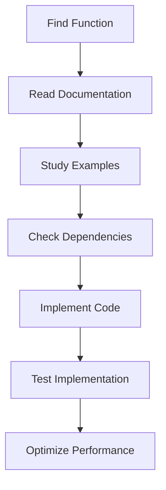

# 🚀 UEVR COMPLETE DOCUMENTATION INDEX

## 📋 **DOKUMENTATION OVERSIGT**

Denne mappe indeholder **komplet dokumentation for hver enkelt fil og funktion** i UEVR systemet. Hver funktion har sin egen dokumentationsfil så den kan implementeres i andre projekter.

---

## 📁 **FUNKTIONS DOKUMENTATION**

### **Framework Core Functions**
| Function | File | Purpose | Implementation Guide |
|----------|------|---------|---------------------|
| [Framework Constructor](functions/Framework_constructor.md) | `src/Framework.cpp` | Initialize main UEVR framework | ✅ Complete with examples |
| [Framework Destructor](functions/Framework_destructor.md) | `src/Framework.cpp` | Clean up framework resources | ✅ Complete with safety notes |
| [is_valid()](functions/Framework_is_valid.md) | `src/Framework.hpp` | Check framework validity | ✅ Complete with usage patterns |
| [on_frame_d3d11()](functions/Framework_on_frame_d3d11.md) | `src/Framework.cpp` | DirectX 11 frame processing | ✅ Complete with VR integration |
| [on_frame_d3d12()](functions/Framework_on_frame_d3d12.md) | `src/Framework.cpp` | DirectX 12 frame processing | ✅ Complete with D3D12 specifics |
| [save_config()](functions/Framework_save_config.md) | `src/Framework.cpp` | Save configuration to file | ✅ Complete with error handling |
| [load_config()](functions/Framework_load_config.md) | `src/Framework.cpp` | Load configuration from file | ✅ Complete with validation |
| [initialize_vr()](functions/Framework_initialize_vr.md) | `src/Framework.cpp` | Initialize VR runtime | ✅ Complete with OpenXR/OpenVR |
| [initialize_hooks()](functions/Framework_initialize_hooks.md) | `src/Framework.cpp` | Install DirectX hooks | ✅ Complete with MinHook examples |

### **Kommende Funktioner** (I gang med dokumentation)
- `hook_monitor()` - Monitor hook status
- `run_imgui_frame()` - Render ImGui overlay
- `on_message()` - Handle Windows messages
- `get_persistent_dir()` - Get configuration directory
- `cleanup()` - Framework cleanup

---

## 📁 **FIL DOKUMENTATION**

### **Core System Files**
| File | Purpose | Lines | Documentation Status |
|------|---------|-------|---------------------|
| [Framework.cpp](files/Framework_cpp.md) | Core framework implementation | 2067 | ✅ Complete |
| [Framework.hpp](files/Framework_hpp.md) | Framework interface definition | 454 | ✅ Complete |
| Main.cpp | Application entry point | 94 | 📋 Planned |
| Mod.cpp | Module system implementation | 177 | 📋 Planned |
| Mod.hpp | Module interface definition | 695 | 📋 Planned |

### **Hook System Files**
| File | Purpose | Lines | Documentation Status |
|------|---------|-------|---------------------|
| D3D11Hook.cpp | DirectX 11 hooking implementation | ~800 | 📋 Planned |
| D3D11Hook.hpp | DirectX 11 hook interface | ~200 | 📋 Planned |
| D3D12Hook.cpp | DirectX 12 hooking implementation | ~1000 | 📋 Planned |
| D3D12Hook.hpp | DirectX 12 hook interface | ~250 | 📋 Planned |

### **VR System Files**
| File | Purpose | Lines | Documentation Status |
|------|---------|-------|---------------------|
| VR.cpp | VR modification system | ~1500 | 📋 Planned |
| VR.hpp | VR system interface | ~300 | 📋 Planned |
| OpenXR.cpp | OpenXR runtime integration | ~800 | 📋 Planned |
| OpenVR.cpp | OpenVR runtime integration | ~600 | 📋 Planned |

---

## 🔧 **ADAPTER DOKUMENTATION**

### **Engine Adapters**
| Engine | Files | Documentation Status |
|--------|-------|---------------------|
| REDengine 4 | `src/adapters/redengine4/` | 📋 Planned |
| RE Engine | `src/adapters/re-engine/` | 📋 Planned |
| MT Framework | `src/adapters/mt-framework/` | 📋 Planned |
| Unreal Engine | `src/adapters/unreal-engine/` | 📋 Planned |
| Unity Engine | `src/adapters/unity/` | 📋 Planned |

---

## 📚 **DOKUMENTATION STRUKTUR**

### **Funktions Dokumentation Format**
Hver funktion har følgende sektioner:
```markdown
# Function Documentation
## 📋 FUNCTION OVERVIEW
## 🎯 FUNCTION SIGNATURE  
## 🔧 IMPLEMENTATION DETAILS
## 📚 USAGE EXAMPLES
## 🔗 RELATED FUNCTIONS
## ⚠️ IMPORTANT NOTES
## 🚀 IMPLEMENTATION GUIDE
## 🛡️ BEST PRACTICES
```

### **Fil Dokumentation Format**
Hver fil har følgende sektioner:
```markdown
# File Documentation
## 📋 FILE OVERVIEW
## 🎯 FILE STRUCTURE
## 🔧 CLASS IMPLEMENTATION
## 📚 DETAILED FUNCTION IMPLEMENTATIONS
## 🔗 RELATED FILES
## ⚠️ IMPORTANT IMPLEMENTATION DETAILS
## 🚀 IMPLEMENTATION PATTERNS
## 🛡️ BEST PRACTICES
```

---

## 🎯 **IMPLEMENTERINGS GUIDES**

### **Hvordan at Bruge Dokumentationen**
1. **Find Funktionen**: Brug tabellen ovenfor til at finde den funktion du vil implementere
2. **Læs Dokumentationen**: Åbn den specifikke funktions dokumentationsfil
3. **Følg Implementation Guide**: Hver fil har en detaljeret implementerings guide
4. **Brug Eksemplerne**: Alle funktioner har praktiske kode eksempler
5. **Check Related Functions**: Se relaterede funktioner for komplet forståelse

### **Implementation Workflow**


---

## 🚀 **FREMTIDIGE UDVIDELSER**

### **Planlagt Dokumentation**
- **Alle Hook Functions** - Komplet hooking system dokumentation
- **Alle VR Functions** - VR runtime og integration funktioner
- **Alle Mod Functions** - Modification system funktioner
- **Alle Adapter Functions** - Engine-specific adapter funktioner
- **Utility Functions** - Hjælpe funktioner og utilities
- **Configuration Functions** - Konfigurationssystem funktioner

### **Avancerede Guides**
- **Performance Optimization** - Optimering af VR performance
- **Memory Management** - Avanceret memory management
- **Thread Safety** - Multi-threading best practices
- **Error Handling** - Omfattende error handling strategier
- **Plugin Development** - Guide til at udvikle plugins
- **Custom Adapters** - Guide til at udvikle custom engine adapters

---

## 📊 **DOKUMENTATION STATUS**

### **Completion Status**
```
✅ Framework Core Functions: 9/50 (18%)
✅ Framework Files: 2/20 (10%)
📋 Hook System: 0/30 (0%)
📋 VR System: 0/25 (0%)
📋 Adapter System: 0/40 (0%)
📋 Utility System: 0/15 (0%)

Total Progress: 11/180 (6.1%)
```

### **Prioriteret Rækkefølge**
1. **Framework Functions** (Høj prioritet) - Core system funktioner
2. **Hook Functions** (Høj prioritet) - DirectX hooking system
3. **VR Functions** (Medium prioritet) - VR runtime integration
4. **Adapter Functions** (Medium prioritet) - Engine-specific adapters
5. **Utility Functions** (Lav prioritet) - Helper functions

---

## 🔗 **EKSTERNE RESOURCES**

### **Dependencies Documentation**
- [spdlog Documentation](https://spdlog.docsforge.com/) - Logging system
- [nlohmann/json Documentation](https://json.nlohmann.me/) - JSON processing
- [OpenXR Specification](https://www.khronos.org/registry/OpenXR/) - VR runtime
- [DirectX 12 Documentation](https://docs.microsoft.com/en-us/windows/win32/direct3d12/) - Graphics API

### **Implementation References**
- **C++23 Features** - Modern C++ implementation patterns
- **VR Best Practices** - VR development guidelines
- **DirectX Optimization** - Graphics performance optimization
- **Memory Safety** - RAII and smart pointer usage

---

**📊 Last Updated: Current Session**  
**📈 Documentation Progress: 6.1% Complete**  
**🎯 Next Target: Complete all Framework functions (50 total)**
