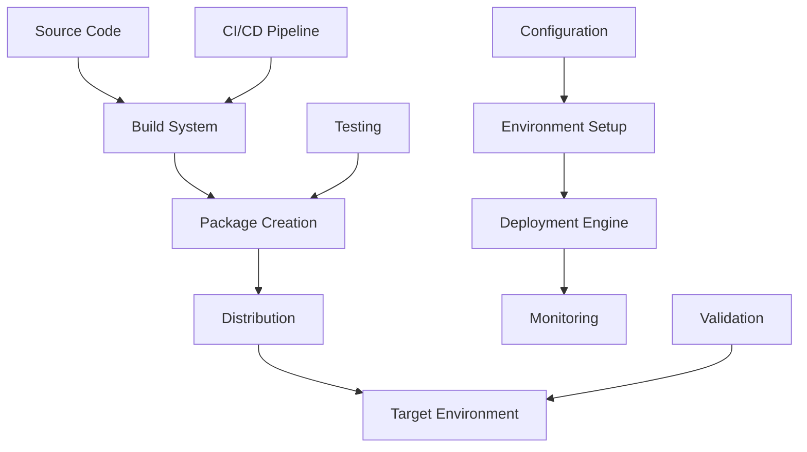

# Deployment Overview

This document provides comprehensive information about deploying UEVR, including deployment strategies, packaging, distribution methods, and deployment best practices.

## Deployment Philosophy

### Core Principles
- **Reliability**: Ensure consistent and reliable deployment across environments
- **Scalability**: Support deployment to various scales and configurations
- **Security**: Maintain security throughout the deployment process
- **Automation**: Minimize manual intervention and human error
- **Monitoring**: Provide comprehensive deployment monitoring and feedback

### Deployment Goals
- **Consistent Environment**: Reproducible deployment across different systems
- **Minimal Downtime**: Smooth deployment with minimal service interruption
- **Easy Rollback**: Quick recovery from deployment issues
- **Environment Parity**: Consistent behavior across development, staging, and production
- **Compliance**: Meet deployment requirements and standards

## Deployment Architecture

### Deployment Components


### Deployment Pipeline
```cpp
// Deployment pipeline manager
class DeploymentPipeline {
public:
    // Pipeline execution
    bool ExecutePipeline(const PipelineConfig& config);
    bool ExecuteStage(const std::string& stageName);
    bool RollbackToStage(const std::string& stageName);
    
    // Pipeline configuration
    bool LoadPipelineConfig(const std::string& configPath);
    bool ValidatePipelineConfig(const PipelineConfig& config);
    PipelineStatus GetPipelineStatus() const;
    
    // Stage management
    std::vector<std::string> GetPipelineStages() const;
    bool AddStage(const std::string& stageName, const StageConfig& config);
    bool RemoveStage(const std::string& stageName);
    
    // Pipeline monitoring
    void MonitorPipeline();
    std::vector<PipelineEvent> GetPipelineEvents() const;
    PipelineMetrics GetPipelineMetrics() const;
    
private:
    PipelineConfig config;
    std::vector<std::unique_ptr<PipelineStage>> stages;
    std::unique_ptr<PipelineExecutor> executor;
    std::unique_ptr<PipelineMonitor> monitor;
    PipelineStatus status;
};
```

## Build and Packaging

### Build System Integration
```cpp
// Build system for deployment
class DeploymentBuildSystem {
public:
    // Build configuration
    bool ConfigureBuild(const BuildConfig& config);
    bool ValidateBuildConfiguration(const BuildConfig& config);
    
    // Build execution
    bool ExecuteBuild(const std::string& target);
    bool ExecuteCleanBuild();
    bool ExecuteIncrementalBuild();
    
    // Build artifacts
    std::vector<std::string> GetBuildArtifacts() const;
    bool ValidateBuildArtifacts() const;
    bool PackageBuildArtifacts(const std::string& packagePath);
    
    // Build optimization
    bool EnableParallelBuilds(bool enable);
    bool EnableBuildCaching(bool enable);
    bool SetBuildOptimization(BuildOptimization optimization);
    
private:
    BuildConfig buildConfig;
    std::unique_ptr<BuildExecutor> buildExecutor;
    std::unique_ptr<ArtifactManager> artifactManager;
    std::unique_ptr<BuildOptimizer> buildOptimizer;
};

// Build configuration
struct BuildConfig {
    std::string buildType;           // Debug, Release, RelWithDebInfo
    std::string targetPlatform;      // Windows, Linux, macOS
    std::string targetArchitecture;  // x86, x64, ARM64
    std::vector<std::string> buildTargets;
    std::vector<std::string> buildOptions;
    bool enableTests;
    bool enableDocumentation;
    bool enableOptimization;
    std::string outputDirectory;
    std::string intermediateDirectory;
    std::vector<std::string> dependencies;
};

// Build optimizations
enum class BuildOptimization {
    None,           // No optimization
    Basic,          // Basic optimization
    Standard,       // Standard optimization
    Aggressive,     // Aggressive optimization
    ProfileGuided   // Profile-guided optimization
};
```

### Package Creation
```cpp
// Package creator for deployment
class PackageCreator {
public:
    // Package configuration
    bool ConfigurePackage(const PackageConfig& config);
    bool ValidatePackageConfiguration(const PackageConfig& config);
    
    // Package creation
    bool CreatePackage(const std::string& outputPath);
    bool CreateInstallerPackage(const std::string& outputPath);
    bool CreatePortablePackage(const std::string& outputPath);
    
    // Package customization
    bool AddCustomFiles(const std::vector<std::string>& filePaths);
    bool AddCustomScripts(const std::vector<std::string>& scriptPaths);
    bool SetPackageMetadata(const PackageMetadata& metadata);
    
    // Package validation
    bool ValidatePackage(const std::string& packagePath);
    bool TestPackageInstallation(const std::string& packagePath);
    PackageValidationReport GetValidationReport() const;
    
private:
    PackageConfig packageConfig;
    std::unique_ptr<PackageBuilder> packageBuilder;
    std::unique_ptr<InstallerBuilder> installerBuilder;
    std::unique_ptr<PackageValidator> packageValidator;
};

// Package configuration
struct PackageConfig {
    std::string packageName;
    std::string packageVersion;
    std::string packageDescription;
    std::string packageAuthor;
    std::string packageLicense;
    
    // Package contents
    std::vector<std::string> includePaths;
    std::vector<std::string> excludePaths;
    std::vector<std::string> requiredFiles;
    std::vector<std::string> optionalFiles;
    
    // Package options
    bool createInstaller;
    bool createPortable;
    bool includeDependencies;
    bool compressPackage;
    std::string compressionLevel;
    
    // Platform-specific options
    std::map<std::string, std::string> platformOptions;
    std::vector<std::string> supportedPlatforms;
};

// Package metadata
struct PackageMetadata {
    std::string name;
    std::string version;
    std::string description;
    std::string author;
    std::string license;
    std::string homepage;
    std::string repository;
    std::vector<std::string> tags;
    std::chrono::system_clock::time_point buildDate;
    std::string buildHash;
    std::string targetPlatform;
    std::string targetArchitecture;
};
```

### Multi-Platform Packaging
```cpp
// Multi-platform package manager
class MultiPlatformPackageManager {
public:
    // Platform-specific packaging
    bool CreateWindowsPackage(const WindowsPackageConfig& config);
    bool CreateLinuxPackage(const LinuxPackageConfig& config);
    bool CreateMacOSPackage(const MacOSPackageConfig& config);
    
    // Cross-platform packaging
    bool CreateUniversalPackage(const UniversalPackageConfig& config);
    bool CreatePlatformSpecificPackages(const std::vector<std::string>& platforms);
    
    // Package distribution
    bool DistributePackage(const std::string& packagePath, const std::string& platform);
    bool UpdatePackageRepository(const std::string& repositoryPath);
    
private:
    std::unique_ptr<WindowsPackageBuilder> windowsBuilder;
    std::unique_ptr<LinuxPackageBuilder> linuxBuilder;
    std::unique_ptr<MacOSPackageBuilder> macosBuilder;
    std::unique_ptr<PackageDistributor> distributor;
};

// Windows package configuration
struct WindowsPackageConfig {
    std::string installerType;       // NSIS, MSI, Inno Setup
    std::string installerScript;     // Custom installer script
    std::string iconPath;            // Application icon
    std::string licensePath;         // License file
    std::string readmePath;          // Readme file
    
    // Windows-specific options
    bool createStartMenuShortcut;
    bool createDesktopShortcut;
    bool createUninstaller;
    bool requireAdministrator;
    std::string installDirectory;
    
    // Dependencies
    std::vector<std::string> requiredDependencies;
    std::vector<std::string> optionalDependencies;
    bool installVisualCRedistributable;
    bool installDirectX;
};

// Linux package configuration
struct LinuxPackageConfig {
    std::string packageFormat;       // DEB, RPM, AppImage, Snap
    std::string packageScript;       // Custom package script
    std::string desktopFile;         // Desktop entry file
    std::string appdataFile;         // AppData file
    
    // Linux-specific options
    std::vector<std::string> dependencies;
    std::vector<std::string> conflicts;
    std::vector<std::string> provides;
    std::string section;
    std::string priority;
    
    // AppImage options
    bool createAppImage;
    std::string appImageRuntime;
    std::vector<std::string> appImageExclude;
};

// macOS package configuration
struct MacOSPackageConfig {
    std::string packageFormat;       // DMG, PKG, APP
    std::string bundleIdentifier;    // Bundle identifier
    std::string bundleName;          // Bundle name
    std::string bundleVersion;       // Bundle version
    
    // macOS-specific options
    bool createDMG;
    std::string dmgFormat;           // UDIF, SPARSE
    std::string dmgCompression;      // None, UDCO, UDZO
    bool createPKG;
    std::string pkgIdentifier;
    
    // Code signing
    bool codeSign;
    std::string developerID;
    std::string certificatePath;
    std::string provisioningProfile;
};
```

## Distribution Methods

### Package Distribution
```cpp
// Package distributor
class PackageDistributor {
public:
    // Distribution methods
    bool DistributeToGitHub(const std::string& packagePath, const GitHubConfig& config);
    bool DistributeToSteam(const std::string& packagePath, const SteamConfig& config);
    bool DistributeToWebsite(const std::string& packagePath, const WebsiteConfig& config);
    bool DistributeToCDN(const std::string& packagePath, const CDNConfig& config);
    
    // Distribution management
    bool UpdateDistribution(const std::string& packageId);
    bool RemoveDistribution(const std::string& packageId);
    std::vector<DistributionInfo> GetDistributions() const;
    
    // Distribution monitoring
    void MonitorDistributions();
    DistributionMetrics GetDistributionMetrics() const;
    
private:
    std::unique_ptr<GitHubDistributor> githubDistributor;
    std::unique_ptr<SteamDistributor> steamDistributor;
    std::unique_ptr<WebsiteDistributor> websiteDistributor;
    std::unique_ptr<CDNDistributor> cdnDistributor;
    std::unique_ptr<DistributionMonitor> monitor;
};

// GitHub distribution configuration
struct GitHubConfig {
    std::string repository;
    std::string token;
    std::string releaseTag;
    std::string releaseName;
    std::string releaseDescription;
    bool draft;
    bool prerelease;
    std::vector<std::string> assets;
    std::vector<std::string> labels;
};

// Steam distribution configuration
struct SteamConfig {
    std::string appId;
    std::string depotPath;
    std::string buildDescription;
    std::string betaBranch;
    std::vector<std::string> tags;
    bool setLive;
    std::string steamCmdPath;
};

// Website distribution configuration
struct WebsiteConfig {
    std::string uploadUrl;
    std::string username;
    std::string password;
    std::string targetDirectory;
    std::vector<std::string> fileTypes;
    bool overwrite;
    bool backup;
};

// CDN distribution configuration
struct CDNConfig {
    std::string cdnProvider;         // CloudFlare, AWS CloudFront, Azure CDN
    std::string endpoint;
    std::string accessKey;
    std::string secretKey;
    std::string bucket;
    std::string region;
    std::vector<std::string> cacheRules;
    bool enableCompression;
    bool enableSSL;
};
```

### Automated Distribution
```cpp
// Automated distribution system
class AutomatedDistributor {
public:
    // Distribution automation
    bool EnableAutomatedDistribution(bool enable);
    bool SetDistributionSchedule(const DistributionSchedule& schedule);
    bool SetDistributionTriggers(const std::vector<DistributionTrigger>& triggers);
    
    // Automated workflows
    bool ExecuteDistributionWorkflow(const std::string& workflowName);
    bool CreateDistributionWorkflow(const WorkflowConfig& config);
    bool UpdateDistributionWorkflow(const std::string& workflowName, const WorkflowConfig& config);
    
    // Distribution rules
    bool AddDistributionRule(const DistributionRule& rule);
    bool RemoveDistributionRule(const std::string& ruleId);
    std::vector<DistributionRule> GetDistributionRules() const;
    
private:
    bool automatedDistributionEnabled;
    DistributionSchedule schedule;
    std::vector<DistributionTrigger> triggers;
    std::vector<DistributionWorkflow> workflows;
    std::vector<DistributionRule> rules;
    std::unique_ptr<WorkflowExecutor> workflowExecutor;
};

// Distribution schedule
struct DistributionSchedule {
    bool enabled;
    std::string frequency;           // daily, weekly, monthly, custom
    std::string time;                // HH:MM format
    std::string dayOfWeek;           // for weekly distribution
    std::string dayOfMonth;          // for monthly distribution
    std::string timezone;
    bool skipWeekends;
    std::vector<std::string> holidays;
};

// Distribution trigger
struct DistributionTrigger {
    std::string id;
    std::string type;                // commit, tag, manual, schedule
    std::string condition;           // trigger condition
    std::string action;              // action to perform
    bool enabled;
    std::vector<std::string> parameters;
};

// Distribution workflow
struct WorkflowConfig {
    std::string name;
    std::string description;
    std::vector<WorkflowStep> steps;
    std::vector<std::string> triggers;
    std::vector<std::string> conditions;
    bool enabled;
    uint32_t timeout;
    std::string onSuccess;
    std::string onFailure;
    std::string onTimeout;
};

// Workflow step
struct WorkflowStep {
    std::string name;
    std::string type;                // build, test, package, distribute
    std::string action;              // action to perform
    std::vector<std::string> parameters;
    std::vector<std::string> dependencies;
    uint32_t timeout;
    bool required;
    std::string onSuccess;
    std::string onFailure;
};

// Distribution rule
struct DistributionRule {
    std::string id;
    std::string name;
    std::string condition;           // rule condition
    std::string action;              // action to perform
    std::vector<std::string> targets;
    bool enabled;
    uint32_t priority;
    std::chrono::system_clock::time_point created;
    std::chrono::system_clock::time_point modified;
};
```

## Environment Management

### Environment Configuration
```cpp
// Environment manager
class EnvironmentManager {
public:
    // Environment setup
    bool SetupEnvironment(const std::string& environmentName, const EnvironmentConfig& config);
    bool DestroyEnvironment(const std::string& environmentName);
    bool UpdateEnvironment(const std::string& environmentName, const EnvironmentConfig& config);
    
    // Environment management
    std::vector<std::string> GetEnvironments() const;
    EnvironmentStatus GetEnvironmentStatus(const std::string& environmentName) const;
    bool ValidateEnvironment(const std::string& environmentName) const;
    
    // Environment synchronization
    bool SyncEnvironment(const std::string& sourceEnv, const std::string& targetEnv);
    bool BackupEnvironment(const std::string& environmentName, const std::string& backupPath);
    bool RestoreEnvironment(const std::string& environmentName, const std::string& backupPath);
    
private:
    std::unordered_map<std::string, EnvironmentConfig> environments;
    std::unordered_map<std::string, EnvironmentStatus> environmentStatuses;
    std::unique_ptr<EnvironmentValidator> validator;
    std::unique_ptr<EnvironmentSynchronizer> synchronizer;
};

// Environment configuration
struct EnvironmentConfig {
    std::string name;
    std::string description;
    std::string type;                // development, staging, production
    std::string platform;            // Windows, Linux, macOS
    std::string architecture;        // x86, x64, ARM64
    
    // System requirements
    SystemRequirements systemRequirements;
    std::vector<std::string> dependencies;
    std::vector<std::string> optionalDependencies;
    
    // Configuration
    std::string configPath;
    std::vector<std::string> configFiles;
    std::map<std::string, std::string> environmentVariables;
    
    // Network configuration
    std::string networkMode;         // isolated, bridged, host
    std::vector<std::string> allowedNetworks;
    std::vector<std::string> blockedNetworks;
    
    // Storage configuration
    std::string storageMode;         // local, shared, remote
    std::vector<std::string> mountPoints;
    std::map<std::string, std::string> volumeMappings;
    
    // Security configuration
    SecurityConfig securityConfig;
    std::vector<std::string> allowedUsers;
    std::vector<std::string> blockedUsers;
    
    // Monitoring configuration
    MonitoringConfig monitoringConfig;
    std::vector<std::string> logPaths;
    std::vector<std::string> metricsEndpoints;
};

// System requirements
struct SystemRequirements {
    uint32_t minCPU;
    uint32_t recommendedCPU;
    uint32_t minRAM;
    uint32_t recommendedRAM;
    uint32_t minStorage;
    uint32_t recommendedStorage;
    std::vector<std::string> requiredOS;
    std::vector<std::string> requiredDrivers;
    std::vector<std::string> requiredLibraries;
};

// Security configuration
struct SecurityConfig {
    bool enableFirewall;
    bool enableAntivirus;
    bool enableIntrusionDetection;
    std::vector<std::string> allowedPorts;
    std::vector<std::string> blockedPorts;
    std::vector<std::string> allowedProcesses;
    std::vector<std::string> blockedProcesses;
    std::string encryptionLevel;
    bool enableAuditLogging;
};

// Monitoring configuration
struct MonitoringConfig {
    bool enableSystemMonitoring;
    bool enableApplicationMonitoring;
    bool enableNetworkMonitoring;
    std::vector<std::string> monitoringTools;
    std::vector<std::string> alertEndpoints;
    uint32_t monitoringInterval;
    bool enablePerformanceProfiling;
    bool enableErrorTracking;
};

// Environment status
enum class EnvironmentStatus {
    Unknown,        // Status unknown
    Creating,       // Environment being created
    Ready,          // Environment ready for use
    Updating,       // Environment being updated
    Degraded,       // Environment has issues
    Failed,         // Environment creation/update failed
    Destroying,     // Environment being destroyed
    Destroyed       // Environment has been destroyed
};
```

### Environment Provisioning
```cpp
// Environment provisioner
class EnvironmentProvisioner {
public:
    // Infrastructure provisioning
    bool ProvisionInfrastructure(const InfrastructureConfig& config);
    bool UpdateInfrastructure(const InfrastructureConfig& config);
    bool DestroyInfrastructure(const std::string& infrastructureId);
    
    // Container provisioning
    bool ProvisionContainers(const ContainerConfig& config);
    bool UpdateContainers(const ContainerConfig& config);
    bool DestroyContainers(const std::string& containerId);
    
    // Virtual machine provisioning
    bool ProvisionVirtualMachine(const VMConfig& config);
    bool UpdateVirtualMachine(const VMConfig& config);
    bool DestroyVirtualMachine(const std::string& vmId);
    
    // Cloud provisioning
    bool ProvisionCloudResources(const CloudConfig& config);
    bool UpdateCloudResources(const CloudConfig& config);
    bool DestroyCloudResources(const std::string& resourceId);
    
private:
    std::unique_ptr<InfrastructureProvisioner> infrastructureProvisioner;
    std::unique_ptr<ContainerProvisioner> containerProvisioner;
    std::unique_ptr<VMProvisioner> vmProvisioner;
    std::unique_ptr<CloudProvisioner> cloudProvisioner;
};

// Infrastructure configuration
struct InfrastructureConfig {
    std::string type;                // physical, virtual, cloud
    std::string provider;            // provider name
    std::string region;              // geographic region
    std::string datacenter;          // datacenter name
    
    // Compute resources
    std::vector<ComputeNode> computeNodes;
    std::vector<StorageNode> storageNodes;
    std::vector<NetworkNode> networkNodes;
    
    // Network configuration
    NetworkConfig networkConfig;
    std::vector<std::string> subnets;
    std::vector<std::string> securityGroups;
    std::vector<std::string> loadBalancers;
    
    // Storage configuration
    StorageConfig storageConfig;
    std::vector<std::string> volumes;
    std::vector<std::string> snapshots;
    std::vector<std::string> backups;
    
    // Security configuration
    SecurityConfig securityConfig;
    std::vector<std::string> firewalls;
    std::vector<std::string> vpns;
    std::vector<std::string> certificates;
};

// Container configuration
struct ContainerConfig {
    std::string name;
    std::string image;
    std::string tag;
    std::string runtime;             // Docker, Podman, containerd
    
    // Container settings
    std::vector<std::string> command;
    std::vector<std::string> arguments;
    std::map<std::string, std::string> environmentVariables;
    std::vector<std::string> volumes;
    std::vector<std::string> ports;
    
    // Resource limits
    ResourceLimits resourceLimits;
    std::vector<std::string> devices;
    std::vector<std::string> capabilities;
    
    // Network configuration
    std::string networkMode;
    std::vector<std::string> networks;
    std::vector<std::string> dnsServers;
    std::vector<std::string> dnsSearch;
    
    // Security configuration
    bool privileged;
    std::string user;
    std::vector<std::string> securityOptions;
    std::vector<std::string> readOnlyPaths;
};

// Virtual machine configuration
struct VMConfig {
    std::string name;
    std::string hypervisor;          // Hyper-V, VMware, VirtualBox, KVM
    std::string guestOS;             // Windows, Linux, macOS
    
    // Hardware configuration
    uint32_t cpuCount;
    uint32_t memorySize;
    uint32_t diskSize;
    std::vector<std::string> networkAdapters;
    std::vector<std::string> storageControllers;
    
    // VM settings
    std::string isoPath;
    std::vector<std::string> cdroms;
    std::vector<std::string> floppies;
    std::vector<std::string> sharedFolders;
    
    // Performance settings
    bool enableVTx;
    bool enableNestedPaging;
    std::string graphicsController;
    uint32_t videoMemory;
    
    // Network configuration
    std::string networkMode;
    std::vector<std::string> networkAdapters;
    std::vector<std::string> portForwards;
};

// Cloud configuration
struct CloudConfig {
    std::string provider;            // AWS, Azure, GCP, DigitalOcean
    std::string region;              // cloud region
    std::string project;             // project/tenant ID
    
    // Compute resources
    std::vector<CloudInstance> instances;
    std::vector<CloudContainer> containers;
    std::vector<CloudFunction> functions;
    
    // Storage resources
    std::vector<CloudStorage> storage;
    std::vector<CloudDatabase> databases;
    std::vector<CloudCache> caches;
    
    // Network resources
    std::vector<CloudNetwork> networks;
    std::vector<CloudLoadBalancer> loadBalancers;
    std::vector<CloudCDN> cdns;
    
    // Security resources
    std::vector<CloudFirewall> firewalls;
    std::vector<CloudVPN> vpns;
    std::vector<CloudCertificate> certificates;
    
    // Monitoring resources
    std::vector<CloudMonitor> monitors;
    std::vector<CloudLog> logs;
    std::vector<CloudAlert> alerts;
};
```

## Deployment Strategies

### Deployment Patterns
```cpp
// Deployment strategy manager
class DeploymentStrategyManager {
public:
    // Strategy selection
    bool SelectStrategy(const std::string& strategyName);
    std::vector<std::string> GetAvailableStrategies() const;
    std::string GetCurrentStrategy() const;
    
    // Strategy configuration
    bool ConfigureStrategy(const std::string& strategyName, const StrategyConfig& config);
    StrategyConfig GetStrategyConfig(const std::string& strategyName) const;
    
    // Strategy execution
    bool ExecuteStrategy(const std::string& strategyName);
    bool ValidateStrategy(const std::string& strategyName) const;
    
private:
    std::string currentStrategy;
    std::unordered_map<std::string, std::unique_ptr<DeploymentStrategy>> strategies;
    std::unordered_map<std::string, StrategyConfig> strategyConfigs;
};

// Base deployment strategy
class DeploymentStrategy {
public:
    virtual ~DeploymentStrategy() = default;
    
    virtual bool Execute(const DeploymentContext& context) = 0;
    virtual bool Validate(const DeploymentContext& context) const = 0;
    virtual std::string GetName() const = 0;
    virtual std::string GetDescription() const = 0;
    
protected:
    virtual bool PreDeployment(const DeploymentContext& context) = 0;
    virtual bool Deployment(const DeploymentContext& context) = 0;
    virtual bool PostDeployment(const DeploymentContext& context) = 0;
    virtual bool Rollback(const DeploymentContext& context) = 0;
};

// Blue-green deployment strategy
class BlueGreenDeployment : public DeploymentStrategy {
public:
    bool Execute(const DeploymentContext& context) override;
    bool Validate(const DeploymentContext& context) const override;
    std::string GetName() const override { return "Blue-Green"; }
    std::string GetDescription() const override { return "Zero-downtime deployment with traffic switching"; }
    
private:
    bool PreDeployment(const DeploymentContext& context) override;
    bool Deployment(const DeploymentContext& context) override;
    bool PostDeployment(const DeploymentContext& context) override;
    bool Rollback(const DeploymentContext& context) override;
    
    bool SwitchTraffic(const std::string& fromEnvironment, const std::string& toEnvironment);
    bool ValidateEnvironment(const std::string& environmentName);
    bool CleanupEnvironment(const std::string& environmentName);
};

// Rolling deployment strategy
class RollingDeployment : public DeploymentStrategy {
public:
    bool Execute(const DeploymentContext& context) override;
    bool Validate(const DeploymentContext& context) const override;
    std::string GetName() const override { return "Rolling"; }
    std::string GetDescription() const override { return "Gradual deployment with minimal downtime"; }
    
private:
    bool PreDeployment(const DeploymentContext& context) override;
    bool Deployment(const DeploymentContext& context) override;
    bool PostDeployment(const DeploymentContext& context) override;
    bool Rollback(const DeploymentContext& context) override;
    
    bool DeployBatch(const std::vector<std::string>& batch);
    bool ValidateBatch(const std::vector<std::string>& batch);
    bool RollbackBatch(const std::vector<std::string>& batch);
};

// Canary deployment strategy
class CanaryDeployment : public DeploymentStrategy {
public:
    bool Execute(const DeploymentContext& context) override;
    bool Validate(const DeploymentContext& context) const override;
    std::string GetName() const override { return "Canary"; }
    std::string GetDescription() const override { return "Risk mitigation through gradual rollout"; }
    
private:
    bool PreDeployment(const DeploymentContext& context) override;
    bool Deployment(const DeploymentContext& context) override;
    bool PostDeployment(const DeploymentContext& context) override;
    bool Rollback(const DeploymentContext& context) override;
    
    bool DeployCanary(const std::string& environmentName, float trafficPercentage);
    bool MonitorCanary(const std::string& environmentName);
    bool PromoteCanary(const std::string& environmentName);
    bool RollbackCanary(const std::string& environmentName);
};

// Deployment context
struct DeploymentContext {
    std::string deploymentId;
    std::string applicationName;
    std::string version;
    std::string environment;
    std::vector<std::string> targets;
    
    // Configuration
    std::map<std::string, std::string> parameters;
    std::vector<std::string> artifacts;
    std::string configPath;
    
    // Execution context
    std::chrono::system_clock::time_point startTime;
    std::chrono::system_clock::time_point endTime;
    DeploymentStatus status;
    std::vector<DeploymentStep> steps;
    
    // Rollback information
    std::string previousVersion;
    std::string rollbackVersion;
    bool rollbackEnabled;
    std::vector<std::string> rollbackSteps;
};

// Strategy configuration
struct StrategyConfig {
    std::string name;
    std::string description;
    std::map<std::string, std::string> parameters;
    
    // Blue-green specific
    bool enableTrafficSwitching;
    std::string trafficSwitchMethod;
    uint32_t healthCheckTimeout;
    uint32_t healthCheckInterval;
    
    // Rolling specific
    uint32_t batchSize;
    uint32_t batchDelay;
    bool enableHealthChecks;
    std::string healthCheckEndpoint;
    
    // Canary specific
    float initialTrafficPercentage;
    float trafficIncreaseStep;
    uint32_t evaluationPeriod;
    std::vector<std::string> successMetrics;
    std::vector<std::string> failureMetrics;
};
```

### Deployment Orchestration
```cpp
// Deployment orchestrator
class DeploymentOrchestrator {
public:
    // Orchestration management
    bool StartOrchestration(const OrchestrationConfig& config);
    bool StopOrchestration();
    bool PauseOrchestration();
    bool ResumeOrchestration();
    
    // Deployment coordination
    bool CoordinateDeployment(const std::string& deploymentId);
    bool CoordinateRollback(const std::string& deploymentId);
    bool CoordinateValidation(const std::string& deploymentId);
    
    // Resource management
    bool AllocateResources(const std::string& deploymentId);
    bool ReleaseResources(const std::string& deploymentId);
    bool MonitorResources(const std::string& deploymentId);
    
    // Dependency management
    bool ResolveDependencies(const std::string& deploymentId);
    bool ValidateDependencies(const std::string& deploymentId);
    bool UpdateDependencies(const std::string& deploymentId);
    
private:
    OrchestrationConfig config;
    std::unique_ptr<ResourceManager> resourceManager;
    std::unique_ptr<DependencyManager> dependencyManager;
    std::unique_ptr<DeploymentCoordinator> coordinator;
    std::unique_ptr<OrchestrationMonitor> monitor;
    OrchestrationStatus status;
};

// Orchestration configuration
struct OrchestrationConfig {
    std::string name;
    std::string description;
    std::vector<std::string> deploymentStrategies;
    
    // Resource management
    ResourceLimits resourceLimits;
    std::vector<std::string> resourcePools;
    std::vector<std::string> resourcePolicies;
    
    // Dependency management
    std::vector<DependencyRule> dependencyRules;
    std::vector<std::string> dependencySources;
    bool enableDependencyValidation;
    
    // Monitoring and alerting
    std::vector<std::string> monitoringEndpoints;
    std::vector<std::string> alertEndpoints;
    bool enableRealTimeMonitoring;
    
    // Rollback configuration
    bool enableAutomaticRollback;
    uint32_t rollbackThreshold;
    std::vector<std::string> rollbackTriggers;
    std::string rollbackStrategy;
};

// Resource limits
struct ResourceLimits {
    uint32_t maxConcurrentDeployments;
    uint32_t maxDeploymentDuration;
    uint32_t maxResourceUsage;
    uint32_t maxNetworkBandwidth;
    uint32_t maxStorageIO;
    
    // Time limits
    uint32_t deploymentTimeout;
    uint32_t validationTimeout;
    uint32_t rollbackTimeout;
    
    // Cost limits
    float maxDeploymentCost;
    float maxResourceCost;
    float maxNetworkCost;
};

// Dependency rule
struct DependencyRule {
    std::string id;
    std::string name;
    std::string type;                // requires, conflicts, suggests
    std::string source;              // dependency source
    std::string target;              // dependency target
    std::string condition;           // dependency condition
    std::string action;              // action to take
    bool enabled;
    uint32_t priority;
};
```

## Monitoring and Validation

### Deployment Monitoring
```cpp
// Deployment monitor
class DeploymentMonitor {
public:
    // Monitoring management
    bool StartMonitoring(const std::string& deploymentId);
    bool StopMonitoring(const std::string& deploymentId);
    bool PauseMonitoring(const std::string& deploymentId);
    bool ResumeMonitoring(const std::string& deploymentId);
    
    // Metrics collection
    DeploymentMetrics GetMetrics(const std::string& deploymentId) const;
    std::vector<DeploymentEvent> GetEvents(const std::string& deploymentId) const;
    DeploymentHealth GetHealth(const std::string& deploymentId) const;
    
    // Alert management
    bool SetAlertThreshold(const std::string& deploymentId, const AlertThreshold& threshold);
    bool EnableAlerting(const std::string& deploymentId);
    bool DisableAlerting(const std::string& deploymentId);
    
    // Performance monitoring
    PerformanceMetrics GetPerformanceMetrics(const std::string& deploymentId) const;
    ResourceUsage GetResourceUsage(const std::string& deploymentId) const;
    NetworkMetrics GetNetworkMetrics(const std::string& deploymentId) const;
    
private:
    std::unordered_map<std::string, std::unique_ptr<DeploymentTracker>> deploymentTrackers;
    std::unique_ptr<MetricsCollector> metricsCollector;
    std::unique_ptr<EventLogger> eventLogger;
    std::unique_ptr<HealthChecker> healthChecker;
    std::unique_ptr<AlertManager> alertManager;
};

// Deployment metrics
struct DeploymentMetrics {
    std::string deploymentId;
    std::chrono::system_clock::time_point startTime;
    std::chrono::system_clock::time_point endTime;
    
    // Time metrics
    std::chrono::milliseconds totalDuration;
    std::chrono::milliseconds deploymentDuration;
    std::chrono::milliseconds validationDuration;
    std::chrono::milliseconds rollbackDuration;
    
    // Success metrics
    bool successful;
    uint32_t totalSteps;
    uint32_t successfulSteps;
    uint32_t failedSteps;
    uint32_t skippedSteps;
    
    // Resource metrics
    uint32_t resourcesAllocated;
    uint32_t resourcesReleased;
    uint32_t peakResourceUsage;
    float averageResourceUsage;
    
    // Performance metrics
    float deploymentSpeed;
    float validationSpeed;
    float rollbackSpeed;
    uint32_t retryCount;
};

// Deployment health
struct DeploymentHealth {
    std::string deploymentId;
    HealthStatus overallHealth;
    std::map<std::string, HealthStatus> componentHealth;
    std::vector<HealthIssue> issues;
    std::chrono::system_clock::time_point lastCheck;
    uint32_t consecutiveFailures;
    bool requiresAttention;
};

// Health status
enum class HealthStatus {
    Unknown,    // Health status unknown
    Healthy,    // Component is healthy
    Degraded,   // Component has minor issues
    Unhealthy,  // Component has major issues
    Critical    // Component is in critical state
};

// Health issue
struct HealthIssue {
    std::string id;
    std::string component;
    std::string description;
    HealthStatus severity;
    std::chrono::system_clock::time_point detected;
    std::chrono::system_clock::time_point resolved;
    std::string resolution;
    bool isResolved;
};
```

### Deployment Validation
```cpp
// Deployment validator
class DeploymentValidator {
public:
    // Validation management
    bool StartValidation(const std::string& deploymentId);
    bool StopValidation(const std::string& deploymentId);
    bool PauseValidation(const std::string& deploymentId);
    bool ResumeValidation(const std::string& deploymentId);
    
    // Validation execution
    bool ExecuteValidation(const ValidationConfig& config);
    bool ValidateHealth(const std::string& deploymentId);
    bool ValidatePerformance(const std::string& deploymentId);
    bool ValidateSecurity(const std::string& deploymentId);
    
    // Validation results
    ValidationResult GetValidationResult(const std::string& deploymentId) const;
    std::vector<ValidationIssue> GetValidationIssues(const std::string& deploymentId) const;
    ValidationReport GenerateValidationReport(const std::string& deploymentId) const;
    
    // Validation configuration
    bool SetValidationConfig(const std::string& deploymentId, const ValidationConfig& config);
    ValidationConfig GetValidationConfig(const std::string& deploymentId) const;
    
private:
    std::unordered_map<std::string, std::unique_ptr<ValidationRunner>> validationRunners;
    std::unique_ptr<HealthValidator> healthValidator;
    std::unique_ptr<PerformanceValidator> performanceValidator;
    std::unique_ptr<SecurityValidator> securityValidator;
    std::unique_ptr<ValidationReporter> reporter;
};

// Validation configuration
struct ValidationConfig {
    std::string name;
    std::string description;
    std::vector<std::string> validationTypes;
    
    // Health validation
    bool enableHealthValidation;
    uint32_t healthCheckTimeout;
    uint32_t healthCheckInterval;
    uint32_t healthCheckRetries;
    std::vector<std::string> healthEndpoints;
    
    // Performance validation
    bool enablePerformanceValidation;
    uint32_t performanceTestDuration;
    uint32_t performanceTestLoad;
    std::vector<std::string> performanceMetrics;
    PerformanceThresholds performanceThresholds;
    
    // Security validation
    bool enableSecurityValidation;
    std::vector<std::string> securityScans;
    std::vector<std::string> vulnerabilityChecks;
    std::vector<std::string> complianceChecks;
    SecurityThresholds securityThresholds;
    
    // General validation
    uint32_t validationTimeout;
    bool enableAutomaticRetry;
    uint32_t maxRetryAttempts;
    std::vector<std::string> customValidators;
};

// Performance thresholds
struct PerformanceThresholds {
    float maxResponseTime;
    float maxErrorRate;
    float minThroughput;
    float maxResourceUsage;
    float maxLatency;
    uint32_t maxConcurrentUsers;
};

// Security thresholds
struct SecurityThresholds {
    uint32_t maxVulnerabilities;
    uint32_t maxCriticalIssues;
    uint32_t maxHighIssues;
    bool requireSecurityCompliance;
    std::vector<std::string> requiredSecurityChecks;
};

// Validation result
struct ValidationResult {
    std::string deploymentId;
    ValidationStatus status;
    std::chrono::system_clock::time_point startTime;
    std::chrono::system_clock::time_point endTime;
    
    // Validation scores
    float overallScore;
    float healthScore;
    float performanceScore;
    float securityScore;
    
    // Validation details
    std::vector<ValidationIssue> issues;
    std::vector<ValidationWarning> warnings;
    std::vector<ValidationRecommendation> recommendations;
    
    // Validation metadata
    std::string validationVersion;
    std::vector<std::string> validationTools;
    std::map<std::string, std::string> validationParameters;
};

// Validation status
enum class ValidationStatus {
    Unknown,        // Validation status unknown
    Pending,        // Validation pending
    Running,        // Validation in progress
    Passed,         // Validation passed
    Failed,         // Validation failed
    Warning,        // Validation passed with warnings
    Error           // Validation error occurred
};

// Validation issue
struct ValidationIssue {
    std::string id;
    std::string type;                // health, performance, security
    std::string severity;            // critical, high, medium, low
    std::string description;
    std::string component;
    std::chrono::system_clock::time_point detected;
    std::string impact;
    std::string recommendation;
    bool isResolved;
};
```

## Resources

- [UEVR Development Setup](../development/setup.md)
- [Build System](../build-system/overview.md)
- [Testing Framework](../testing/overview.md)
- [Performance Optimization](../performance/overview.md)
- [Security Overview](../security/overview.md)

---

*For deployment-related questions or support, check the GitHub Issues or join the community Discord.*
