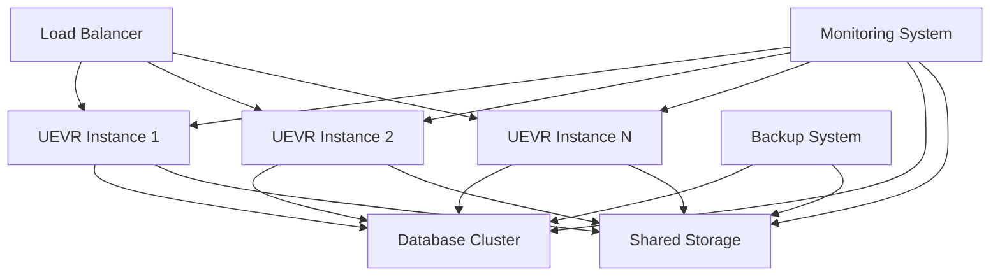

# Production Deployment

This document provides comprehensive guidance for deploying UEVR in production environments, including setup, monitoring, scaling, and maintenance procedures.

## Production Environment Overview

### Production Requirements
Production deployments of UEVR require:
- **High Availability**: 99.9%+ uptime
- **Scalability**: Handle multiple concurrent users
- **Security**: Robust security measures
- **Monitoring**: Comprehensive system monitoring
- **Backup**: Regular backup and recovery procedures
- **Documentation**: Complete operational procedures

### Production Architecture


## Production Setup

### Infrastructure Requirements
```cpp
// Production infrastructure configuration
struct ProductionInfrastructure {
    // Compute resources
    uint32_t minInstances;
    uint32_t maxInstances;
    uint32_t cpuCoresPerInstance;
    uint32_t memoryGBPerInstance;
    uint32_t storageGBPerInstance;
    
    // Network requirements
    uint32_t bandwidthMbps;
    std::string networkLatency;
    bool enableLoadBalancing;
    bool enableAutoScaling;
    
    // Security requirements
    bool enableFirewall;
    bool enableVPN;
    bool enableEncryption;
    std::vector<std::string> allowedIPs;
    
    // Monitoring requirements
    bool enableLogging;
    bool enableMetrics;
    bool enableAlerting;
    uint32_t logRetentionDays;
};
```

### Environment Configuration
```cpp
// Production environment configuration
class ProductionEnvironment {
public:
    // Environment setup
    bool SetupProductionEnvironment(const ProductionConfig& config);
    bool ValidateProductionEnvironment() const;
    bool UpdateProductionEnvironment(const ProductionConfig& config);
    
    // Configuration management
    bool LoadProductionConfig(const std::string& configPath);
    bool SaveProductionConfig(const std::string& configPath) const;
    ProductionConfig GetProductionConfig() const;
    
    // Environment validation
    bool ValidateSecurityConfiguration() const;
    bool ValidatePerformanceConfiguration() const;
    bool ValidateMonitoringConfiguration() const;
    
private:
    ProductionConfig config;
    std::unique_ptr<SecurityManager> securityManager;
    std::unique_ptr<PerformanceManager> performanceManager;
    std::unique_ptr<MonitoringManager> monitoringManager;
};

// Production configuration
struct ProductionConfig {
    // Basic configuration
    std::string environmentName;
    std::string deploymentType;        // single, cluster, distributed
    std::string scalingStrategy;       // manual, auto, predictive
    
    // Resource configuration
    ResourceConfiguration resources;
    NetworkConfiguration network;
    SecurityConfiguration security;
    MonitoringConfiguration monitoring;
    
    // Deployment configuration
    DeploymentConfiguration deployment;
    BackupConfiguration backup;
    RecoveryConfiguration recovery;
    
    // Performance configuration
    PerformanceConfiguration performance;
    QualityConfiguration quality;
    OptimizationConfiguration optimization;
};

// Resource configuration
struct ResourceConfiguration {
    // Compute resources
    uint32_t cpuCores;
    uint32_t memoryGB;
    uint32_t storageGB;
    std::string instanceType;
    
    // Scaling configuration
    uint32_t minInstances;
    uint32_t maxInstances;
    uint32_t targetInstances;
    uint32_t scaleUpThreshold;
    uint32_t scaleDownThreshold;
    
    // Resource allocation
    std::map<std::string, float> resourceLimits;
    std::map<std::string, float> resourceRequests;
    bool enableResourceQuotas;
};
```

### Security Configuration
```cpp
// Production security configuration
struct ProductionSecurity {
    // Access control
    bool enableAuthentication;
    bool enableAuthorization;
    std::vector<std::string> allowedUsers;
    std::vector<std::string> allowedRoles;
    
    // Network security
    bool enableFirewall;
    std::vector<std::string> allowedPorts;
    std::vector<std::string> blockedIPs;
    bool enableVPN;
    
    // Data security
    bool enableEncryption;
    std::string encryptionAlgorithm;
    bool enableDataBackup;
    bool enableAuditLogging;
    
    // Application security
    bool enableCodeSigning;
    bool enableIntegrityChecking;
    bool enableVulnerabilityScanning;
    std::vector<std::string> securityPolicies;
};

// Security manager for production
class ProductionSecurityManager {
public:
    // Security initialization
    bool InitializeSecurity(const ProductionSecurity& config);
    bool ValidateSecurityConfiguration() const;
    
    // Access control
    bool AuthenticateUser(const std::string& username, const std::string& password);
    bool AuthorizeUser(const std::string& username, const std::string& resource);
    bool ValidateUserSession(const std::string& sessionToken);
    
    // Security monitoring
    void MonitorSecurityEvents();
    std::vector<SecurityEvent> GetSecurityEvents() const;
    bool HandleSecurityIncident(const SecurityIncident& incident);
    
    // Compliance
    bool ValidateCompliance(const std::string& standard);
    ComplianceReport GenerateComplianceReport() const;
    
private:
    ProductionSecurity config;
    std::unique_ptr<AuthenticationManager> authManager;
    std::unique_ptr<AuthorizationManager> authzManager;
    std::unique_ptr<SecurityMonitor> securityMonitor;
    std::unique_ptr<ComplianceChecker> complianceChecker;
};
```

## Production Monitoring

### Monitoring Architecture
```cpp
// Production monitoring system
class ProductionMonitoring {
public:
    // Monitoring initialization
    bool InitializeMonitoring(const MonitoringConfig& config);
    bool StartMonitoring();
    bool StopMonitoring();
    
    // System monitoring
    SystemMetrics GetSystemMetrics() const;
    PerformanceMetrics GetPerformanceMetrics() const;
    ResourceMetrics GetResourceMetrics() const;
    
    // Application monitoring
    ApplicationMetrics GetApplicationMetrics() const;
    ErrorMetrics GetErrorMetrics() const;
    UserMetrics GetUserMetrics() const;
    
    // Alert management
    bool SetAlertThreshold(const AlertThreshold& threshold);
    bool EnableAlerting(const std::string& metricName);
    bool DisableAlerting(const std::string& metricName);
    
    // Reporting
    MonitoringReport GenerateReport(const std::string& reportType) const;
    bool ExportMetrics(const std::string& format, const std::string& path);
    
private:
    MonitoringConfig config;
    std::unique_ptr<SystemMonitor> systemMonitor;
    std::unique_ptr<ApplicationMonitor> appMonitor;
    std::unique_ptr<PerformanceMonitor> perfMonitor;
    std::unique_ptr<AlertManager> alertManager;
    std::unique_ptr<ReportGenerator> reportGenerator;
};

// Monitoring configuration
struct MonitoringConfig {
    // Monitoring types
    bool enableSystemMonitoring;
    bool enableApplicationMonitoring;
    bool enablePerformanceMonitoring;
    bool enableSecurityMonitoring;
    
    // Collection settings
    uint32_t collectionInterval;
    uint32_t retentionPeriod;
    bool enableRealTimeMonitoring;
    bool enableHistoricalMonitoring;
    
    // Alert configuration
    std::vector<AlertThreshold> alertThresholds;
    std::vector<std::string> alertChannels;
    bool enableEscalation;
    uint32_t escalationDelay;
    
    // Reporting configuration
    std::vector<std::string> reportTypes;
    std::string reportFormat;
    bool enableAutomatedReporting;
    std::string reportSchedule;
};

// System metrics
struct SystemMetrics {
    // CPU metrics
    float cpuUsage;
    float cpuTemperature;
    uint32_t cpuFrequency;
    uint32_t cpuCores;
    
    // Memory metrics
    uint64_t totalMemory;
    uint64_t usedMemory;
    uint64_t availableMemory;
    float memoryUsage;
    
    // Storage metrics
    uint64_t totalStorage;
    uint64_t usedStorage;
    uint64_t availableStorage;
    float storageUsage;
    
    // Network metrics
    uint64_t networkIn;
    uint64_t networkOut;
    float networkLatency;
    uint32_t networkErrors;
    
    // Timestamp
    std::chrono::system_clock::time_point timestamp;
};

// Performance metrics
struct PerformanceMetrics {
    // Response time
    float averageResponseTime;
    float p95ResponseTime;
    float p99ResponseTime;
    float maxResponseTime;
    
    // Throughput
    uint32_t requestsPerSecond;
    uint32_t transactionsPerSecond;
    uint32_t concurrentUsers;
    
    // Error rates
    float errorRate;
    uint32_t totalErrors;
    uint32_t successfulRequests;
    
    // Resource utilization
    float cpuUtilization;
    float memoryUtilization;
    float diskUtilization;
    float networkUtilization;
    
    // Timestamp
    std::chrono::system_clock::time_point timestamp;
};
```

### Alert Management
```cpp
// Alert management system
class AlertManager {
public:
    // Alert configuration
    bool ConfigureAlert(const AlertConfig& config);
    bool EnableAlert(const std::string& alertName);
    bool DisableAlert(const std::string& alertName);
    
    // Alert processing
    void ProcessAlert(const Alert& alert);
    bool SendAlert(const Alert& alert);
    bool EscalateAlert(const Alert& alert);
    
    // Alert history
    std::vector<Alert> GetAlertHistory() const;
    std::vector<Alert> GetActiveAlerts() const;
    bool AcknowledgeAlert(const std::string& alertId);
    bool ResolveAlert(const std::string& alertId);
    
private:
    std::vector<AlertConfig> alertConfigs;
    std::vector<Alert> activeAlerts;
    std::vector<Alert> alertHistory;
    std::unique_ptr<AlertSender> alertSender;
    std::unique_ptr<EscalationManager> escalationManager;
};

// Alert configuration
struct AlertConfig {
    std::string name;
    std::string description;
    std::string metricName;
    std::string condition;              // >, <, >=, <=, ==, !=
    float threshold;
    
    // Alert settings
    bool enabled;
    uint32_t severity;                  // 1=Low, 2=Medium, 3=High, 4=Critical
    uint32_t cooldownPeriod;
    bool enableEscalation;
    
    // Notification settings
    std::vector<std::string> channels;
    std::vector<std::string> recipients;
    std::string messageTemplate;
    
    // Actions
    std::vector<std::string> actions;
    bool enableAutoRemediation;
};

// Alert
struct Alert {
    std::string id;
    std::string name;
    std::string description;
    uint32_t severity;
    std::string status;                 // active, acknowledged, resolved
    
    // Alert details
    std::string metricName;
    float currentValue;
    float threshold;
    std::string condition;
    
    // Metadata
    std::chrono::system_clock::time_point timestamp;
    std::chrono::system_clock::time_point acknowledgedAt;
    std::chrono::system_clock::time_point resolvedAt;
    std::string acknowledgedBy;
    std::string resolvedBy;
    
    // Context
    std::map<std::string, std::string> context;
    std::vector<std::string> tags;
};
```

## Production Scaling

### Auto-Scaling Configuration
```cpp
// Auto-scaling system
class AutoScalingManager {
public:
    // Scaling configuration
    bool ConfigureScaling(const ScalingConfig& config);
    bool EnableAutoScaling();
    bool DisableAutoScaling();
    
    // Scaling policies
    bool AddScalingPolicy(const ScalingPolicy& policy);
    bool RemoveScalingPolicy(const std::string& policyName);
    std::vector<ScalingPolicy> GetScalingPolicies() const;
    
    // Scaling execution
    bool ExecuteScaling(const ScalingDecision& decision);
    bool ScaleUp(uint32_t instanceCount);
    bool ScaleDown(uint32_t instanceCount);
    
    // Scaling monitoring
    ScalingMetrics GetScalingMetrics() const;
    std::vector<ScalingEvent> GetScalingEvents() const;
    
private:
    ScalingConfig config;
    std::vector<ScalingPolicy> policies;
    std::unique_ptr<ScalingEvaluator> evaluator;
    std::unique_ptr<ScalingExecutor> executor;
    std::unique_ptr<ScalingMonitor> monitor;
};

// Scaling configuration
struct ScalingConfig {
    // Basic scaling
    bool enabled;
    std::string scalingMode;            // manual, automatic, predictive
    uint32_t minInstances;
    uint32_t maxInstances;
    uint32_t targetInstances;
    
    // Scaling thresholds
    float scaleUpThreshold;
    float scaleDownThreshold;
    uint32_t scaleUpCooldown;
    uint32_t scaleDownCooldown;
    
    // Scaling policies
    std::vector<ScalingPolicy> policies;
    std::string defaultPolicy;
    
    // Resource constraints
    ResourceConstraints resourceConstraints;
    CostConstraints costConstraints;
};

// Scaling policy
struct ScalingPolicy {
    std::string name;
    std::string description;
    std::string triggerType;            // metric, schedule, manual
    
    // Trigger configuration
    std::string metricName;
    float threshold;
    std::string condition;
    uint32_t evaluationPeriod;
    
    // Action configuration
    std::string action;                 // scale_up, scale_down, scale_to
    uint32_t instanceCount;
    uint32_t percentage;
    
    // Policy settings
    bool enabled;
    uint32_t priority;
    std::vector<std::string> dependencies;
};

// Scaling decision
struct ScalingDecision {
    std::string id;
    std::string policyName;
    std::string action;
    uint32_t currentInstances;
    uint32_t targetInstances;
    uint32_t instanceDelta;
    
    // Decision context
    std::string reason;
    float metricValue;
    float threshold;
    std::chrono::system_clock::time_point timestamp;
    
    // Execution
    std::string status;                 // pending, executing, completed, failed
    std::chrono::system_clock::time_point executedAt;
    std::string executedBy;
    std::string result;
};
```

### Load Balancing
```cpp
// Load balancer for production
class ProductionLoadBalancer {
public:
    // Load balancer configuration
    bool ConfigureLoadBalancer(const LoadBalancerConfig& config);
    bool StartLoadBalancer();
    bool StopLoadBalancer();
    
    // Backend management
    bool AddBackend(const BackendConfig& config);
    bool RemoveBackend(const std::string& backendId);
    bool UpdateBackend(const std::string& backendId, const BackendConfig& config);
    
    // Health checking
    bool EnableHealthCheck(const std::string& backendId);
    bool DisableHealthCheck(const std::string& backendId);
    BackendHealth GetBackendHealth(const std::string& backendId) const;
    
    // Traffic management
    bool SetTrafficWeight(const std::string& backendId, float weight);
    bool EnableStickySessions(bool enable);
    bool SetSessionTimeout(uint32_t timeout);
    
private:
    LoadBalancerConfig config;
    std::vector<BackendConfig> backends;
    std::unique_ptr<HealthChecker> healthChecker;
    std::unique_ptr<TrafficManager> trafficManager;
    std::unique_ptr<SessionManager> sessionManager;
};

// Load balancer configuration
struct LoadBalancerConfig {
    // Basic configuration
    std::string name;
    std::string type;                   // round_robin, least_connections, weighted
    std::string protocol;               // http, https, tcp, udp
    uint32_t port;
    
    // Health check configuration
    bool enableHealthChecks;
    std::string healthCheckPath;
    uint32_t healthCheckInterval;
    uint32_t healthCheckTimeout;
    uint32_t unhealthyThreshold;
    uint32_t healthyThreshold;
    
    // Session configuration
    bool enableStickySessions;
    std::string sessionCookie;
    uint32_t sessionTimeout;
    
    // SSL configuration
    bool enableSSL;
    std::string certificatePath;
    std::string privateKeyPath;
    std::vector<std::string> ciphers;
};

// Backend configuration
struct BackendConfig {
    std::string id;
    std::string name;
    std::string address;
    uint32_t port;
    std::string protocol;
    
    // Health check settings
    bool enableHealthCheck;
    std::string healthCheckPath;
    uint32_t healthCheckInterval;
    uint32_t healthCheckTimeout;
    
    // Traffic settings
    float weight;
    bool enabled;
    uint32_t maxConnections;
    
    // Advanced settings
    std::map<std::string, std::string> customHeaders;
    std::vector<std::string> allowedMethods;
    bool enableCompression;
};
```

## Production Maintenance

### Backup and Recovery
```cpp
// Backup and recovery system
class BackupRecoveryManager {
public:
    // Backup configuration
    bool ConfigureBackup(const BackupConfig& config);
    bool EnableBackup();
    bool DisableBackup();
    
    // Backup execution
    bool ExecuteBackup(const std::string& backupType);
    bool ScheduleBackup(const BackupSchedule& schedule);
    bool CancelBackup(const std::string& backupId);
    
    // Recovery operations
    bool ExecuteRecovery(const std::string& backupId, const RecoveryConfig& config);
    bool ValidateBackup(const std::string& backupId);
    bool TestRecovery(const std::string& backupId);
    
    // Backup management
    std::vector<BackupInfo> GetBackups() const;
    bool DeleteBackup(const std::string& backupId);
    bool RestoreBackup(const std::string& backupId);
    
private:
    BackupConfig config;
    std::vector<BackupSchedule> schedules;
    std::unique_ptr<BackupExecutor> backupExecutor;
    std::unique_ptr<RecoveryExecutor> recoveryExecutor;
    std::unique_ptr<BackupStorage> backupStorage;
};

// Backup configuration
struct BackupConfig {
    // Backup types
    bool enableFullBackup;
    bool enableIncrementalBackup;
    bool enableDifferentialBackup;
    
    // Storage configuration
    std::string storageType;            // local, network, cloud
    std::string storagePath;
    std::string storageCredentials;
    uint64_t maxStorageSize;
    
    // Retention policy
    uint32_t retentionDays;
    uint32_t maxBackups;
    bool enableCompression;
    bool enableEncryption;
    
    // Schedule configuration
    std::vector<BackupSchedule> schedules;
    bool enableAutomatedBackup;
    
    // Validation
    bool enableBackupValidation;
    bool enableRecoveryTesting;
    uint32_t validationTimeout;
};

// Backup schedule
struct BackupSchedule {
    std::string id;
    std::string name;
    std::string backupType;
    std::string frequency;              // daily, weekly, monthly
    std::string time;
    std::string dayOfWeek;              // for weekly backups
    std::string dayOfMonth;             // for monthly backups
    
    // Schedule settings
    bool enabled;
    std::string timezone;
    bool skipWeekends;
    std::vector<std::string> holidays;
    
    // Advanced settings
    std::vector<std::string> dependencies;
    std::string failureAction;          // retry, skip, abort
    uint32_t maxRetries;
    uint32_t retryDelay;
};

// Recovery configuration
struct RecoveryConfig {
    std::string recoveryType;           // full, partial, selective
    std::string targetLocation;
    bool validateAfterRecovery;
    bool testAfterRecovery;
    
    // Recovery options
    bool overwriteExisting;
    bool preserveTimestamps;
    bool preservePermissions;
    
    // Advanced options
    std::vector<std::string> includePaths;
    std::vector<std::string> excludePaths;
    std::map<std::string, std::string> pathMappings;
    
    // Validation
    bool enableIntegrityCheck;
    bool enableChecksumValidation;
    std::string validationMethod;
};
```

### Update Management
```cpp
// Update management system
class UpdateManager {
public:
    // Update configuration
    bool ConfigureUpdates(const UpdateConfig& config);
    bool EnableAutoUpdates();
    bool DisableAutoUpdates();
    
    // Update operations
    bool CheckForUpdates();
    bool DownloadUpdate(const std::string& updateId);
    bool InstallUpdate(const std::string& updateId);
    bool RollbackUpdate(const std::string& updateId);
    
    // Update management
    std::vector<UpdateInfo> GetAvailableUpdates() const;
    std::vector<UpdateInfo> GetInstalledUpdates() const;
    UpdateStatus GetUpdateStatus() const;
    
    // Update validation
    bool ValidateUpdate(const std::string& updateId);
    bool TestUpdate(const std::string& updateId);
    bool ApproveUpdate(const std::string& updateId);
    
private:
    UpdateConfig config;
    std::vector<UpdateInfo> availableUpdates;
    std::vector<UpdateInfo> installedUpdates;
    std::unique_ptr<UpdateChecker> updateChecker;
    std::unique_ptr<UpdateDownloader> updateDownloader;
    std::unique_ptr<UpdateInstaller> updateInstaller;
};

// Update configuration
struct UpdateConfig {
    // Update types
    bool enableSecurityUpdates;
    bool enableFeatureUpdates;
    bool enableBugFixUpdates;
    bool enableBetaUpdates;
    
    // Update settings
    std::string updateChannel;          // stable, beta, alpha
    bool enableAutoDownload;
    bool enableAutoInstall;
    bool enableAutoRestart;
    
    // Schedule configuration
    std::string updateSchedule;
    std::string updateTime;
    bool enableMaintenanceWindow;
    uint32_t maintenanceWindowDuration;
    
    // Validation settings
    bool enableUpdateValidation;
    bool enableRollbackProtection;
    uint32_t maxRollbackAttempts;
    
    // Notification settings
    bool enableUpdateNotifications;
    std::vector<std::string> notificationChannels;
    std::vector<std::string> notificationRecipients;
};

// Update information
struct UpdateInfo {
    std::string id;
    std::string version;
    std::string description;
    std::string type;                   // security, feature, bugfix, beta
    
    // Update details
    std::string releaseNotes;
    std::string changelog;
    std::vector<std::string> features;
    std::vector<std::string> fixes;
    
    // Compatibility
    std::vector<std::string> supportedPlatforms;
    std::vector<std::string> requirements;
    std::vector<std::string> dependencies;
    
    // Metadata
    std::chrono::system_clock::time_point releaseDate;
    std::string downloadUrl;
    uint64_t downloadSize;
    std::string checksum;
    
    // Status
    std::string status;                 // available, downloaded, installed, failed
    std::chrono::system_clock::time_point installedAt;
    std::string installedBy;
};
```

## Production Operations

### Operational Procedures
```cpp
// Production operations manager
class ProductionOperations {
public:
    // Operational procedures
    bool ExecuteProcedure(const std::string& procedureName, const ProcedureParams& params);
    bool ValidateProcedure(const std::string& procedureName) const;
    std::vector<std::string> GetAvailableProcedures() const;
    
    // Incident management
    bool ReportIncident(const Incident& incident);
    bool UpdateIncident(const std::string& incidentId, const IncidentUpdate& update);
    bool ResolveIncident(const std::string& incidentId);
    
    // Change management
    bool RequestChange(const ChangeRequest& request);
    bool ApproveChange(const std::string& changeId);
    bool ExecuteChange(const std::string& changeId);
    
    // Maintenance operations
    bool ScheduleMaintenance(const MaintenanceWindow& window);
    bool ExecuteMaintenance(const std::string& maintenanceId);
    bool CompleteMaintenance(const std::string& maintenanceId);
    
private:
    std::vector<OperationalProcedure> procedures;
    std::vector<Incident> incidents;
    std::vector<ChangeRequest> changes;
    std::vector<MaintenanceWindow> maintenanceWindows;
    std::unique_ptr<IncidentManager> incidentManager;
    std::unique_ptr<ChangeManager> changeManager;
    std::unique_ptr<MaintenanceManager> maintenanceManager;
};

// Operational procedure
struct OperationalProcedure {
    std::string name;
    std::string description;
    std::string category;               // startup, shutdown, maintenance, emergency
    
    // Procedure steps
    std::vector<ProcedureStep> steps;
    std::vector<std::string> prerequisites;
    std::vector<std::string> postActions;
    
    // Execution settings
    uint32_t estimatedDuration;
    uint32_t timeout;
    bool requireApproval;
    std::vector<std::string> approvers;
    
    // Safety settings
    bool enableRollback;
    std::vector<std::string> safetyChecks;
    std::string failureAction;
    
    // Documentation
    std::string documentation;
    std::vector<std::string> relatedProcedures;
    std::vector<std::string> trainingRequirements;
};

// Incident management
struct Incident {
    std::string id;
    std::string title;
    std::string description;
    uint32_t severity;                  // 1=Low, 2=Medium, 3=High, 4=Critical
    std::string status;                 // open, investigating, resolved, closed
    
    // Incident details
    std::string category;
    std::string subcategory;
    std::vector<std::string> affectedServices;
    std::vector<std::string> affectedUsers;
    
    // Timeline
    std::chrono::system_clock::time_point reportedAt;
    std::chrono::system_clock::time_point acknowledgedAt;
    std::chrono::system_clock::time_point resolvedAt;
    std::chrono::system_clock::time_point closedAt;
    
    // Assignment
    std::string reportedBy;
    std::string assignedTo;
    std::string resolvedBy;
    
    // Resolution
    std::string rootCause;
    std::string resolution;
    std::vector<std::string> actions;
    bool preventRecurrence;
};
```

## Resources

- [Deployment Overview](overview.md) - General deployment information
- [Build System](../build-system/overview.md) - Building UEVR for production
- [Testing Framework](../testing/overview.md) - Production testing procedures
- [Security Overview](../security/overview.md) - Production security considerations
- [Performance Optimization](../performance/overview.md) - Production performance tuning

---

*For production deployment questions or support, contact the operations team or create a GitHub issue.*
