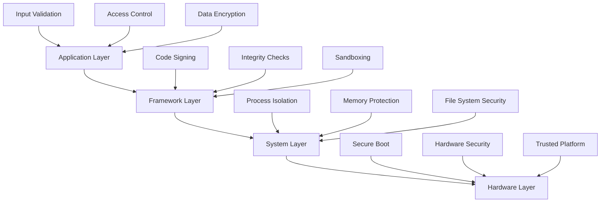

# Security and Safety Overview

This document provides comprehensive information about security considerations, safety guidelines, and best practices for UEVR development and usage.

## Security Philosophy

### Core Principles
- **Security by Design**: Security considerations integrated from the beginning
- **Defense in Depth**: Multiple layers of security protection
- **Principle of Least Privilege**: Minimal access rights for functionality
- **Fail Secure**: System fails to a secure state
- **Transparency**: Open source for security review and verification

### Security Goals
- **User Privacy**: Protect user data and privacy
- **System Integrity**: Prevent unauthorized modifications
- **Runtime Safety**: Ensure safe execution of VR applications
- **Data Protection**: Secure handling of sensitive information
- **Vulnerability Prevention**: Minimize attack surface

## Security Architecture

### Security Layers


### Security Components
```cpp
// Security manager for UEVR
class SecurityManager {
public:
    // Security initialization
    bool InitializeSecurity();
    void ShutdownSecurity();
    
    // Access control
    bool ValidateAccess(const std::string& resource, AccessLevel level);
    bool GrantAccess(const std::string& resource, AccessLevel level);
    bool RevokeAccess(const std::string& resource);
    
    // Integrity verification
    bool VerifyIntegrity(const std::string& filePath);
    bool VerifySignature(const std::string& filePath, const std::string& signature);
    std::string CalculateHash(const std::string& filePath);
    
    // Security monitoring
    void MonitorSecurityEvents();
    void LogSecurityEvent(SecurityEventType type, const std::string& details);
    std::vector<SecurityEvent> GetSecurityLog() const;
    
private:
    std::unique_ptr<AccessController> accessController;
    std::unique_ptr<IntegrityChecker> integrityChecker;
    std::unique_ptr<SecurityMonitor> securityMonitor;
    std::vector<SecurityEvent> securityLog;
};
```

## Input Validation and Sanitization

### Input Validation Framework
```cpp
// Input validation utilities
class InputValidator {
public:
    // String validation
    static bool ValidateString(const std::string& input, const ValidationRule& rule);
    static bool ValidatePath(const std::string& path);
    static bool ValidateURL(const std::string& url);
    
    // Numeric validation
    static bool ValidateInteger(int value, int min, int max);
    static bool ValidateFloat(float value, float min, float max);
    static bool ValidateRange(const std::vector<int>& values, int min, int max);
    
    // File validation
    static bool ValidateFileExtension(const std::string& filePath, const std::vector<std::string>& allowedExtensions);
    static bool ValidateFileSize(const std::string& filePath, size_t maxSize);
    static bool ValidateFileContent(const std::string& filePath, const ContentValidator& validator);
    
    // Configuration validation
    static bool ValidateConfiguration(const Config& config);
    static bool ValidateVRConfig(const VRConfig& config);
    static bool ValidateModConfig(const ModConfig& config);
};

// Validation rules
struct ValidationRule {
    std::string pattern;
    size_t minLength;
    size_t maxLength;
    std::vector<std::string> allowedCharacters;
    std::vector<std::string> forbiddenCharacters;
    bool allowEmpty;
    bool caseSensitive;
};
```

### Input Sanitization
```cpp
// Input sanitization utilities
class InputSanitizer {
public:
    // String sanitization
    static std::string SanitizeString(const std::string& input);
    static std::string SanitizePath(const std::string& path);
    static std::string SanitizeHTML(const std::string& html);
    static std::string SanitizeSQL(const std::string& sql);
    
    // File path sanitization
    static std::string SanitizeFilePath(const std::string& filePath);
    static std::string NormalizePath(const std::string& path);
    static std::string ResolvePath(const std::string& relativePath, const std::string& basePath);
    
    // Configuration sanitization
    static Config SanitizeConfig(const Config& config);
    static VRConfig SanitizeVRConfig(const VRConfig& config);
    static ModConfig SanitizeModConfig(const ModConfig& config);
    
private:
    static std::string RemoveNullBytes(const std::string& input);
    static std::string RemoveControlCharacters(const std::string& input);
    static std::string EscapeSpecialCharacters(const std::string& input);
};
```

## Access Control and Authorization

### Access Control System
```cpp
// Access control implementation
class AccessController {
public:
    // User management
    bool AddUser(const std::string& username, const std::string& passwordHash);
    bool RemoveUser(const std::string& username);
    bool AuthenticateUser(const std::string& username, const std::string& password);
    
    // Permission management
    bool GrantPermission(const std::string& username, const std::string& resource, PermissionLevel level);
    bool RevokePermission(const std::string& username, const std::string& resource);
    bool CheckPermission(const std::string& username, const std::string& resource, PermissionLevel level);
    
    // Role-based access control
    bool AssignRole(const std::string& username, const std::string& role);
    bool RemoveRole(const std::string& username, const std::string& role);
    std::vector<std::string> GetUserRoles(const std::string& username);
    
private:
    std::unordered_map<std::string, UserInfo> users;
    std::unordered_map<std::string, std::vector<Permission>> permissions;
    std::unordered_map<std::string, std::vector<std::string>> userRoles;
};

// Permission levels
enum class PermissionLevel {
    None,       // No access
    Read,       // Read-only access
    Write,      // Read and write access
    Execute,    // Execute access
    Admin       // Full administrative access
};

// User information
struct UserInfo {
    std::string username;
    std::string passwordHash;
    std::vector<std::string> roles;
    std::chrono::system_clock::time_point lastLogin;
    bool isActive;
    uint32_t failedLoginAttempts;
};
```

### Resource Protection
```cpp
// Resource protection system
class ResourceProtector {
public:
    // File protection
    bool ProtectFile(const std::string& filePath, ProtectionLevel level);
    bool UnprotectFile(const std::string& filePath);
    bool IsFileProtected(const std::string& filePath) const;
    
    // Directory protection
    bool ProtectDirectory(const std::string& dirPath, ProtectionLevel level);
    bool UnprotectDirectory(const std::string& dirPath);
    bool IsDirectoryProtected(const std::string& dirPath) const;
    
    // Memory protection
    bool ProtectMemoryRegion(void* address, size_t size, MemoryProtection protection);
    bool UnprotectMemoryRegion(void* address, size_t size);
    
    // Process protection
    bool ProtectProcess(uint32_t processId);
    bool UnprotectProcess(uint32_t processId);
    
private:
    std::unordered_map<std::string, ProtectionInfo> protectedResources;
    std::unordered_map<uint32_t, ProcessProtectionInfo> protectedProcesses;
};

// Protection levels
enum class ProtectionLevel {
    None,           // No protection
    ReadOnly,       // Read-only protection
    NoAccess,       // No access protection
    Encrypted,      // Encrypted protection
    Signed          // Digitally signed protection
};

// Memory protection flags
enum class MemoryProtection {
    None,           // No protection
    Read,           // Read protection
    Write,          // Write protection
    Execute,        // Execute protection
    ReadWrite,      // Read-write protection
    ReadExecute,    // Read-execute protection
    ReadWriteExecute // Full access protection
};
```

## Code Integrity and Verification

### Code Signing
```cpp
// Code signing implementation
class CodeSigner {
public:
    // Sign executable files
    bool SignExecutable(const std::string& filePath, const std::string& certificatePath);
    bool SignDLL(const std::string& filePath, const std::string& certificatePath);
    bool SignDriver(const std::string& filePath, const std::string& certificatePath);
    
    // Verify signatures
    bool VerifySignature(const std::string& filePath);
    bool VerifyCertificate(const std::string& certificatePath);
    std::string GetSignatureInfo(const std::string& filePath);
    
    // Certificate management
    bool InstallCertificate(const std::string& certificatePath);
    bool RemoveCertificate(const std::string& certificatePath);
    std::vector<std::string> GetInstalledCertificates();
    
private:
    std::unique_ptr<CryptoProvider> cryptoProvider;
    std::vector<std::string> trustedCertificates;
};

// Signature information
struct SignatureInfo {
    std::string signerName;
    std::string certificateSubject;
    std::string certificateIssuer;
    std::chrono::system_clock::time_point signingTime;
    std::string signatureAlgorithm;
    bool isValid;
    std::string validationError;
};
```

### Integrity Checking
```cpp
// Integrity checker implementation
class IntegrityChecker {
public:
    // File integrity
    bool CheckFileIntegrity(const std::string& filePath);
    bool CheckDirectoryIntegrity(const std::string& dirPath);
    bool CheckSystemIntegrity();
    
    // Hash verification
    bool VerifyFileHash(const std::string& filePath, const std::string& expectedHash);
    std::string CalculateFileHash(const std::string& filePath, HashAlgorithm algorithm);
    bool VerifyHashList(const std::string& hashListPath);
    
    // Checksum verification
    bool VerifyChecksum(const std::string& filePath, const std::string& checksum);
    std::string CalculateChecksum(const std::string& filePath, ChecksumAlgorithm algorithm);
    
    // Integrity monitoring
    void StartIntegrityMonitoring();
    void StopIntegrityMonitoring();
    bool IsMonitoringActive() const;
    
private:
    std::unique_ptr<HashCalculator> hashCalculator;
    std::unique_ptr<ChecksumCalculator> checksumCalculator;
    std::unique_ptr<IntegrityMonitor> integrityMonitor;
    bool monitoringActive;
};

// Hash algorithms
enum class HashAlgorithm {
    MD5,        // MD5 hash (deprecated, use only for legacy compatibility)
    SHA1,       // SHA-1 hash (deprecated, use only for legacy compatibility)
    SHA256,     // SHA-256 hash (recommended)
    SHA512,     // SHA-512 hash (high security)
    Blake2b,    // Blake2b hash (fast and secure)
    Blake3      // Blake3 hash (fastest and most secure)
};

// Checksum algorithms
enum class ChecksumAlgorithm {
    CRC32,      // CRC-32 checksum (fast, basic integrity)
    Adler32,    // Adler-32 checksum (fast, good for small data)
    Fletcher32  // Fletcher-32 checksum (fast, good error detection)
};
```

## Memory Safety and Protection

### Memory Protection
```cpp
// Memory protection manager
class MemoryProtector {
public:
    // Memory allocation protection
    void* AllocateProtectedMemory(size_t size, MemoryProtection protection);
    bool FreeProtectedMemory(void* address);
    bool ChangeMemoryProtection(void* address, size_t size, MemoryProtection newProtection);
    
    // Stack protection
    bool EnableStackProtection();
    bool DisableStackProtection();
    bool IsStackProtectionEnabled() const;
    
    // Heap protection
    bool EnableHeapProtection();
    bool DisableHeapProtection();
    bool IsHeapProtectionEnabled() const;
    
    // Buffer overflow protection
    bool EnableBufferOverflowProtection();
    bool DisableBufferOverflowProtection();
    bool IsBufferOverflowProtectionEnabled() const;
    
private:
    bool stackProtectionEnabled;
    bool heapProtectionEnabled;
    bool bufferOverflowProtectionEnabled;
    std::vector<ProtectedMemoryRegion> protectedRegions;
};

// Protected memory region
struct ProtectedMemoryRegion {
    void* address;
    size_t size;
    MemoryProtection protection;
    std::chrono::system_clock::time_point creationTime;
    bool isActive;
};
```

### Buffer Safety
```cpp
// Safe buffer operations
class SafeBuffer {
public:
    // Safe buffer creation
    SafeBuffer(size_t size);
    SafeBuffer(const void* data, size_t size);
    ~SafeBuffer();
    
    // Safe access methods
    uint8_t& operator[](size_t index);
    const uint8_t& operator[](size_t index) const;
    
    // Safe data access
    bool ReadData(void* destination, size_t offset, size_t length) const;
    bool WriteData(const void* source, size_t offset, size_t length);
    
    // Buffer information
    size_t GetSize() const;
    bool IsValid() const;
    const uint8_t* GetData() const;
    
    // Buffer operations
    bool Resize(size_t newSize);
    bool Clear();
    bool Fill(uint8_t value);
    
private:
    std::vector<uint8_t> buffer;
    bool isValid;
    
    // Bounds checking
    bool IsValidIndex(size_t index) const;
    bool IsValidRange(size_t offset, size_t length) const;
};

// Safe string operations
class SafeString {
public:
    // Safe string creation
    SafeString(const std::string& str);
    SafeString(const char* str);
    
    // Safe string operations
    SafeString Substring(size_t start, size_t length) const;
    SafeString Concat(const SafeString& other) const;
    
    // Safe character access
    char At(size_t index) const;
    char& At(size_t index);
    
    // String information
    size_t Length() const;
    bool IsEmpty() const;
    const char* CStr() const;
    
private:
    std::string string;
    
    // Bounds checking
    bool IsValidIndex(size_t index) const;
};
```

## Process Isolation and Sandboxing

### Process Isolation
```cpp
// Process isolation manager
class ProcessIsolator {
public:
    // Process isolation
    bool IsolateProcess(uint32_t processId);
    bool UnisolateProcess(uint32_t processId);
    bool IsProcessIsolated(uint32_t processId) const;
    
    // Namespace isolation
    bool CreateIsolatedNamespace(const std::string& namespaceName);
    bool DestroyIsolatedNamespace(const std::string& namespaceName);
    bool AttachProcessToNamespace(uint32_t processId, const std::string& namespaceName);
    
    // Resource isolation
    bool IsolateFileSystem(const std::string& processId, const std::string& rootPath);
    bool IsolateNetwork(const std::string& processId);
    bool IsolateMemory(const std::string& processId);
    
    // Isolation monitoring
    void MonitorIsolatedProcesses();
    std::vector<IsolationInfo> GetIsolationInfo() const;
    
private:
    std::unordered_map<uint32_t, ProcessIsolationInfo> isolatedProcesses;
    std::unordered_map<std::string, NamespaceInfo> namespaces;
    std::unique_ptr<IsolationMonitor> isolationMonitor;
};

// Process isolation information
struct ProcessIsolationInfo {
    uint32_t processId;
    std::string namespaceName;
    IsolationLevel level;
    std::vector<std::string> isolatedResources;
    std::chrono::system_clock::time_point isolationTime;
    bool isActive;
};

// Isolation levels
enum class IsolationLevel {
    None,           // No isolation
    Light,          // Light isolation (file system)
    Medium,         // Medium isolation (file system + network)
    Heavy,          // Heavy isolation (file system + network + memory)
    Full            // Full isolation (complete sandbox)
};
```

### Sandboxing
```cpp
// Sandbox implementation
class Sandbox {
public:
    // Sandbox creation
    bool CreateSandbox(const SandboxConfig& config);
    bool DestroySandbox();
    bool IsSandboxActive() const;
    
    // Process execution
    bool ExecuteProcess(const std::string& executablePath, const std::vector<std::string>& arguments);
    bool TerminateProcess(uint32_t processId);
    std::vector<uint32_t> GetRunningProcesses() const;
    
    // Resource access control
    bool AllowFileAccess(const std::string& path, AccessLevel level);
    bool DenyFileAccess(const std::string& path);
    bool AllowNetworkAccess(const std::string& address, uint16_t port);
    bool DenyNetworkAccess(const std::string& address, uint16_t port);
    
    // Sandbox monitoring
    void MonitorSandbox();
    SandboxStatus GetStatus() const;
    std::vector<SandboxEvent> GetEventLog() const;
    
private:
    SandboxConfig config;
    std::unique_ptr<ProcessManager> processManager;
    std::unique_ptr<ResourceController> resourceController;
    std::unique_ptr<SandboxMonitor> sandboxMonitor;
    bool isActive;
};

// Sandbox configuration
struct SandboxConfig {
    std::string name;
    std::string rootPath;
    IsolationLevel isolationLevel;
    std::vector<std::string> allowedPaths;
    std::vector<std::string> deniedPaths;
    std::vector<NetworkRule> networkRules;
    MemoryLimits memoryLimits;
    bool enableLogging;
    std::string logPath;
};

// Network access rules
struct NetworkRule {
    std::string address;
    uint16_t port;
    NetworkProtocol protocol;
    AccessLevel access;
    bool isAllowed;
};

// Memory limits
struct MemoryLimits {
    size_t maxMemoryUsage;
    size_t maxStackSize;
    size_t maxHeapSize;
    bool enableMemoryProtection;
};
```

## Cryptographic Security

### Encryption and Hashing
```cpp
// Cryptographic provider
class CryptoProvider {
public:
    // Symmetric encryption
    std::vector<uint8_t> Encrypt(const std::vector<uint8_t>& data, const std::string& key);
    std::vector<uint8_t> Decrypt(const std::vector<uint8_t>& encryptedData, const std::string& key);
    
    // Asymmetric encryption
    std::vector<uint8_t> EncryptWithPublicKey(const std::vector<uint8_t>& data, const std::string& publicKey);
    std::vector<uint8_t> DecryptWithPrivateKey(const std::vector<uint8_t>& encryptedData, const std::string& privateKey);
    
    // Hashing
    std::string Hash(const std::vector<uint8_t>& data, HashAlgorithm algorithm);
    std::string HashFile(const std::string& filePath, HashAlgorithm algorithm);
    
    // Digital signatures
    std::vector<uint8_t> Sign(const std::vector<uint8_t>& data, const std::string& privateKey);
    bool VerifySignature(const std::vector<uint8_t>& data, const std::vector<uint8_t>& signature, const std::string& publicKey);
    
    // Key management
    std::pair<std::string, std::string> GenerateKeyPair(KeyAlgorithm algorithm, size_t keySize);
    std::string GenerateSymmetricKey(KeyAlgorithm algorithm, size_t keySize);
    
private:
    std::unique_ptr<EncryptionEngine> encryptionEngine;
    std::unique_ptr<HashEngine> hashEngine;
    std::unique_ptr<SignatureEngine> signatureEngine;
    std::unique_ptr<KeyManager> keyManager;
};

// Key algorithms
enum class KeyAlgorithm {
    RSA,        // RSA asymmetric encryption
    ECC,        // Elliptic Curve Cryptography
    AES,        // Advanced Encryption Standard
    ChaCha20,   // ChaCha20 stream cipher
    Ed25519     // Ed25519 digital signature
};
```

### Secure Communication
```cpp
// Secure communication manager
class SecureCommunicator {
public:
    // Secure connection establishment
    bool EstablishSecureConnection(const std::string& address, uint16_t port);
    bool TerminateSecureConnection();
    bool IsConnected() const;
    
    // Secure data transmission
    bool SendSecureData(const std::vector<uint8_t>& data);
    std::vector<uint8_t> ReceiveSecureData();
    
    // Certificate validation
    bool ValidateServerCertificate(const std::string& certificatePath);
    bool ValidateClientCertificate(const std::string& certificatePath);
    
    // Connection security
    bool EnablePerfectForwardSecrecy();
    bool DisablePerfectForwardSecrecy();
    bool IsPerfectForwardSecrecyEnabled() const;
    
private:
    std::unique_ptr<SSLContext> sslContext;
    std::unique_ptr<SecureSocket> secureSocket;
    bool isConnected;
    bool perfectForwardSecrecyEnabled;
};
```

## Security Monitoring and Logging

### Security Event Monitoring
```cpp
// Security monitor implementation
class SecurityMonitor {
public:
    // Event monitoring
    void StartMonitoring();
    void StopMonitoring();
    bool IsMonitoringActive() const;
    
    // Event registration
    void RegisterEventHandler(SecurityEventType type, SecurityEventHandler handler);
    void UnregisterEventHandler(SecurityEventType type, SecurityEventHandler handler);
    
    // Event logging
    void LogSecurityEvent(SecurityEventType type, const std::string& details);
    void LogSecurityEvent(SecurityEventType type, const std::string& details, SecurityLevel level);
    std::vector<SecurityEvent> GetSecurityEvents() const;
    
    // Alert system
    void SetAlertThreshold(SecurityEventType type, uint32_t threshold);
    void EnableAlerting(SecurityEventType type);
    void DisableAlerting(SecurityEventType type);
    
private:
    std::unordered_map<SecurityEventType, std::vector<SecurityEventHandler>> eventHandlers;
    std::vector<SecurityEvent> securityEvents;
    std::unordered_map<SecurityEventType, uint32_t> alertThresholds;
    std::unordered_map<SecurityEventType, bool> alertingEnabled;
    bool monitoringActive;
    std::mutex eventMutex;
};

// Security event types
enum class SecurityEventType {
    Authentication,      // Authentication events
    Authorization,       // Authorization events
    DataAccess,         // Data access events
    SystemModification, // System modification events
    NetworkActivity,    // Network activity events
    FileOperation,      // File operation events
    ProcessCreation,    // Process creation events
    MemoryAccess,       // Memory access events
    ConfigurationChange, // Configuration change events
    SecurityViolation   // Security violation events
};

// Security levels
enum class SecurityLevel {
    Info,       // Informational events
    Warning,    // Warning events
    Error,      // Error events
    Critical    // Critical security events
};

// Security event
struct SecurityEvent {
    SecurityEventType type;
    SecurityLevel level;
    std::string details;
    std::chrono::system_clock::time_point timestamp;
    std::string source;
    std::string user;
    std::string ipAddress;
    uint32_t eventId;
};
```

### Audit Logging
```cpp
// Audit logger implementation
class AuditLogger {
public:
    // Audit event logging
    void LogAuditEvent(const std::string& action, const std::string& resource, const std::string& user);
    void LogAuditEvent(const std::string& action, const std::string& resource, const std::string& user, AuditResult result);
    
    // Audit trail
    std::vector<AuditEvent> GetAuditTrail() const;
    std::vector<AuditEvent> GetAuditTrail(const std::string& user) const;
    std::vector<AuditEvent> GetAuditTrail(const std::string& resource, const std::chrono::system_clock::time_point& start, const std::chrono::system_clock::time_point& end) const;
    
    // Audit configuration
    void SetAuditLevel(AuditLevel level);
    AuditLevel GetAuditLevel() const;
    void EnableAuditLogging(bool enable);
    bool IsAuditLoggingEnabled() const;
    
    // Audit export
    bool ExportAuditLog(const std::string& filePath, ExportFormat format);
    bool ImportAuditLog(const std::string& filePath, ExportFormat format);
    
private:
    std::vector<AuditEvent> auditEvents;
    AuditLevel auditLevel;
    bool auditLoggingEnabled;
    std::mutex auditMutex;
};

// Audit levels
enum class AuditLevel {
    None,       // No auditing
    Minimal,    // Minimal auditing (critical events only)
    Standard,   // Standard auditing (important events)
    Verbose,    // Verbose auditing (all events)
    Debug       // Debug auditing (detailed events)
};

// Audit results
enum class AuditResult {
    Success,    // Operation successful
    Failure,    // Operation failed
    Denied,     // Operation denied
    Error       // Operation error
};

// Audit event
struct AuditEvent {
    std::string action;
    std::string resource;
    std::string user;
    AuditResult result;
    std::chrono::system_clock::time_point timestamp;
    std::string details;
    std::string ipAddress;
    uint32_t eventId;
};
```

## Vulnerability Management

### Vulnerability Assessment
```cpp
// Vulnerability scanner implementation
class VulnerabilityScanner {
public:
    // System vulnerability scan
    bool ScanSystemVulnerabilities();
    bool ScanProcessVulnerabilities(uint32_t processId);
    bool ScanFileVulnerabilities(const std::string& filePath);
    
    // Vulnerability database
    bool UpdateVulnerabilityDatabase();
    bool CheckVulnerability(const std::string& component, const std::string& version);
    std::vector<VulnerabilityInfo> GetKnownVulnerabilities() const;
    
    // Vulnerability reporting
    std::vector<VulnerabilityReport> GenerateVulnerabilityReport();
    bool ExportVulnerabilityReport(const std::string& filePath);
    
    // Remediation
    std::vector<RemediationAction> GetRemediationActions(const std::string& vulnerabilityId);
    bool ApplyRemediation(const std::string& vulnerabilityId, const std::string& actionId);
    
private:
    std::unique_ptr<VulnerabilityDatabase> vulnerabilityDatabase;
    std::unique_ptr<SystemScanner> systemScanner;
    std::unique_ptr<ProcessScanner> processScanner;
    std::unique_ptr<FileScanner> fileScanner;
};

// Vulnerability information
struct VulnerabilityInfo {
    std::string id;
    std::string title;
    std::string description;
    std::string severity;
    std::string component;
    std::string version;
    std::string cveId;
    std::chrono::system_clock::time_point discoveryDate;
    std::chrono::system_clock::time_point disclosureDate;
    std::vector<std::string> affectedVersions;
    std::vector<std::string> remediationActions;
};

// Vulnerability report
struct VulnerabilityReport {
    std::chrono::system_clock::time_point scanDate;
    std::vector<VulnerabilityInfo> vulnerabilities;
    uint32_t totalVulnerabilities;
    uint32_t criticalVulnerabilities;
    uint32_t highVulnerabilities;
    uint32_t mediumVulnerabilities;
    uint32_t lowVulnerabilities;
    std::string scanStatus;
    std::string recommendations;
};

// Remediation action
struct RemediationAction {
    std::string id;
    std::string title;
    std::string description;
    std::string action;
    std::string risk;
    bool requiresRestart;
    std::chrono::system_clock::time_point estimatedDuration;
};
```

### Security Updates
```cpp
// Security update manager
class SecurityUpdateManager {
public:
    // Update checking
    bool CheckForUpdates();
    bool CheckForSecurityUpdates();
    std::vector<UpdateInfo> GetAvailableUpdates() const;
    
    // Update installation
    bool InstallUpdate(const std::string& updateId);
    bool InstallSecurityUpdate(const std::string& updateId);
    bool RollbackUpdate(const std::string& updateId);
    
    // Update configuration
    void SetAutoUpdateEnabled(bool enabled);
    bool IsAutoUpdateEnabled() const;
    void SetUpdateSchedule(const UpdateSchedule& schedule);
    UpdateSchedule GetUpdateSchedule() const;
    
    // Update status
    UpdateStatus GetUpdateStatus() const;
    std::vector<UpdateHistory> GetUpdateHistory() const;
    
private:
    std::unique_ptr<UpdateChecker> updateChecker;
    std::unique_ptr<UpdateInstaller> updateInstaller;
    std::unique_ptr<UpdateScheduler> updateScheduler;
    bool autoUpdateEnabled;
    UpdateSchedule updateSchedule;
};

// Update information
struct UpdateInfo {
    std::string id;
    std::string title;
    std::string description;
    std::string version;
    std::string type;
    std::string severity;
    size_t size;
    std::chrono::system_clock::time_point releaseDate;
    std::vector<std::string> dependencies;
    bool requiresRestart;
    std::string changelog;
};

// Update schedule
struct UpdateSchedule {
    bool enabled;
    std::string frequency; // daily, weekly, monthly
    std::string dayOfWeek; // for weekly updates
    std::string dayOfMonth; // for monthly updates
    std::string time; // HH:MM format
    bool installSecurityUpdatesImmediately;
    bool notifyBeforeInstallation;
};

// Update status
enum class UpdateStatus {
    UpToDate,       // System is up to date
    UpdatesAvailable, // Updates are available
    Installing,     // Update installation in progress
    RestartRequired, // Restart required to complete update
    Error           // Update error occurred
};
```

## Best Practices and Guidelines

### Development Security
```cpp
// Security best practices for development
class SecurityGuidelines {
public:
    // Input validation
    static bool ValidateAllInputs(const std::vector<std::string>& inputs);
    static bool SanitizeAllOutputs(std::vector<std::string>& outputs);
    
    // Memory safety
    static bool UseSafeMemoryPractices();
    static bool EnableMemoryProtection();
    static bool UseSmartPointers();
    
    // Error handling
    static bool ImplementSecureErrorHandling();
    static bool AvoidInformationDisclosure();
    static bool LogSecurityEvents();
    
    // Authentication and authorization
    static bool ImplementStrongAuthentication();
    static bool UseRoleBasedAccessControl();
    static bool ValidateAllPermissions();
    
    // Cryptography
    static bool UseStrongCryptographicAlgorithms();
    static bool ImplementSecureKeyManagement();
    static bool UseSecureRandomNumberGeneration();
    
    // Network security
    static bool ImplementSecureCommunication();
    static bool ValidateAllNetworkInputs();
    static bool UseSecureProtocols();
    
    // File security
    static bool ValidateAllFileOperations();
    static bool ImplementSecureFileHandling();
    static bool UseSecureFilePermissions();
};
```

### Runtime Security
```cpp
// Runtime security guidelines
class RuntimeSecurity {
public:
    // Process security
    static bool MonitorProcessCreation();
    static bool ValidateProcessIntegrity();
    static bool ControlProcessAccess();
    
    // Memory security
    static bool MonitorMemoryAccess();
    static bool DetectMemoryViolations();
    static bool ProtectCriticalMemory();
    
    // File system security
    static bool MonitorFileOperations();
    static bool ValidateFileAccess();
    static bool ControlFilePermissions();
    
    // Network security
    static bool MonitorNetworkActivity();
    static bool ValidateNetworkConnections();
    static bool ControlNetworkAccess();
    
    // User security
    static bool MonitorUserActivity();
    static bool ValidateUserPermissions();
    static bool ControlUserAccess();
};
```

## Resources

- [UEVR Development Setup](../development/setup.md)
- [Code Standards](../development/code-standards.md)
- [Testing Framework](../testing/overview.md)
- [Performance Optimization](../performance/overview.md)
- [Contributing Guidelines](../../CONTRIBUTING.md)

---

*For security-related questions or vulnerability reports, contact the security team or check the GitHub repository.*
