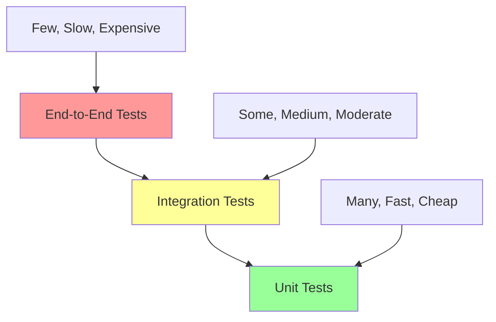

# Testing Framework Overview

This document provides a comprehensive overview of UEVR's testing framework, including testing strategies, frameworks, test organization, and best practices for ensuring code quality and reliability.

## Testing Philosophy

### Core Principles
- **Comprehensive Coverage**: Test all critical functionality and edge cases
- **Automated Testing**: Minimize manual testing through comprehensive automation
- **Continuous Testing**: Integrate testing into the development workflow
- **Performance Testing**: Ensure VR performance meets requirements
- **Compatibility Testing**: Verify support for different engines and platforms

### Testing Pyramid


## Testing Framework Architecture

### Core Components
```cpp
// Testing framework core
class TestingFramework {
public:
    static TestingFramework& Instance();
    
    // Test registration
    void RegisterTestSuite(const std::string& name, std::unique_ptr<TestSuite> suite);
    
    // Test execution
    TestResults RunAllTests();
    TestResults RunTestSuite(const std::string& name);
    TestResults RunTest(const std::string& suiteName, const std::string& testName);
    
    // Test discovery
    std::vector<std::string> GetTestSuites() const;
    std::vector<std::string> GetTests(const std::string& suiteName) const;
    
private:
    std::unordered_map<std::string, std::unique_ptr<TestSuite>> testSuites;
    TestConfiguration config;
};
```

### Test Suite Structure
```cpp
// Base test suite class
class TestSuite {
public:
    virtual ~TestSuite() = default;
    
    // Setup and teardown
    virtual void SetUp() {}
    virtual void TearDown() {}
    
    // Test registration
    void RegisterTest(const std::string& name, std::function<void()> test);
    
    // Test execution
    void RunTests();
    
protected:
    std::vector<std::pair<std::string, std::function<void()>>> tests;
    TestContext context;
};
```

## Unit Testing

### Framework Integration
UEVR uses Google Test (gtest) as the primary unit testing framework, with custom extensions for VR-specific testing.

```cpp
// Example unit test
#include <gtest/gtest.h>
#include "uevr/core/framework.h"

class FrameworkTest : public ::testing::Test {
protected:
    void SetUp() override {
        framework = std::make_unique<Framework>();
    }
    
    void TearDown() override {
        framework.reset();
    }
    
    std::unique_ptr<Framework> framework;
};

TEST_F(FrameworkTest, InitializationTest) {
    EXPECT_TRUE(framework->Initialize());
    EXPECT_TRUE(framework->IsInitialized());
}

TEST_F(FrameworkTest, ConfigurationTest) {
    Config config;
    config.SetValue("vr.enabled", true);
    config.SetValue("vr.renderScale", 0.85f);
    
    EXPECT_TRUE(framework->LoadConfiguration(config));
    EXPECT_TRUE(framework->GetConfig().GetValue<bool>("vr.enabled"));
    EXPECT_FLOAT_EQ(framework->GetConfig().GetValue<float>("vr.renderScale"), 0.85f);
}
```

### Mock Objects
```cpp
// Mock VR runtime for testing
class MockVRRuntime : public IVRRuntime {
public:
    MOCK_METHOD(bool, Initialize, (), (override));
    MOCK_METHOD(void, Shutdown, (), (override));
    MOCK_METHOD(bool, IsInitialized, (), (const, override));
    MOCK_METHOD(VRPose, GetHeadPose, (), (const, override));
    MOCK_METHOD(std::vector<VRController>, GetControllers, (), (const, override));
    MOCK_METHOD(bool, SubmitFrame, (const VRFrame& frame), (override));
};

// Using mock in tests
TEST_F(VRModTest, VRRuntimeIntegration) {
    auto mockRuntime = std::make_shared<MockVRRuntime>();
    
    EXPECT_CALL(*mockRuntime, Initialize())
        .WillOnce(Return(true));
    
    EXPECT_CALL(*mockRuntime, GetHeadPose())
        .WillRepeatedly(Return(VRPose{}));
    
    VRMod vrMod;
    EXPECT_TRUE(vrMod.Initialize(mockRuntime));
}
```

### Test Fixtures
```cpp
// Test fixture for VR testing
class VRTestFixture : public ::testing::Test {
protected:
    void SetUp() override {
        // Initialize VR systems
        vrRuntime = std::make_unique<MockVRRuntime>();
        vrRenderer = std::make_unique<MockVRRenderer>();
        vrInput = std::make_unique<MockVRInput>();
        
        // Setup test environment
        SetupTestEnvironment();
    }
    
    void TearDown() override {
        // Cleanup test environment
        CleanupTestEnvironment();
    }
    
    // Helper methods
    void SetupTestEnvironment();
    void CleanupTestEnvironment();
    
    // Test components
    std::unique_ptr<MockVRRuntime> vrRuntime;
    std::unique_ptr<MockVRRenderer> vrRenderer;
    std::unique_ptr<MockVRInput> vrInput;
    
    // Test data
    TestData testData;
};
```

## Integration Testing

### Component Integration
```cpp
// Integration test for complete VR pipeline
class VRPipelineIntegrationTest : public ::testing::Test {
protected:
    void SetUp() override {
        // Initialize all VR components
        framework = std::make_unique<Framework>();
        hookManager = std::make_unique<HookManager>();
        vrMod = std::make_unique<VRMod>();
        renderer = std::make_unique<StereoRenderer>();
        
        // Setup integration
        SetupIntegration();
    }
    
    void TearDown() override {
        CleanupIntegration();
    }
    
private:
    void SetupIntegration();
    void CleanupIntegration();
    
    std::unique_ptr<Framework> framework;
    std::unique_ptr<HookManager> hookManager;
    std::unique_ptr<VRMod> vrMod;
    std::unique_ptr<StereoRenderer> renderer;
};

TEST_F(VRPipelineIntegrationTest, CompleteVRWorkflow) {
    // Test complete VR workflow
    EXPECT_TRUE(framework->Initialize());
    EXPECT_TRUE(hookManager->InstallHooks());
    EXPECT_TRUE(vrMod->EnableVR());
    EXPECT_TRUE(renderer->StartRendering());
    
    // Simulate frame rendering
    for (int i = 0; i < 10; ++i) {
        EXPECT_TRUE(renderer->RenderFrame());
        std::this_thread::sleep_for(std::chrono::milliseconds(16)); // ~60 FPS
    }
    
    // Verify VR state
    EXPECT_TRUE(vrMod->IsVREnabled());
    EXPECT_TRUE(renderer->IsRendering());
}
```

### Engine Adapter Testing
```cpp
// Test engine adapter integration
class EngineAdapterIntegrationTest : public ::testing::Test {
protected:
    void SetUp() override {
        // Setup test engine environment
        SetupTestEngine();
        
        // Create adapter
        adapter = CreateTestAdapter();
    }
    
    void TearDown() override {
        CleanupTestEngine();
    }
    
private:
    void SetupTestEngine();
    void CleanupTestEngine();
    std::unique_ptr<IEngineAdapter> CreateTestAdapter();
    
    std::unique_ptr<IEngineAdapter> adapter;
    TestEngineEnvironment engineEnv;
};

TEST_F(EngineAdapterIntegrationTest, AdapterInitialization) {
    EXPECT_TRUE(adapter->Initialize());
    EXPECT_TRUE(adapter->IsCompatible());
    EXPECT_TRUE(adapter->InstallHooks());
}

TEST_F(EngineAdapterIntegrationTest, VRIntegration) {
    adapter->Initialize();
    
    EXPECT_TRUE(adapter->SetupVRRendering());
    EXPECT_TRUE(adapter->SetupVRInput());
    EXPECT_TRUE(adapter->SetupVRTracking());
}
```

## Performance Testing

### Performance Metrics
```cpp
// Performance test framework
class PerformanceTest : public ::testing::Test {
protected:
    void SetUp() override {
        performanceMonitor = std::make_unique<PerformanceMonitor>();
        performanceMonitor->StartMonitoring();
    }
    
    void TearDown() override {
        performanceMonitor->StopMonitoring();
        auto results = performanceMonitor->GetResults();
        LogPerformanceResults(results);
    }
    
    // Performance assertions
    void AssertFrameRate(float minFPS, float maxFPS = 1000.0f);
    void AssertLatency(float maxLatency);
    void AssertMemoryUsage(size_t maxMemoryMB);
    void AssertCPUUsage(float maxCPUPercent);
    
private:
    void LogPerformanceResults(const PerformanceResults& results);
    
    std::unique_ptr<PerformanceMonitor> performanceMonitor;
};

// Performance test example
TEST_F(PerformanceTest, VRFrameRendering) {
    auto renderer = std::make_unique<StereoRenderer>();
    renderer->Initialize();
    
    // Warm up
    for (int i = 0; i < 100; ++i) {
        renderer->RenderFrame();
    }
    
    // Performance measurement
    auto startTime = std::chrono::high_resolution_clock::now();
    
    for (int i = 0; i < 1000; ++i) {
        renderer->RenderFrame();
    }
    
    auto endTime = std::chrono::high_resolution_clock::now();
    auto duration = std::chrono::duration_cast<std::chrono::milliseconds>(endTime - startTime);
    
    // Assertions
    float fps = 1000.0f / (duration.count() / 1000.0f);
    AssertFrameRate(80.0f, 120.0f); // VR requires 80+ FPS
    
    // Check memory usage
    AssertMemoryUsage(2048); // Max 2GB
}
```

### Benchmarking
```cpp
// Benchmark framework
class BenchmarkTest : public ::testing::Test {
protected:
    void SetUp() override {
        benchmarkRunner = std::make_unique<BenchmarkRunner>();
    }
    
    void TearDown() override {
        auto results = benchmarkRunner->GetResults();
        GenerateBenchmarkReport(results);
    }
    
    // Benchmark helpers
    void RunBenchmark(const std::string& name, std::function<void()> func, int iterations = 1000);
    void CompareBenchmarks(const std::string& baseline, const std::string& current);
    
private:
    void GenerateBenchmarkReport(const BenchmarkResults& results);
    
    std::unique_ptr<BenchmarkRunner> benchmarkRunner;
};

// Benchmark example
TEST_F(BenchmarkTest, StereoRenderingPerformance) {
    auto renderer = std::make_unique<StereoRenderer>();
    renderer->Initialize();
    
    // Benchmark different rendering modes
    RunBenchmark("SinglePass", [&]() {
        renderer->SetRenderingMode(RenderingMode::SinglePass);
        renderer->RenderFrame();
    });
    
    RunBenchmark("MultiPass", [&]() {
        renderer->SetRenderingMode(RenderingMode::MultiPass);
        renderer->RenderFrame();
    });
    
    // Compare with baseline
    CompareBenchmarks("baseline_singlepass", "SinglePass");
    CompareBenchmarks("baseline_multipass", "MultiPass");
}
```

## Compatibility Testing

### Engine Compatibility
```cpp
// Test compatibility with different engines
class EngineCompatibilityTest : public ::testing::Test {
protected:
    void SetUp() override {
        compatibilityTester = std::make_unique<CompatibilityTester>();
    }
    
    void TearDown() override {
        auto results = compatibilityTester->GetResults();
        GenerateCompatibilityReport(results);
    }
    
    // Compatibility test helpers
    void TestEngineCompatibility(const std::string& engineName, const std::string& version);
    void TestFeatureCompatibility(const std::string& feature);
    void TestPerformanceCompatibility(const std::string& engineName);
    
private:
    void GenerateCompatibilityReport(const CompatibilityResults& results);
    
    std::unique_ptr<CompatibilityTester> compatibilityTester;
};

// Compatibility test example
TEST_F(EngineCompatibilityTest, UnrealEngineCompatibility) {
    // Test UE4 compatibility
    TestEngineCompatibility("UnrealEngine", "4.27");
    TestEngineCompatibility("UnrealEngine", "4.26");
    
    // Test UE5 compatibility
    TestEngineCompatibility("UnrealEngine", "5.0");
    TestEngineCompatibility("UnrealEngine", "5.1");
    TestEngineCompatibility("UnrealEngine", "5.2");
    TestEngineCompatibility("UnrealEngine", "5.3");
}

TEST_F(EngineCompatibilityTest, FeatureCompatibility) {
    // Test core features
    TestFeatureCompatibility("StereoRendering");
    TestFeatureCompatibility("VRInput");
    TestFeatureCompatibility("VRTracking");
    TestFeatureCompatibility("PerformanceOptimization");
}
```

### Platform Compatibility
```cpp
// Test platform compatibility
class PlatformCompatibilityTest : public ::testing::Test {
protected:
    void SetUp() override {
        platformTester = std::make_unique<PlatformTester>();
    }
    
    void TearDown() override {
        auto results = platformTester->GetResults();
        GeneratePlatformReport(results);
    }
    
    // Platform test helpers
    void TestWindowsCompatibility();
    void TestLinuxCompatibility();
    void TestMacOSCompatibility();
    
private:
    void GeneratePlatformReport(const PlatformResults& results);
    
    std::unique_ptr<PlatformTester> platformTester;
};

// Platform test example
TEST_F(PlatformCompatibilityTest, WindowsCompatibility) {
    #ifdef _WIN32
    TestWindowsCompatibility();
    #else
    GTEST_SKIP() << "Skipping Windows compatibility test on non-Windows platform";
    #endif
}
```

## Automated Testing

### CI/CD Integration
```yaml
# GitHub Actions testing workflow
name: Test Suite

on: [push, pull_request]

jobs:
  test:
    runs-on: ${{ matrix.os }}
    strategy:
      matrix:
        os: [windows-latest, ubuntu-latest, macos-latest]
        build_type: [Debug, Release]
    
    steps:
    - uses: actions/checkout@v3
    
    - name: Setup build environment
      run: |
        # Platform-specific setup
        if [ "${{ runner.os }}" == "Windows" ]; then
          # Windows setup
        elif [ "${{ runner.os }}" == "Linux" ]; then
          sudo apt-get update
          sudo apt-get install -y build-essential cmake ninja-build
        elif [ "${{ runner.os }}" == "macOS" ]; then
          brew install cmake ninja
        fi
    
    - name: Configure CMake
      run: |
        cmake -B build \
          -DCMAKE_BUILD_TYPE=${{ matrix.build_type }} \
          -DBUILD_TESTS=ON
    
    - name: Build
      run: cmake --build build --config ${{ matrix.build_type }}
    
    - name: Run Tests
      run: ctest --test-dir build --output-on-failure --parallel
    
    - name: Run Performance Tests
      run: |
        cd build
        ./bin/${{ matrix.build_type }}/UEVR_PerformanceTests
    
    - name: Generate Test Report
      run: |
        cd build
        ./bin/${{ matrix.build_type }}/UEVR_TestReporter
```

### Test Automation
```cpp
// Automated test runner
class AutomatedTestRunner {
public:
    // Run all tests
    TestResults RunAllTests();
    
    // Run specific test categories
    TestResults RunUnitTests();
    TestResults RunIntegrationTests();
    TestResults RunPerformanceTests();
    TestResults RunCompatibilityTests();
    
    // Generate reports
    void GenerateTestReport(const TestResults& results);
    void GenerateCoverageReport();
    void GeneratePerformanceReport();
    
    // Notifications
    void SendTestResults(const TestResults& results);
    void NotifyTestFailure(const TestFailure& failure);
    
private:
    TestConfiguration config;
    std::vector<std::unique_ptr<TestSuite>> testSuites;
    TestReporter reporter;
};
```

## Test Data Management

### Test Data Generation
```cpp
// Test data generator
class TestDataGenerator {
public:
    // Generate test scenarios
    std::vector<TestScenario> GenerateTestScenarios();
    
    // Generate test data
    FrameData GenerateFrameData(int width, int height);
    VRInputData GenerateVRInputData();
    ConfigurationData GenerateConfigurationData();
    
    // Generate edge cases
    std::vector<FrameData> GenerateEdgeCaseFrames();
    std::vector<VRInputData> GenerateEdgeCaseInputs();
    
private:
    RandomGenerator random;
    TestDataTemplates templates;
};
```

### Test Data Persistence
```cpp
// Test data storage
class TestDataStorage {
public:
    // Save test data
    void SaveTestData(const std::string& testName, const TestData& data);
    void SaveTestResults(const std::string& testName, const TestResults& results);
    
    // Load test data
    TestData LoadTestData(const std::string& testName);
    TestResults LoadTestResults(const std::string& testName);
    
    // Manage test data
    void CleanupOldTestData(int maxAgeDays);
    void ArchiveTestData(const std::string& archivePath);
    
private:
    std::string dataDirectory;
    Database database;
};
```

## Test Reporting

### Test Results
```cpp
// Test results structure
struct TestResults {
    std::string testSuite;
    std::string testName;
    TestStatus status;
    std::chrono::milliseconds duration;
    std::string errorMessage;
    std::vector<std::string> logs;
    PerformanceMetrics performance;
    TestMetadata metadata;
};

enum class TestStatus {
    Passed,
    Failed,
    Skipped,
    Inconclusive
};
```

### Report Generation
```cpp
// Test report generator
class TestReportGenerator {
public:
    // Generate different report types
    void GenerateHTMLReport(const TestResults& results, const std::string& outputPath);
    void GenerateXMLReport(const TestResults& results, const std::string& outputPath);
    void GenerateJSONReport(const TestResults& results, const std::string& outputPath);
    
    // Generate summary reports
    void GenerateSummaryReport(const std::vector<TestResults>& results);
    void GenerateTrendReport(const std::vector<TestResults>& historicalResults);
    
    // Custom report templates
    void SetReportTemplate(const std::string& templatePath);
    void CustomizeReport(const ReportCustomization& customization);
    
private:
    ReportTemplate template_;
    ReportCustomization customization_;
};
```

## Best Practices

### Test Design
1. **Test Naming**: Use descriptive test names that explain the scenario
2. **Test Isolation**: Each test should be independent and not rely on other tests
3. **Setup/Teardown**: Use proper setup and teardown methods for test state
4. **Assertions**: Use specific assertions that provide clear failure messages
5. **Test Data**: Use realistic test data that represents actual usage scenarios

### Test Organization
1. **Logical Grouping**: Group related tests into test suites
2. **Hierarchical Structure**: Organize tests in a logical hierarchy
3. **Naming Conventions**: Use consistent naming conventions for tests and suites
4. **Documentation**: Document complex test scenarios and requirements

### Performance Testing
1. **Baseline Establishment**: Establish performance baselines for comparison
2. **Realistic Scenarios**: Test with realistic workloads and data
3. **Statistical Analysis**: Use statistical methods to analyze performance results
4. **Regression Detection**: Automatically detect performance regressions

### Continuous Integration
1. **Automated Execution**: Run tests automatically on every code change
2. **Fast Feedback**: Ensure tests complete quickly for rapid feedback
3. **Failure Notification**: Notify developers immediately of test failures
4. **Test Coverage**: Maintain high test coverage for critical code paths

## Resources

- [Google Test Documentation](https://google.github.io/googletest/)
- [CMake Testing](https://cmake.org/cmake/help/latest/manual/ctest.1.html)
- [UEVR Build System](../build-system/overview.md)
- [Development Setup](../development/setup.md)
- [Performance Optimization](../performance/overview.md)

---

*For testing framework support, check the GitHub Issues or join the community Discord.*
